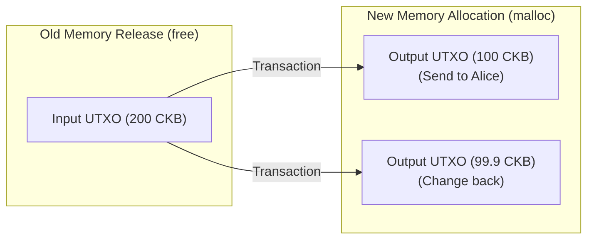

# Blockchain Overview for Embedded Software Engineers

Welcome to the world of Blockchain! As an **Embedded Software Engineer**, you already have powerful mental models for: **low-level systems programming, basic memory management (malloc/free), finite state machines (FSM), concurrency, and microprocessor architectures (such as ARM, RISC-V)**.

This guide will use familiar concepts from embedded systems to explain core blockchain principles, building a solid foundation to help you master **Nervos CKB**.

---

## Table of Contents
1. [Blockchain from an Embedded Systems Perspective](#1-blockchain-from-an-embedded-systems-perspective)
2. [Core Concepts Through an Embedded Lens](#2-core-concepts-through-an-embedded-lens)
3. [State Storage Models: Account vs UTXO (malloc/free)](#3-state-storage-models-account-vs-utxo-mallocfree)
4. [Smart Contracts & CKB-VM: A RISC-V Virtual Machine](#4-smart-contracts--ckb-vm-a-risc-v-virtual-machine)
5. [Terminology Comparison Table (Embedded vs. Blockchain)](#5-terminology-comparison-table-embedded-vs-blockchain)

---

## 1. Blockchain from an Embedded Systems Perspective

In the embedded world, you often design a **Finite State Machine (FSM)** to manage device behavior (e.g., LED_OFF -> pressing button -> LED_ON).

Blockchain is essentially a **Distributed State Machine** running across a network of interconnected nodes (computers):
*   **State:** The database storing account balances and contract data (analogous to global variable values stored in a microcontroller's RAM/Flash).
*   **Transaction:** Commands that change the device state (analogous to an Interrupt Event that triggers a state transition).
*   **State Transition Function:**
    $$\text{State}_{\text{new}} = f(\text{State}_{\text{old}}, \text{Transaction})$$
*   **Immutability:** Historical data on the blockchain is written sequentially and cannot be modified or deleted, similar to writing logs to **Flash ROM** memory in append-only mode, or OTP (One-Time Programmable) memory regions.

---

## 2. Core Concepts Through an Embedded Lens

### A. Cryptographic Hash Functions
*   **In embedded systems:** You use **CRC (Cyclic Redundancy Check)** or Checksums to verify data integrity for packets transmitted over UART/SPI, or to verify firmware partitions during Bootloader startup.
*   **In Blockchain:** Uses **cryptographic hash functions (e.g., SHA-256, Blake2b)**. These are like an extremely powerful CRC algorithm with one-way and collision-resistant properties. Even a 1-bit change in the input data will completely change the output hash value.

### B. Private Key & Public Key Pair
*   **In embedded systems:** When implementing **Secure Boot** or **OTA (Over-The-Air)** firmware upgrades, you use the manufacturer's Private Key to sign the firmware and embed the Public Key in the microcontroller's ROM to verify the authenticity of new firmware.
*   **In Blockchain:** 
    *   **Private Key:** Like the secret key for signing transaction commands. Only the holder of the Private Key can "sign" to spend assets from a wallet.
    *   **Public Key:** Similar to your public wallet address for receiving funds. Anyone in the network can use the Public Key to verify whether a transaction was genuinely signed by the wallet owner (the holder of the corresponding Private Key).

### C. Consensus Mechanism & Bus Arbitration
*   **In embedded systems:** When multiple microcontrollers communicate on a shared bus (like CAN Bus or I2C Multi-Master), you need an **Arbitration** mechanism based on ID priority to avoid data collisions.
*   **In Blockchain:** A distributed network has no central Master chip to coordinate. Therefore, nodes need a consensus protocol (like **Proof of Work - PoW** or **Proof of Stake - PoS**) to self-negotiate and decide which node's block will be appended to the chain next.
    *   **Proof of Work (PoW):** Similar to making nodes run a tight loop (`while(1)`) to solve a computationally intensive hash problem (costly in CPU/bandwidth). The first node to solve it wins the right to write data.

---

## 3. State Storage Models: Account vs UTXO (malloc/free)

There are two common state management models in blockchain. Embedded thinking about RAM memory management will help you grasp them immediately:

### Account Model (e.g., Ethereum) — Like "Global Variables"
*   Each account is a fixed memory slot in system RAM, directly storing a balance (e.g., `uint64_t Alice_Balance = 100;`).
*   When a transaction occurs, the system overwrites the slot with the new value (`Alice_Balance -= 10;`).
*   **Pros:** Easy to understand, easy to program.
*   **Cons:** Prone to Race Condition bugs. If two processes write to the same global variable without proper Semaphore/Mutex locking, data can become corrupted (in blockchain, this corresponds to the **Reentrancy Attack** — a classic Ethereum security exploit).

### UTXO Model (e.g., Bitcoin) — Like "Dynamic Memory Allocation" (malloc / free)
*   The UTXO (Unspent Transaction Output) model does not use global variables to store wallet balances. Instead, assets exist as independent "coin fragments" called UTXOs.
*   Think of each UTXO as a memory block allocated by `malloc()`.
*   When you want to spend (transact):
    1.  You specify input UTXOs as parameters (like calling `free()` to release old memory).
    2.  The system processes the transaction.
    3.  New output UTXOs are created (like calling `malloc()` to allocate new memory regions with new sizes for the recipient and the change returned to you).




### Cell Model (Nervos CKB) — A Generalized Upgrade of UTXO
*   If Bitcoin's UTXO can only hold **a coin amount**, CKB's **Cell** is a multipurpose memory block. It doesn't just hold a CKB balance — it can hold any data structure (byte arrays, strings, executable code...) and logic code to control that memory slot.
*   As an embedded engineer, you can think of **each Cell as a Struct** in RAM:
    ```c
    struct Cell {
        uint64_t capacity;     // Size of the Cell (in bytes)
        uint8_t  data[];       // Arbitrary data stored in the memory slot (state)
        Script   lock;         // Code that defines who has the right to free this slot (write permission)
        Script   type;         // Code that defines how data in this slot is allowed to change
    };
    ```

---

## 4. Smart Contracts & CKB-VM: A RISC-V Virtual Machine

The most exciting aspect of **Nervos CKB** for an embedded engineer is the **CKB-VM** virtual machine:

*   **CKB-VM is essentially a RISC-V processor emulator!**
*   RISC-V is an open-source Instruction Set Architecture (ISA) that is rapidly growing in the embedded hardware world (e.g., ESP32-C3 chips, SiFive CPU cores, Western Digital drives...).
*   Smart contracts on CKB don't use a specialized, hard-to-understand language like Ethereum's Solidity. Since CKB-VM is a standard RISC-V CPU, you can write code in familiar systems languages like **C, C++, or Rust**, then compile directly to RISC-V binary machine code (Binary ELF) and deploy it to the blockchain.
*   When CKB-VM executes code:
    *   It uses standard RISC-V registers (`x0` through `x31`) and the program counter `PC`.
    *   It uses **Syscalls** to interact with the external environment (e.g., reading data from other Cells via `ckb_load_cell_data()`).
    *   **Cycles:** In embedded programming, you optimize code by counting CPU clock cycles to ensure interrupt handlers run fast enough. On CKB-VM, each RISC-V instruction (e.g., `ADD`, `SUB`, `JUMP`) also consumes a fixed number of **Cycles**. The network limits the total cycles per block to ensure code doesn't fall into an infinite loop and freeze the system.

---

## 5. Terminology Comparison Table (Embedded vs. Blockchain)

| Embedded Concept | Equivalent Blockchain Concept | Brief Explanation |
| :--- | :--- | :--- |
| **Microcontroller RAM / registers state** | **Ledger State** | The current state of all variables/data in the system. |
| **Interrupt / Event trigger** | **Transaction** | An event requesting a state change in the system. |
| **FSM (Finite State Machine)** | **Blockchain State Machine** | Logic machine governing transitions from old state to new state. |
| **CRC32 / Checksum** | **Cryptographic Hash (SHA256, Blake2b)** | A one-way function used to verify data integrity. |
| **Firmware Signature Verification** | **Signature Verification** | Uses public-key cryptography to validate the origin and validity of a command. |
| **CAN Bus / I2C Bus Arbitration** | **Consensus Protocol (NC-MAX, PoW)** | Mechanism for independent devices to self-synchronize data without collision. |
| **malloc() / free()** | **Cell Creation / Cell Consumption** | Mechanism for allocating and reclaiming independent data blocks on CKB. |
| **C Struct (customizable memory slot)** | **Cell (Cell Model)** | A flexible, structured storage block on the CKB network. |
| **MCU Instruction Clock Cycles** | **CKB-VM Execution Cycles** | A measure of the CPU time and energy consumed to execute a piece of code. |
| **RISC-V / ARM CPU** | **CKB-VM (CKB Virtual Machine)** | A virtual machine environment emulating a processor architecture to run smart contract software. |
