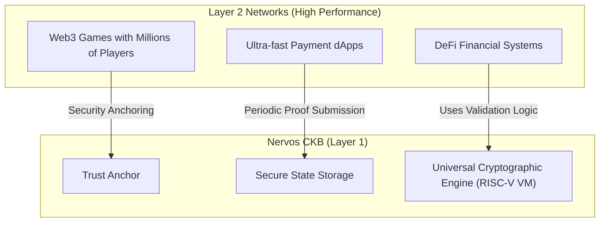

# The Purpose of Blockchain, Bitcoin, and Nervos CKB in Real Life

When first encountering the topic, many people think blockchain is only about "virtual currency" or financial speculation. In reality, from a technical and social perspective, blockchain solves a much deeper problem: **Trust and Ownership in the Digital World**.

This document explains in detail the purpose, role, and practical applications of Blockchain in general, and Bitcoin and Nervos CKB in particular.

---

## 1. What is Blockchain Used For? (The Core Problem)

### A. Eliminating the Trusted Middleman
In traditional life, every transaction or ownership verification requires a **centralized third party** as a guarantor:
*   Sending money: Requires a Bank.
*   Buying/selling real estate: Requires a Land Registry Office (Title Deed).
*   Signing contracts: Requires a Notary Office or Court.

**Risks of the centralized model:** If this intermediary is hacked, goes bankrupt, becomes corrupt, or abuses its power, your data can be lost, frozen, or arbitrarily altered.

**Blockchain's solution:** Replace trust in people/organizations with **Mathematics, Cryptography, and Consensus Algorithms**. The ledger containing data is distributed across tens of thousands of nodes worldwide for storage and validation. No one has the unilateral right to modify your data.

### B. Solving the "Double Spending" Problem
In the conventional digital world, any file can be copied infinitely (copy-paste). If you send a PDF to a friend, you still keep the original.
*   **If digital money worked the same way:** How do you prevent someone from sending 1 digital coin to 2 different people simultaneously?
*   Blockchain solves this problem by packaging transactions into cryptographically linked Blocks, ordering them linearly in time, and synchronizing them across the entire network. Once a coin has been spent, the old memory slot state is deleted (Dead Cell/UTXO consumed) and can no longer be reused.

---

## 2. What is Bitcoin Used For in Real Life?

Bitcoin (BTC) is the first and most successful application of blockchain technology. It is likened to **"Digital Gold"** due to its properties:

```text
 ┌─────────────────────────────────────────────────────────────────┐
 │                      PROPERTIES OF BITCOIN                      │
 ├───────────────────┬──────────────────────────┬──────────────────┤
 │ Absolute Scarcity │ Censorship Resistant      │ Non-inflationary │
 │ Only 21 million   │ No one can block          │ Cannot be        │
 │ BTC will ever     │ or freeze your assets     │ printed like     │
 │ exist             │                           │ fiat currency    │
 └───────────────────┴──────────────────────────┴──────────────────┘
```

*   **Store of Value:** Like gold, Bitcoin has an absolutely fixed supply (only 21 million coins). No country or central bank can print more Bitcoin to cause inflation. In hyperinflationary economies (like Venezuela or Turkey), Bitcoin is a tool that helps citizens protect their assets from devaluation.
*   **Cross-border transactions:** You can transfer millions of USD worth of Bitcoin to anyone on the other side of the globe within minutes at an extremely low cost, without needing bank approval, and without worrying about transfer limits or administrative procedures.

---

## 3. What Are Next-Generation Blockchains (Smart Contracts) Used For?

If Bitcoin is like a **pocket calculator** (only capable of adding/subtracting wallet balances), then later-generation blockchains (like Ethereum) are like a **personal computer** (capable of running any software).

These programs are called **Smart Contracts**. As a result, blockchain is applied across many real-world fields:

*   **Decentralized Finance (DeFi):** Allows you to borrow, lend, save, buy insurance, or trade assets directly with others through code running on the blockchain — completely without banks or financial companies.
*   **Supply Chain Traceability:** Scan a QR code on a milk carton or vaccine to trace the entire journey: from the farm, to container temperature during transport, to the packaging date at the factory. All data sent by IoT sensors to the blockchain cannot be altered or forged.
*   **Digital Asset Ownership (NFTs & Asset Tokenization):** Certifies unique ownership of digital artworks, music copyrights, in-game items, or even fractionalizes real-world real estate into token shares for multiple investors to purchase together.
*   **Digital Identity:** Storing diplomas, medical certificates, and national IDs directly on-chain eliminates document forgery and shortens administrative verification time.

---

## 4. What is Nervos CKB Used For? (Common Knowledge Base)

Nervos CKB is designed to become the **"Ultimate Foundation Layer for All Common Knowledge" (Common Knowledge Base)**. CKB's practical missions include:



*   **Trust Anchor for Layer 2 (Securing Layer 2):** Applications requiring extreme speed (like Web3 games, micro-payment networks handling millions of transactions per second) run on Layer 2 networks to reduce costs. Periodically, Layer 2 submits cryptographic proofs to Layer 1 (CKB) for permanent storage, ensuring data can never be hacked or forged.
*   **Sustainable State Storage (State Rent Economy):** On other blockchains, developers store gigabytes of data on the network by paying a one-time fee, causing state bloat that burdens full nodes. CKB solves this by binding CKB tokens to storage space ($1\text{ CKB} = 1\text{ Byte}$). If your application is no longer active, you free the storage Cell and reclaim the CKB tokens to sell or use elsewhere. This is an extremely sustainable state rent economic model.
*   **Universal Bridge Between Blockchains (Interoperability):** Because the CKB-VM emulates a low-level RISC-V chip, it can run the cryptographic solutions of any other blockchain (like Ethereum, Bitcoin, Cardano...). This allows CKB to act as a bridge, enabling you to use a Bitcoin wallet (like Unisat) or an Ethereum wallet (like MetaMask) to sign and interact directly with dApps on CKB without creating a new wallet.
