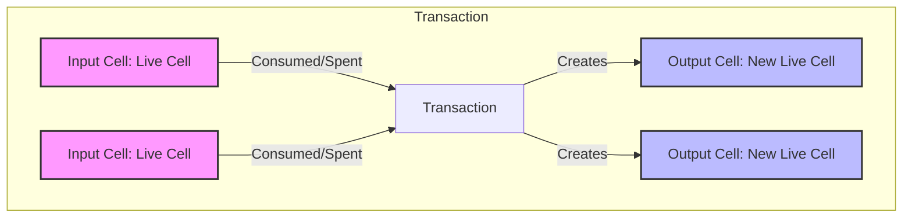
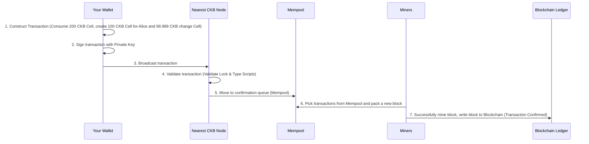

# Understanding Nervos CKB: Core Concepts, Technical Details & Terminology (Week 1)

This document synthesizes and organizes knowledge about Nervos CKB from official documentation:
1. [Nervos Blockchain](https://docs.nervos.org/docs/ckb-fundamentals/nervos-blockchain)
2. [Cell Model](https://docs.nervos.org/docs/ckb-fundamentals/cell-model)
3. [How CKB Works](https://docs.nervos.org/docs/getting-started/how-ckb-works)

---

## Table of Contents
1. [Nervos Blockchain Overview](#1-nervos-blockchain-overview)
2. [The Cell Model](#2-the-cell-model)
3. [How CKB Works](#3-how-ckb-works)
4. [Glossary](#4-glossary)

---

## 1. Nervos Blockchain Overview

### What is Nervos CKB?
**Nervos CKB (Common Knowledge Base)** is the Layer 1 (base layer) blockchain of the Nervos ecosystem. CKB's role is to provide trust for all layers above it. CKB's design maximally prioritizes **decentralization**, **minimalism**, **flexibility**, and **security**. Its primary mission is to store and protect assets and data safely and permanently.

### Multi-Layer Architecture
To solve the notorious blockchain "Trilemma" (Scalability, Security, Decentralization), Nervos designs its system in a multi-layer structure:
*   **Layer 1 (Common Knowledge Base - CKB):** Maximally focused on **Security** and **Decentralization**, serving as the trust anchor and state storage layer.
*   **Layer 2:** Focused on **Scalability**, delivering near-instant transactions at extremely low costs for millions of users.

### NC-MAX Consensus
Nervos uses an improved Proof of Work (PoW) consensus algorithm called **NC-MAX**:
*   Developed based on Bitcoin's Nakamoto Consensus.
*   Optimizes bandwidth, increases transaction throughput (TPS), and reduces confirmation time without sacrificing security or decentralization.
*   Currently delivers approximately 10x the performance of Ethereum Layer 1 and can grow dramatically when combined with Layer 2.

---

## 2. The Cell Model

The Cell Model is the heart of Nervos CKB, inheriting from Bitcoin's **UTXO** model but generalized into a **state storage model**.

### Core Properties of Cells:
*   **Immutability:** Once a Cell has been written to the blockchain, it can never be changed.
*   **Consumption:** To update a Cell's data, the mandatory process is: consume (destroy) the old Cell $\rightarrow$ extract & modify the data $\rightarrow$ create a new Cell containing the updated data.
*   **Single Consumption:** Each Cell can be consumed at most once.
    *   **Live Cell:** A Cell that has not yet been consumed; ready for use.
    *   **Dead Cell:** A Cell that has been consumed; can never be used again.

### Key Advantages of the Cell Model:
1.  **First-Class Assets:**
    *   In CKB, digital assets (CKBytes, tokens, NFTs) are directly owned by users through a Lock script, rather than sitting inside a smart contract's balance (like Ethereum's EVM).
    *   If a smart contract is exploited, attackers still cannot steal your assets because the contract does not directly hold them.
2.  **Flexible Fee Coverage:**
    *   CKB allows any third party (such as the recipient or a dApp) to pay transaction fees on the sender's behalf. The user sending the transaction is not required to hold CKB tokens in their wallet, significantly improving user experience (UX).
3.  **Scalability:**
    *   **Separation of Computation & Validation (Off-chain computation, On-chain validation):** All computation that generates new data happens off-chain; the blockchain only validates whether the data is correct.
    *   **Parallel Execution:** Each transaction runs independently on its own CKB-VM instance. The system can run multiple virtual machines simultaneously, fully utilizing multi-core CPUs.
    *   **Transaction Batching:** Allows multiple smart contract operations to be combined into a single transaction to minimize cost and block size.

---

## 3. How CKB Works

To understand how CKB operates, we need to grasp 4 foundational components: **Cell**, **Transaction**, **Scripts**, and **CKB-VM**.

### A. Cell Structure & CKBytes
Each Cell is like a storage container. The network's native token is **CKByte (or CKB)** which represents storage capacity:
$$\text{1 CKByte} = \text{1 Byte of storage space on the blockchain}$$

*   A standard Cell requires a **minimum of 61 CKBytes** to store mandatory information (Lock script, capacity field, etc.). In practice, at least 62 CKBytes is recommended to cover transaction fees.
*   When you store data, the corresponding CKBytes are locked. When the data is deleted, those CKBytes are released and can be reused.

### B. Transaction Lifecycle
Example: you want to send 100 CKBytes to Alice from a Live Cell containing 200 CKBytes:

**Result:**
*   The original 200 CKB Cell becomes a **Dead Cell**.
*   Two new Cells (100 CKB locked for Alice and 99.999 CKB locked for you) become **Live Cells**.
*   The 0.001 CKB difference is used as a transaction fee paid to the miners.

### C. Smart Contracts as Scripts
In CKB, smart contracts are executable binary code snippets called **Scripts**, running on the **CKB-VM** virtual machine. Each Script consists of 3 fields:
*   `code_hash`: The identifying hash of the Script code to be loaded into CKB-VM.
*   `hash_type`: The method the VM uses to locate the Script code (by data or by type).
*   `args`: Input parameters (e.g., the user's public key hash).

#### Two Main Types of Scripts:
1.  **Lock Script (Required):** Controls ownership and access to a Cell. Only a party with a valid signature matching the Lock Script has the right to consume the Cell.
    *   *Default system script:* Uses the `secp256k1_blake160_sighash_all` script, which uses the elliptic curve `secp256k1` algorithm combined with the `Blake2b` hash function to protect user assets.
2.  **Type Script (Optional):** Defines rules about how data in a Cell can be changed or created within a transaction (governs token logic, NFT rules, etc.).

### D. CKB-VM & Execution Cycles
*   **CKB-VM:** A virtual machine that executes Scripts based on the open-source **RISC-V** instruction set. Using this low-level instruction set optimizes hardware performance and grants developers maximum flexibility.
*   **Cycles:** A measure of the computational cost of instructions executed within a Script.
*   **Block Cycle Limit (`max_block_cycles`):** To prevent malicious code (like infinite loops that clog the network), CKB sets a maximum cycle limit per Block.
    *   On the current mainnet (`MIRANA`), `max_block_cycles` is **`3,500,000,000`**.
    *   *Note:* There is no per-transaction or per-Script cycle limit, as long as the total cycles of all transactions in a block do not exceed the block's limit.
    *   If a Script returns `0`, the transaction succeeds. If it returns any non-zero value, the transaction is considered invalid.

---

## 4. Glossary

| Term | Definition | Detailed Explanation |
| :--- | :--- | :--- |
| **Common Knowledge Base (CKB)** | Common Knowledge Base | Another name for the Nervos Blockchain Layer 1. |
| **Cell** | Cell | The most basic storage unit of CKB, containing data, tokens, and state. Inherited from UTXO. |
| **CKByte (CKB)** | CKByte | The native token of the Nervos network. 1 CKByte equals ownership of 1 Byte of on-chain storage. |
| **Live Cell** | Live Cell | A Cell that has not been consumed; represents the current state of an asset/data. |
| **Dead Cell** | Dead Cell | A Cell that has been consumed/spent in a past transaction; cannot be reused. |
| **NC-MAX** | NC-MAX | Nervos CKB's improved Proof of Work (PoW) consensus algorithm. |
| **Lock Script** | Lock Script | Code that governs Cell ownership; ensures only the holder of a valid private key can unlock the Cell. |
| **Type Script** | Type Script | Code that governs business logic, data structure, and constraints when changing a Cell's state. |
| **CKB-VM** | CKB-VM | The virtual machine that executes CKB's smart contracts (Scripts), built on the RISC-V instruction set. |
| **Cycles** | Cycles | The unit measuring the computational complexity and resources consumed by a Script running on CKB-VM. |
| **Mempool** | Memory Pool | A queue holding transactions that have passed a node's preliminary validation, waiting for miners to include them in a new block. |
| **State Rent** | State Rent | The cost of maintaining storage space on the blockchain in the form of locking CKByte tokens proportional to the bytes stored. |
| **First-Class Asset** | First-Class Asset | An asset model where assets are independently owned, controlled directly by the user's Lock Script rather than residing inside a Smart Contract. |

---

## 5. Frequently Asked Questions (Q&A)

### Q1: If no miner validates and packs a transaction into a block, has the transaction succeeded?
**Answer:** **NO, it has NOT succeeded.**
*   **Transaction State:** The transaction has only been broadcast and is waiting in the **Mempool** (the buffer queue of Nodes). This is analogous to a packet sitting in a **Tx Buffer** of an embedded device that hasn't been pushed to the physical bus (CAN/UART) and hasn't received an ACK from the receiving device.
*   **Asset (Cell) State:** The source Cell (containing your original 200 CKB) is still in **Live Cell** state (not yet consumed on the official ledger). You can still perform another transaction to spend this money.
*   **What happens next:** If miners don't select your transaction (e.g., because you set the fee too low), after a timeout period, the Nodes on the network will automatically remove (drop) that transaction from the Mempool. Your money is not lost because, on the official ledger, that transaction never existed. A transaction is only officially successful when it is packed into a new block by a miner and propagated to the blockchain (reaching at least **1 Confirmation**).

### Q2: What is a CKB System Script?
**Answer:**
*   **The practical problem:** If every transaction had to attach the full smart contract source code (signature verification code, encryption libraries...), the transaction size would be enormous and expensive to store.
*   **The solution (System Cell/Script):** CKB pre-compiles core system code snippets (like the `secp256k1_blake160_sighash_all` single-signature validation algorithm, Multisig wallet...) into RISC-V binary ELF files and stores them in special on-chain Cells called **System Cells** (initialized at the Genesis Block).
*   **System Script definition:** Scripts in user Cells that point to these System Cells by their `code_hash` hash for reuse. This works exactly like **Static Libraries/ROM Firmware** pre-installed in a microcontroller chip — your application just needs to call the library path or load the library address rather than rebuilding the library source code itself.

### Q3: How does Script Execution on CKB-VM work?
**Answer:** When a transaction is submitted to the network, the Node launches the CKB-VM (a RISC-V processor emulator) to run the validation Scripts in the following steps:
1.  **Load Code (Load Executable):** CKB-VM reads the `code_hash` field from the Script in the transaction, searches for the Cell containing the corresponding code on the blockchain, then loads the RISC-V ELF binary of that Cell into the VM's virtual RAM (analogous to a Bootloader loading Firmware from Flash into chip RAM to prepare for execution).
2.  **Fetch Parameters (Syscalls):** The Script code starts running from the `main()` function. During execution, it calls **Syscalls** (like `ckb_load_cell_data()`, `ckb_load_witnesses()`) to read data from input Cells, output Cells, and signatures (Witnesses) in the current transaction.
3.  **Execute & Count Cycles:** The VM decodes and executes each RISC-V machine instruction (ADD, SUB, JUMP...). Each instruction consumes a fixed number of **Cycles**. If the total execution cycles of all Scripts in a block exceed the consensus limit (`max_block_cycles`), the transaction is halted and aborted (equivalent to a Watchdog Timer resetting the microcontroller when the program enters an infinite loop).
4.  **Return Result (Exit Code):**
    *   If the code runs successfully and validates correctly (e.g., the signature matches the public key hash), the program exits and returns exit code `0` (transaction is valid).
    *   If any rule is violated, the program returns a non-zero error code (e.g., `-1`), and the transaction is immediately considered invalid and rejected.
