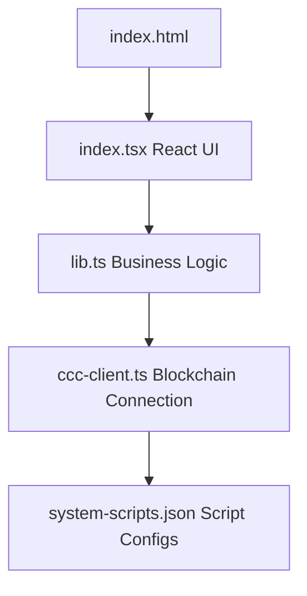
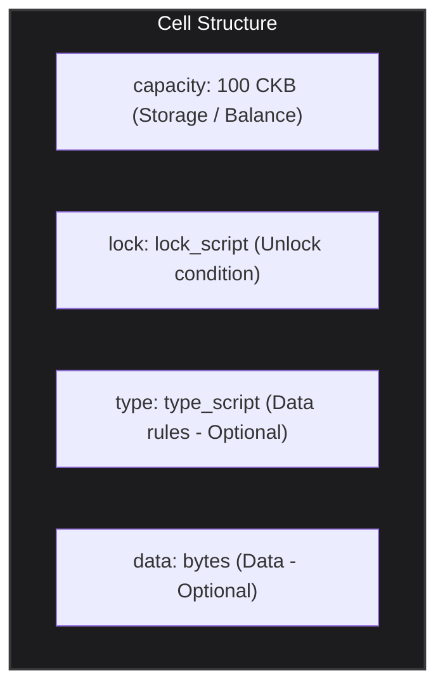
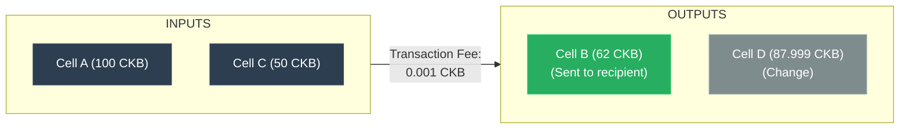
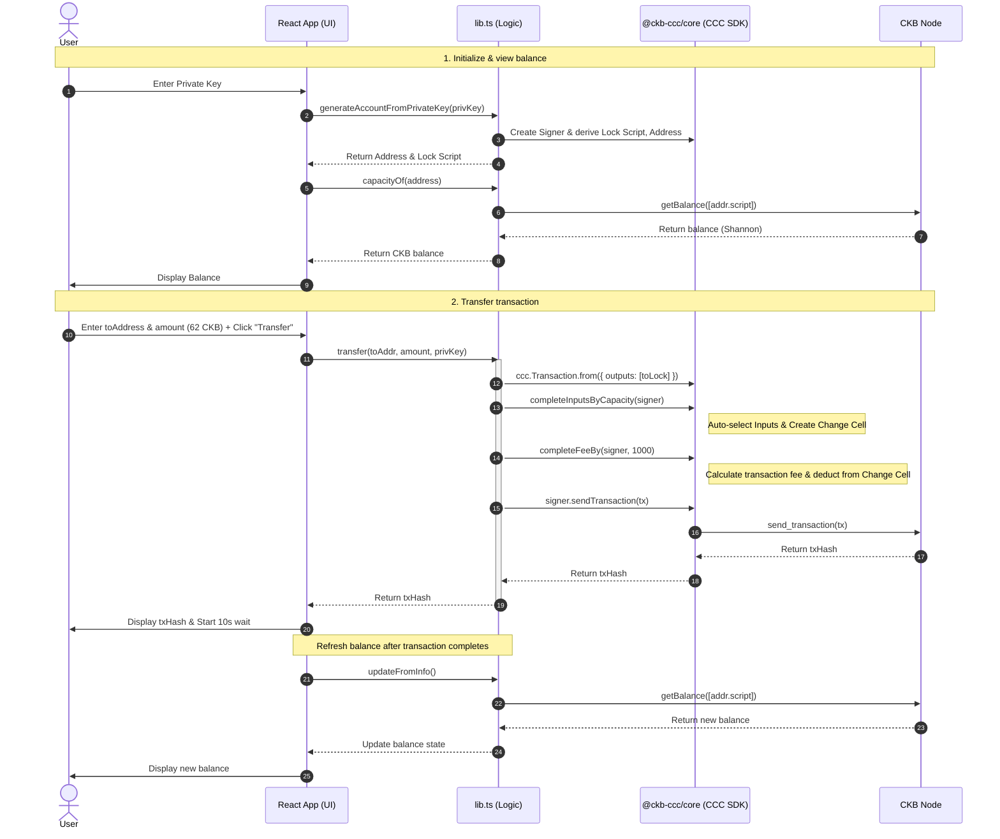
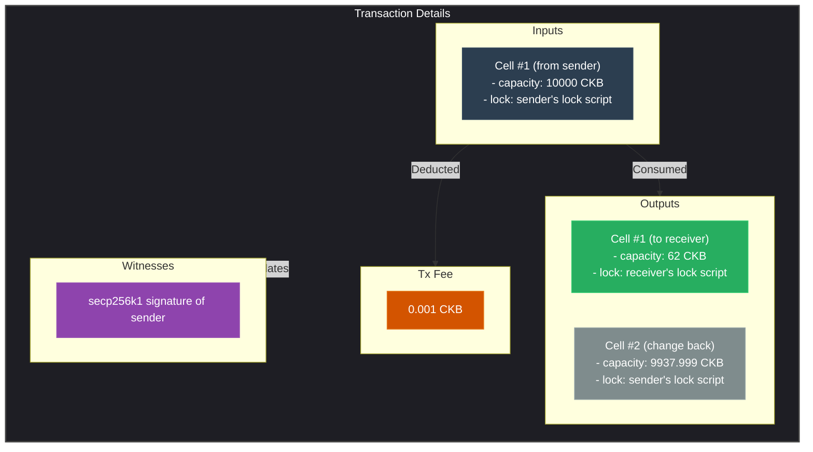

# 📖 Detailed Explanation: Simple Transfer dApp

> **Reference**: [Transfer CKB Tutorial - Nervos Docs](https://docs.nervos.org/docs/dapp/transfer-ckb)
>
> This is a simple example dApp to **view balances** and **transfer CKB** on the Nervos CKB blockchain.

---

## 📋 Table of Contents

1. [Overview](#1-overview)
2. [Project Architecture](#2-project-architecture)
3. [CKB Concepts to Know Beforehand](#3-ckb-concepts-to-know-beforehand)
4. [Analyzing `ccc-client.ts` — Blockchain Connection](#4-analyzing-ccc-clientts--blockchain-connection)
5. [Analyzing `lib.ts` — Business Logic](#5-analyzing-libts--business-logic)
6. [Analyzing `index.tsx` — React UI](#6-analyzing-indextsx--react-ui)
7. [End-to-End Flow](#7-end-to-end-flow)
8. [Why Must You Transfer a Minimum of 61 CKB?](#8-why-must-you-transfer-a-minimum-of-61-ckb)
9. [Other Supporting Components](#9-other-supporting-components)
10. [How to Run the Example](#10-how-to-run-the-example)
11. [Detailed Transaction Analysis on CKB Explorer](#11-detailed-transaction-analysis-on-ckb-explorer)
12. [Explaining the Run Commands](#12-explaining-the-run-commands)
13. [Comparing Testnet and Devnet Environments](#13-comparing-testnet-and-devnet-environments)
14. [Summary of Knowledge Gained](#14-summary-of-knowledge-gained)

---

## 1. Overview

### Purpose
This dApp performs the **2 most fundamental functions** when working with CKB:

| Function | Description |
|----------|-------------|
| **View Balance** | Enter a private key → display CKB address, lock script, and total capacity (balance) |
| **Transfer CKB** | Enter recipient address + amount → build transaction → sign → submit to blockchain |

### Tech Stack

| Technology | Role |
|------------|------|
| **React 18** | Build UI |
| **TypeScript** | Type-safe code |
| **Parcel** | Bundler (instead of Webpack/Vite) |
| **@ckb-ccc/core** (v1.5.3+) | Main SDK for interacting with CKB blockchain |

---

## 2. Project Architecture

```
simple-transfer/
├── index.html          # HTML entry point
├── index.tsx           # Main React component (UI)
├── lib.ts              # Business logic: create account, view balance, transfer CKB
├── ccc-client.ts       # CCC client configuration for CKB node connection
├── system-scripts.json # System scripts configuration (devnet/testnet/mainnet)
├── package.json        # Dependencies and scripts
└── tsconfig.json       # TypeScript configuration
```

### Dependency flow between files:



---

## 3. CKB Concepts to Know Beforehand

### 3.1 Cell Model

CKB uses the **Cell Model** instead of the Account Model (Ethereum) or UTXO (Bitcoin). Each Cell is a "box" containing data:



> **Important**: `capacity` is both the **CKB balance** and the **maximum storage capacity** the cell can hold.

### 3.2 Capacity & Shannon

- **1 CKB = 100,000,000 Shannon** (similar to 1 BTC = 100,000,000 Satoshi)
- Capacity is measured in Shannon (smallest unit)
- Capacity defines the **maximum bytes** a cell can occupy on the blockchain
- **1 CKB = 1 byte** of storage space

### 3.3 Lock Script

A Lock Script defines **who has the right to use (spend)** a Cell. Structure:

```json
{
  "codeHash": "0x9bd7e06f...",  // Hash of the validation code
  "hashType": "type",            // How to find code: "type" or "data"
  "args": "0xabc123..."          // Arguments (usually public key hash)
}
```

With the **secp256k1_blake160** lock script (default):
- `codeHash`: points to secp256k1 signature verification code
- `args`: contains the **blake160 hash** of the public key (20 bytes)

### 3.4 Transaction on CKB



Rule: Total Input ≥ Total Output + Tx Fee
     150 CKB  ≥  62 + 87.999 + 0.001

---

## 4. Analyzing `ccc-client.ts` — Blockchain Connection

This file is responsible for **creating the CCC client** to communicate with the CKB node.

### 4.1 Import

```typescript
import { ccc, CellDepInfoLike, KnownScript, Script } from "@ckb-ccc/core";
import systemScripts from "./system-scripts.json";
```

- `ccc`: Main SDK namespace (Common Chains Connector)
- `KnownScript`: Enum of known scripts (Secp256k1, Multisig, OmniLock...)
- `systemScripts`: JSON with script configurations for devnet/testnet/mainnet

### 4.2 Type Definitions

```typescript
export type Network = 'devnet' | 'testnet' | 'mainnet';

export type ScriptInfo = Pick<Script, "codeHash" | "hashType"> & {
  cellDeps: CellDepInfoLike[]
};
```

- **Network**: 3 CKB network types:
  - `devnet`: local development network (using offckb)
  - `testnet` (Pudge): public test network
  - `mainnet` (Lina): official main network
- **ScriptInfo**: Script information including `codeHash`, `hashType`, and `cellDeps`

### 4.3 DEVNET_SCRIPTS — Mapping System Scripts

```typescript
export const DEVNET_SCRIPTS: Record<string, ScriptInfo> = {
  [KnownScript.Secp256k1Blake160]:
    systemScripts["devnet"].secp256k1_blake160_sighash_all!.script as ScriptInfo,
  [KnownScript.Secp256k1Multisig]: ...,
  [KnownScript.AnyoneCanPay]: ...,
  [KnownScript.OmniLock]: ...,
  [KnownScript.XUdt]: ...,
  [KnownScript.NervosDao]: ...,
};
```

**Why is this needed?**
- On testnet/mainnet, the CCC SDK **already knows** the addresses of system scripts
- On devnet (local), scripts are deployed at different locations → must be **specified manually**
- The `system-scripts.json` file contains detailed information for all 3 networks

### 4.4 buildCccClient — Creating the Connection Client

```typescript
export function buildCccClient(network: Network) {
  const client =
    network === "mainnet"
      ? new ccc.ClientPublicMainnet()          // Connect to mainnet
      : network === "testnet"
      ? new ccc.ClientPublicTestnet()           // Connect to testnet
      : new ccc.ClientPublicTestnet({
          url: "http://localhost:28114",         // Devnet RPC proxy URL
          scripts: DEVNET_SCRIPTS as any,       // Pass scripts config manually
        });
  return client;
}
```

**Explanation**:
- `ClientPublicMainnet()` / `ClientPublicTestnet()`: Uses Nervos' default **public RPC endpoints**
- Devnet: Creates a `ClientPublicTestnet` but points the URL to **localhost:28114** (offckb proxy) and passes a custom scripts config

### 4.5 readEnvNetwork — Reading Network from Environment

```typescript
export function readEnvNetwork(): Network {
  const network = process.env.NETWORK;
  const defaultNetwork = 'testnet';
  if (!network) return defaultNetwork;
  if (!['devnet', 'testnet', 'mainnet'].includes(network)) {
    return defaultNetwork;
  }
  return network as Network;
}
```

- Defaults to `testnet` if the `NETWORK` env variable is not set
- To use devnet: `NETWORK=devnet npm start`

### 4.6 Exporting the Client Instance

```typescript
export const cccClient = buildCccClient(readEnvNetwork());
```

→ Creates a **singleton client** for use across the entire app.

---

## 5. Analyzing `lib.ts` — Business Logic

This file contains **3 main functions**: create account, view balance, transfer CKB.

### 5.1 Account Type

```typescript
type Account = {
  lockScript: Script;  // Lock script (who owns the cell)
  address: string;     // CKB address (bech32m format)
  pubKey: string;      // Public key
};
```

### 5.2 `generateAccountFromPrivateKey` — Create Account from Private Key

```typescript
export const generateAccountFromPrivateKey = async (
  privKey: string
): Promise<Account> => {
  // Step 1: Create signer from private key
  const signer = new ccc.SignerCkbPrivateKey(cccClient, privKey);

  // Step 2: Get address object using secp256k1
  const lock = await signer.getAddressObjSecp256k1();

  // Step 3: Return account info
  return {
    lockScript: lock.script,     // Lock script: { codeHash, hashType, args }
    address: lock.toString(),    // CKB address format: ckt1q... or ckb1q...
    pubKey: signer.publicKey,    // Public key hex
  };
};
```

**Conversion flow**:

```mermaid
flowchart TD
    A["Private Key (32 bytes hex)"] -->|secp256k1 elliptic curve| B["Public Key (33 bytes compressed)"]
    B -->|blake160 hash (take first 20 bytes)| C["Lock Args (20 bytes)"]
    C -->|combined with codeHash + hashType| D["Lock Script"]
    D -->|bech32m encoding| E["CKB Address (ckt1q... or ckb1q...)"]
```

### 5.3 `capacityOf` — View Balance of an Address

```typescript
export async function capacityOf(address: string): Promise<bigint> {
  // Step 1: Parse address string into Address object
  const addr = await ccc.Address.fromString(address, cccClient);

  // Step 2: Query blockchain to get total balance
  // getBalance finds all live cells with matching lock script
  // then sums their capacities
  let balance = await cccClient.getBalance([addr.script]);

  return balance; // Returns in Shannon (bigint)
}
```

**What does `getBalance` do internally?**
1. Extracts the `lock script` from the address
2. Calls the `get_cells` RPC to find all **live cells** (unconsumed cells) with a matching lock script
3. Sums the `capacity` of all those cells
4. Returns the total as a `bigint` (in Shannon)

### 5.4 `transfer` — Transfer CKB ⭐ (Most Important)

This is the **core function** of the dApp. Step-by-step analysis:

```typescript
export async function transfer(
  toAddress: string,        // Recipient address
  amountInCKB: string,      // Amount of CKB to send
  signerPrivateKey: string  // Sender's private key
): Promise<string> {
```

#### Step 1: Create Signer

```typescript
const signer = new ccc.SignerCkbPrivateKey(cccClient, signerPrivateKey);
```
Signer = an object capable of **signing transactions** using the private key.

#### Step 2: Parse Recipient Address → Lock Script

```typescript
const { script: toLock } = await ccc.Address.fromString(toAddress, cccClient);
```
Converts the address string → lock script to use as the output cell.

#### Step 3: Build Transaction Skeleton

```typescript
const tx = ccc.Transaction.from({
  outputs: [{ lock: toLock }],    // 1 output cell for the recipient
  outputsData: [],                 // No data
});
```

At this point the transaction is **incomplete**: no inputs, no capacity for the output, no fee.

#### Step 4: Set Output Capacity

```typescript
tx.outputs.forEach((output, i) => {
  if (output.capacity > ccc.fixedPointFrom(amountInCKB)) {
    alert(`Insufficient capacity at output ${i} to store data`);
    return;
  }
  output.capacity = ccc.fixedPointFrom(amountInCKB);
});
```

- `ccc.fixedPointFrom(amountInCKB)`: Converts "62" CKB → `6200000000n` Shannon
- Sets the output cell's capacity to the amount of CKB to transfer
- Checks: if the cell already has a larger capacity (due to data), alert error

#### Step 5: Auto-Add Inputs (CCC Magic ✨)

```typescript
await tx.completeInputsByCapacity(signer);
```

**This is CCC SDK's strength!** This function automatically:
1. Finds live cells belonging to `signer` (based on lock script)
2. Selects enough cells so that total capacity ≥ total outputs
3. Adds those cells to `tx.inputs`
4. Automatically creates a **change cell** if needed

#### Step 6: Auto-Calculate & Complete Fee

```typescript
await tx.completeFeeBy(signer, 1000);
```

- `1000`: fee rate (Shannon per byte)
- Automatically calculates fee based on transaction size
- Adjusts the change cell capacity so that: `total inputs = total outputs + fee`

#### Step 7: Sign & Submit Transaction

```typescript
const txHash = await signer.sendTransaction(tx);
```

This function does 3 things:
1. **Sign**: Creates a secp256k1 signature for the transaction
2. **Add witness**: Places the signature into the witnesses array
3. **Send**: Calls the `send_transaction` RPC to send to the CKB node

Returns `txHash` — the unique identifier of the transaction.

#### Step 8: Log Explorer Link

```typescript
console.log(
  `Go to explorer to check the sent transaction https://pudge.explorer.nervos.org/transaction/${txHash}`
);
```

### 5.5 Utility Functions

```typescript
// Wait N seconds
export async function wait(seconds: number) {
  return new Promise((resolve) => setTimeout(resolve, seconds * 1000));
}

// Convert Shannon → CKB (divide by 10^8)
export function shannonToCKB(amount: bigint) {
  return amount / 100000000n;  // BigInt division
}
```

---

## 6. Analyzing `index.tsx` — React UI

### 6.1 State Management

```typescript
// === Account Info ===
const [privKey, setPrivKey] = useState('0x6109170b...');  // Private key (default: offckb account #1)
const [fromAddr, setFromAddr] = useState('');              // CKB address derived from private key
const [fromLock, setFromLock] = useState<Script>();        // Lock script
const [balance, setBalance] = useState('0');               // Balance (CKB)

// === Transfer Info ===
const [toAddr, setToAddr] = useState('ckt1qzda0cr08m85hc8...');  // Recipient address (default: account #2)
const [amountInCKB, setAmountInCKB] = useState('62');             // CKB to send (default: 62)

// === UI State ===
const [isTransferring, setIsTransferring] = useState(false);  // Loading state
const [txHash, setTxHash] = useState<string>();                // Transaction hash after submission
```

> **Note**: Default values (`privKey`, `toAddr`) come from **offckb devnet accounts** — use only for dev/testing.

### 6.2 useEffect — Auto-load Account Info

```typescript
useEffect(() => {
  if (privKey) {
    updateFromInfo();
  }
}, [privKey]);
```

Every time `privKey` changes → automatically calls `updateFromInfo()` to update the address, lock script, and balance.

### 6.3 updateFromInfo — Update Account Info

```typescript
const updateFromInfo = async () => {
  const { lockScript, address } = await generateAccountFromPrivateKey(privKey);
  const capacity = await capacityOf(address);
  setFromAddr(address);
  setFromLock(lockScript);
  setBalance(shannonToCKB(capacity).toString());
};
```

Flow: Private Key → Account Info → Query Balance → Update UI

### 6.4 onInputPrivKey — Validate Private Key

```typescript
const onInputPrivKey = (e) => {
  const priv = e.target.value;
  const privateKeyRegex = /^0x[0-9a-fA-F]{64}$/;  // 0x + 64 hex chars = 32 bytes

  const isValid = privateKeyRegex.test(priv);
  if (isValid) {
    setPrivKey(priv);
  } else {
    alert(`Invalid private key: must start with 0x and 32 bytes length...`);
  }
};
```

Validation: Private key must be `0x` + 64 hex characters (= 32 bytes).

### 6.5 onTransfer — Handle CKB Transfer

```typescript
const onTransfer = async () => {
  setIsTransferring(true);

  // Call transfer function, catch errors with alert
  const txHash = await transfer(toAddr, amountInCKB, privKey).catch(alert);

  if (txHash) {
    setTxHash(txHash);

    // Wait 10 seconds for transaction to be confirmed
    // (correct approach is to poll using RPC get_transaction, but kept simple here)
    await wait(10);

    // Refresh balance
    await updateFromInfo();
  }

  setIsTransferring(false);
};
```

### 6.6 Transfer Button — Enable/Disable Logic

```typescript
const enabled =
  +amountInCKB > 61 &&        // Amount > 61 CKB (minimum cell capacity)
  +balance > +amountInCKB &&   // Balance is sufficient
  toAddr.length > 0 &&         // Recipient address provided
  !isTransferring;             // Not currently in the transfer process
```

### 6.7 Amount Tip — Minimum Warning

```typescript
const amountTip =
  amountInCKB.length > 0 && +amountInCKB < 61 ? (
    <span>
      amount must larger than 61 CKB, see <a href="...">why</a>
    </span>
  ) : null;
```

---

## 7. End-to-End Flow

### Scenario: User transfers 62 CKB



### Transaction Illustration:



---

## 8. Why Must You Transfer a Minimum of 61 CKB?

On CKB, every cell occupies space on the blockchain. **Capacity must be ≥ the actual cell size**.

Calculating the minimum cell size (lock-only, no data, no type script):

| Component | Size |
|-----------|------|
| `capacity` field | 8 bytes |
| `lock script` codeHash | 32 bytes |
| `lock script` hashType | 1 byte |
| `lock script` args (blake160) | 20 bytes |
| Overhead | 0 bytes |
| **Total** | **61 bytes** |

Because **1 CKB = 1 byte** of space → **minimum 61 CKB** for a secp256k1 cell.

> This is why the code checks `+amountInCKB > 61` before allowing a transfer.

---

## 9. Other Supporting Components

### 9.1 `system-scripts.json`

This file contains configuration for **all system scripts** across 3 networks. Each script includes:

```json
{
  "codeHash": "0x...",    // Script identifying hash
  "hashType": "type",     // How to reference the script
  "cellDeps": [...]       // Cells containing the executable code
}
```

Key scripts:
| Script | Purpose |
|--------|---------|
| `secp256k1_blake160_sighash_all` | Default lock script, validates secp256k1 signatures |
| `secp256k1_blake160_multisig_all` | Multi-signature lock script |
| `anyone_can_pay` | Lock script allowing anyone to receive funds |
| `omnilock` | Versatile lock script (supports multiple key types) |
| `xudt` | Type script for tokens (eXtensible UDT) |
| `dao` | Type script for Nervos DAO (staking) |

### 9.2 `package.json`

```json
{
  "scripts": {
    "start": "parcel index.html",           // Dev server
    "build": "parcel build index.html ...",  // Production build
    "lint": "tsc --noEmit"                   // Type checking
  },
  "dependencies": {
    "@ckb-ccc/core": "^1.5.3",   // Main CKB SDK
    "react": "^18.2.0",          // UI framework
    "react-dom": "^18.2.0"       // React DOM renderer
  },
  "devDependencies": {
    "parcel": "^2.15.4",             // Bundler
    "crypto-browserify": "^3.12.0",  // Polyfill for crypto module
    "events": "^3.1.0",             // Polyfill for events module
    "process": "^0.11.10",          // Polyfill for process (env vars)
    "stream-browserify": "^3.0.0",  // Polyfill for stream module
    "path-browserify": "^1.0.0"     // Polyfill for path module
  }
}
```

> **Why so many polyfills?** Because `@ckb-ccc/core` uses Node.js APIs (crypto, stream...) that browsers don't have. Parcel needs these polyfills to run in the browser.

### 9.3 `index.html`

```html
<!DOCTYPE html>
<html lang="en">
  <head>
    <meta charset="UTF-8" />
    <title>View and Transfer Balance</title>
  </head>
  <body>
    <div id="root"></div>
    <script src="index.tsx" type="module"></script>  <!-- Parcel handles TSX directly -->
  </body>
</html>
```

---

## 10. How to Run the Example

### Requirements
- **Node.js** version 18 or higher.
- **npm** or **yarn** package manager.

---

### Running on Testnet (CKB Test Network)

This is the process for running the app directly on Nervos CKB's public test network (Testnet).

#### Step 1: Install dependencies
Open a terminal in the example directory (`week1/docs.nervos.org/examples/dApp/simple-transfer`) and install dependencies:
```bash
npm install
```

#### Step 2: Start the application
The system defaults to `testnet` if the `NETWORK` environment variable is not specified. However, to ensure the application connects to Testnet correctly, run with:
```bash
NETWORK=testnet npm start
```
The app will start via Parcel at the default port: **`http://localhost:1234`**.

#### Step 3: Log in & Get Testnet CKB (Faucet)
1. Open your web browser and navigate to **`http://localhost:1234`**.
2. On the dApp interface, a default test **Private Key** will be pre-filled. The app will automatically derive a corresponding **CKB Address** (starting with `ckt1qyq...`).
3. **Copy your CKB Address**.
4. Visit the faucet to get free testnet coins: **[Nervos CKB Testnet Faucet](https://faucet.nervos.org/)**.
5. Paste your address into the Faucet input field, complete the captcha, and click **Claim**.
6. Wait approximately **10–30 seconds** for the Faucet transaction to be confirmed (mined) on Testnet. The **Total capacity** on the dApp will then update with the new balance (usually `10,000 CKB`).

> **Tip**: If you already have your own testnet wallet (e.g., from JoyID or another wallet), you can paste its **Private Key** directly into the dApp's input field. The dApp will automatically sync the address and display the actual balance.

#### Step 4: Perform a Transfer
1. In the **Transfer to Address** field: keep the default destination address (`ckt1qzda...`) or enter any other valid testnet address.
2. In the **Amount** field: enter the amount of CKB to send (note: must be more than **61 CKB** as this is the minimum for a Cell).
3. Click the **Transfer** button. The button will become disabled/loading.
4. After the transaction completes:
   - A **tx hash: 0x...** line will appear on screen.
   - You can click the hash to look up transaction details on the **[CKB Testnet Explorer](https://pudge.explorer.nervos.org/)**.
   - After 10 seconds, the dApp will automatically refresh your new balance (old balance minus amount sent and a small gas fee ~0.001 CKB).

---

### Running on Devnet (Local Node)

If you want to test on a locally isolated virtual network on your personal computer using the `offckb` tool for extremely fast testing:

#### Step 1: Start your local devnet node
```bash
offckb node
```
This command starts the local CKB blockchain. It comes with an RPC server listening on port `8114` and a proxy on port `28114`.

#### Step 2: Start the dApp pointing to devnet
In the project directory, start the Parcel server with the environment variable configured to connect to devnet:
```bash
NETWORK=devnet npm start
```
Open your browser at: **`http://localhost:1234`**.

#### Step 3: View the local pre-funded accounts
Open a new terminal and run:
```bash
offckb accounts
```
This lists 20 accounts with their private keys (`privkey`) and corresponding addresses.

#### Step 4: Perform a transfer on Devnet
1. **Sender**:
   - On the dApp UI, the **Private Key** input field already contains: `0x6109170b275a09ad54877b82f7d9930f88cab5717d484fb4741ae9d1dd078cd6`.
   - This corresponds to **Account #1** in your devnet. The displayed balance will be very large (approximately `420,000 CKB`).
2. **Receiver**:
   - Copy the address of any local test account from the `offckb accounts` output (e.g., **Account #4** or **Account #5**).
   - Paste it into the **Transfer to Address** field on the dApp.
3. **Transfer**:
   - Enter the amount of CKB to send (minimum more than 61 CKB).
   - Click **Transfer**.
   - Transactions on Devnet happen almost **instantly** (a few milliseconds). The **Total capacity** will decrease immediately by the amount sent + a tiny gas fee, and the `tx hash` will appear on screen right away.

## 11. Detailed Transaction Analysis on CKB Explorer

Below is a real screenshot and detailed analysis of a CKB Testnet transaction on the CKB Testnet Explorer interface:


### General Parameters
- **Transaction Hash (`0xf5686e1593ee581c2b5cda616d51d78a864dbb9a70739d4179d2fdbbfa90d37`)**: The unique identifier (ID) of this transaction on the network.
- **Block Height (`21,488,375`)**: This transaction was packed by miners into block number `21,488,375`.
- **Timestamp (`2026/06/20 22:10:42`)**: The time the block was successfully mined (UTC).
- **Transaction Fee | Fee Rate (`0.00000465 CKB | 1,002 shannons/kB`)**:
  - `0.00000465 CKB` (equivalent to `465 Shannons`): Transaction fee paid to miners.
  - `1,002 shannons/kB`: Fee rate per kilobyte of data.
- **Status (`34 Confirmations`)**: Number of subsequent blocks confirming this transaction. More confirmations = greater immutability and security.
- **Size (`460 Bytes`)**: The actual physical size of the raw transaction when transmitted over the network.
- **Cycles (`1,612,700`)**: Computational resource (CPU) index consumed by CKB-VM to execute the validator script code for signature verification.

### Input & Output Analysis
- **Input (1) — Source**:
  - Consumes **1 Cell** (`Input #0`) belonging to the sender at wallet address: `ckt1qzda...f40px3f599cytcyd8`.
  - The Cell's original capacity before the transaction was: **`1,244.88952052 CKB`**.
- **Output (2) — Results**: The transaction produces **2 new Cells**:
  - `Output #0`: Transfers exactly **`62.00000000 CKB`** to the recipient's address: `ckt1qzda...q5lrlyt52lg48ucew`.
  - `Output #1` (Change Cell): Returns the remaining balance **`1,182.88951587 CKB`** to the original sender's wallet `ckt1qzda...f40px3f599cytcyd8`.

### Financial Reconciliation Formula
$$\text{Total Input Capacity} = \text{Total Output Capacity} + \text{Transaction Fee (Tx Fee)}$$
$$\Rightarrow 1,244.88952052\text{ CKB} = (62.00000000\text{ CKB} + 1,182.88951587\text{ CKB}) + 0.00000465\text{ CKB}$$
$$\Rightarrow 1,244.88952052\text{ CKB} = 1,244.88952052\text{ CKB}$$

This balance confirms the transaction was designed and executed perfectly correctly.

---

## 12. Explaining the Run Commands

Below is a detailed breakdown of all commands used in the `simple-transfer` project:

### 1. `npm install`
- **What it does**: Reads `package.json` and `package-lock.json` to download all required libraries (dependencies). All libraries are stored in the `node_modules` directory.
- **When to use**:
  - When you first download/clone the project.
  - When there are changes (add, modify, remove packages) to `package.json` from other developers.
- **Additional info**: You can also use `yarn` or `pnpm install` if preferred.

### 2. `npm start` (or `npm run start`)
- **What it does**: Runs the `parcel index.html` command configured in the `scripts` field of `package.json`. This command:
  1. Compiles TypeScript (`.ts`, `.tsx`) and HTML files into browser-runnable JavaScript.
  2. Starts a local dev server with HMR (Hot Module Replacement — auto-reloads the page when code changes).
  3. Listens and connects by default to the **Testnet**.
- **When to use**: When you want to run the app in a browser for testing, development, or debugging.

### 3. `NETWORK=testnet npm start`
- **What it does**: Same as `npm start` but explicitly sets the `NETWORK` environment variable to `testnet`.
- **When to use**: When you want to run your dApp and transact directly on Nervos CKB's public test network. This variable tells the CCC SDK to configure connection endpoints to the public CKB Testnet node.

### 4. `NETWORK=devnet npm start`
- **What it does**: Sets the `NETWORK` environment variable to `devnet` and starts the dev server.
- **When to use**: When you want to run this dApp and connect it to the local (Devnet) node running on your personal computer instead of the public testnet. The CCC Client will communicate through local port `http://localhost:28114`.

### 5. `offckb node`
- **What it does**: An `offckb` tool command that downloads and starts a local development CKB node (Devnet) in the background. This node comes with 20 pre-funded test accounts and has necessary system scripts pre-deployed.
- **When to use**: Run this command before using `NETWORK=devnet npm start`.
- **Additional info**: The local node lets you test your app at extreme speed without waiting for Testnet block confirmation times and without needing to visit the Faucet for test coins.

### 6. `npm run build`
- **What it does**: Runs the production build command: `parcel build index.html --dist-dir dist --public-url ./`. It optimizes code size (minify, tree-shake) and outputs to the `dist` directory.
- **When to use**: When you've finished development and want to deploy the dApp to static web hosting services (like Vercel, Netlify, GitHub Pages...).
- **Additional info**: The built files will be very lightweight, secure, and run independently without Parcel's dev server.

### 7. `npm run lint`
- **What it does**: Runs `tsc --noEmit` to have the TypeScript compiler scan through the entire project source code to find type errors without emitting any JS files.
- **When to use**: Before committing source code to git or before building the production bundle to ensure there are no syntax or type errors.

---

## 13. Comparing Testnet and Devnet Environments

Although both environments serve the purpose of dApp development and testing, they differ fundamentally in practice:

| Criterion | Testnet (Public Test Network) | Devnet (Local Node) |
| :--- | :--- | :--- |
| **Node connection** | Connects over the Internet to public RPC nodes run by the community/Nervos Foundation. | Connects locally to a virtual node running on your personal machine (`http://localhost:28114`). |
| **Confirmation speed** | Takes **10–20 seconds** for transactions to be verified by miners and included in a global consensus block. | Almost **instant** (a few milliseconds) because blocks are auto-generated immediately on the local machine. |
| **System Scripts (Secp256k1, Omnilock...)** | **Fixed**: `codeHash` and location (`outPoint`) are fixed. The CCC SDK recognizes them automatically without extra configuration. | **Dynamic**: Redeployed each time a new local node is initialized. You must manually load `system-scripts.json` into the CCC Client. |
| **Getting test CKB** | Must request via the **online Faucet** (`faucet.nervos.org`) and wait for the transfer to complete. | Uses **pre-funded accounts** pre-loaded with millions of virtual CKB generated when the node first starts. |
| **Privacy** | All your transactions are publicly visible on the global blockchain explorer. | Completely local on your machine; no one outside can see your test data. |
| **Data persistence** | Transactions are stored permanently on the public test ledger. | Can be completely wiped (reset) back to the initial state at any time via `offckb clean`. |

### Implementation details in code:

#### 1. Connection client configuration (`ccc-client.ts`)
Depending on the `NETWORK` environment variable, the app selects the endpoint:
* **Testnet**: Uses `ccc.ClientPublicTestnet()` with a public endpoint.
* **Devnet**: Uses `ccc.ClientPublicTestnet` but passes the option `url: "http://localhost:28114"` to override the endpoint locally, along with the `DEVNET_SCRIPTS` configuration loaded from `system-scripts.json`.

#### 2. CKB Address format
On both environments, test addresses start with the prefix `ckt1...` (CKB Testnet/Devnet Address).
- However, an address holding test CKB received on the local Devnet is completely worthless on the public Testnet, and vice versa. They operate on two completely independent ledgers.

---

## 14. Summary of Knowledge Gained

After working through this example, you have learned:

| # | Knowledge | Details |
|---|-----------|---------|
| 1 | **Cell Model** | Understanding Cell structure: capacity, lock, type, data |
| 2 | **Lock Script** | How to define Cell ownership |
| 3 | **Capacity & Shannon** | The unit of currency and storage on CKB |
| 4 | **CKB Address** | How to derive from private key → public key → lock script → address |
| 5 | **CKB Transaction** | Structure of inputs/outputs, change cell, fee |
| 6 | **CCC SDK** | How to use `@ckb-ccc/core` to query balance and send transactions |
| 7 | **System Scripts** | Role of secp256k1_blake160 and other scripts |
| 8 | **Network Config** | How to connect to devnet/testnet/mainnet |
| 9 | **Min Cell Capacity** | Why a minimum of 61 CKB is needed for a cell |

### Quick Comparison with Ethereum

| | CKB | Ethereum |
|---|-----|----------|
| Model | Cell Model (UTXO++) | Account Model |
| Smallest unit | Shannon | Wei |
| Ratio | 1 CKB = 10^8 Shannon | 1 ETH = 10^18 Wei |
| "Address" | Lock Script + bech32m | Keccak256(pubkey)[12:] |
| Transaction | Consume cells → Create new cells | Directly modify state |
| Smart Contract | Script (lock/type) attached to Cell | Contract exists independently |
| SDK | @ckb-ccc/core | ethers.js / web3.js |

---

> 📝 **Note**: This is the most basic tutorial (Level 1) in the Nervos dApp tutorial series. Upcoming tutorials will cover: xUDT tokens, Spore DOB (Digital Objects), and Script development.
