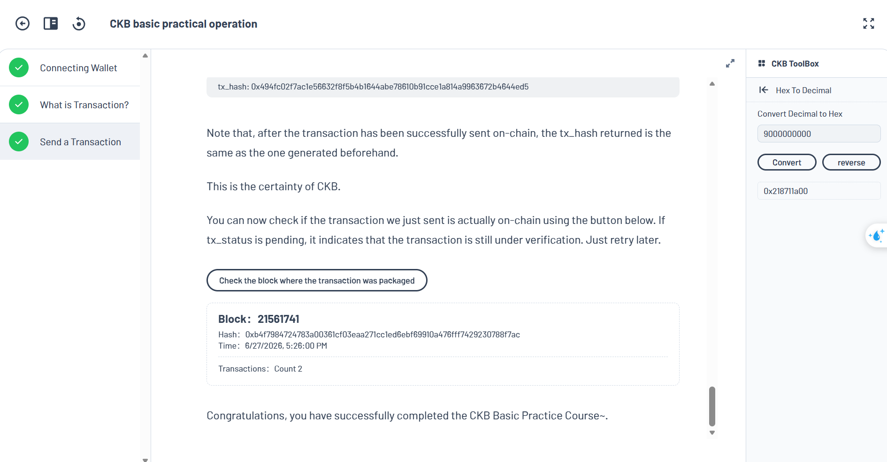
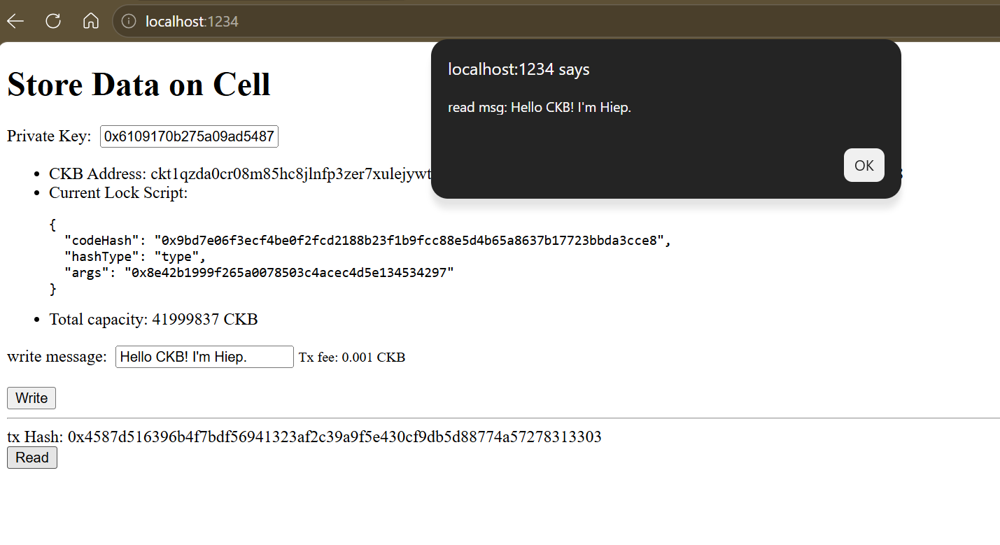
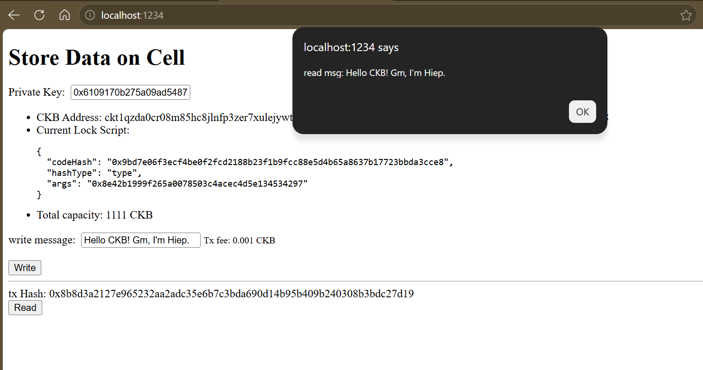

## Builder Track Weekly Report — Week 2

**Name:** Hiep Thach  
**Week Ending:** 06-28-2026

---

### Courses Completed

- **Module 2 — CKB Basic Practical Operation** ([CKB Academy](https://academy.ckb.dev/courses/basic-operation))
  - **Chapter 1 — Cell Model & Live Cells**: Connected wallet via JoyID/MetaMask; observed 10 Live Cells (100 CKB each) provisioned for the testnet account; decoded `0x2540be400` = 10,000,000,000 Shannons = 100 CKB (1 CKB = 10^8 Shannons); understood that wallet balance = total capacity of all Live Cells owned by the private key
  - **Chapter 1 — Cellbase Transaction**: Analyzed the special miner reward transaction (analogous to Bitcoin's Coinbase) — `txHash = 0x000...000`, `index = 0xffffffff`; read the actual JSON structure of block 21531277 on CKB Testnet
  - **Chapter 1 — Chain Configuration**: Studied System Scripts pre-deployed in the genesis block: `SECP256K1_BLAKE160`, `SECP256K1_BLAKE160_MULTISIG`, `DAO`, `SUDT`, `ANYONE_CAN_PAY`, `OMNILOCK`; testnet addresses use the `ckt` prefix, mainnet uses `ckb`
  - **Chapter 2 — What is Transaction?**: CKB follows an "Off-chain computing, on-chain verifying" model — transactions can be built entirely offline; full TX structure includes `inputs`, `outputs`, `cellDeps`, `outputsData`, `witnesses`, `headerDeps`; distinguished between `depType: "code"` and `depType: "depGroup"`
  - **Chapter 3 — Send a Transaction**: Hands-on practice building a transaction manually: used the Toolbox to select a Live Cell as input → used the Address Tool to decode a wallet address into a lock script → filled in cellDeps (Omnilock + Secp256k1) → Generate TX Hash → Sign → Send; encountered and resolved 2 real-world errors
  - **Advanced Deep Dive**: `WitnessArgs` structure (lock / input_type / output_type); Omnilock's versatility (supports MetaMask, Bitcoin, JoyID/Passkey via WebAuthn); the strict Blake2b signing process (tx_hash → group inputs by lock → accumulate-hash with witnesses → Message → Signature)

- **Store Data on Cell Tutorial** ([Nervos Docs](https://docs.nervos.org/docs/dapp/store-data-on-cell))
  - Read and analyzed the full source code of the sample dApp (4 files: `ccc-client.ts`, `lib.ts`, `index.tsx`, `system-scripts.json`)
  - Understood the UTF-8 ↔ Hex encode/decode mechanism (`TextEncoder` / `TextDecoder`)
  - Successfully ran the dApp on both **Devnet** (local) and **Testnet** (public)

---

### Key Learnings

- **Cells are Immutable**: You cannot edit a Cell once it exists on-chain. Every "update" is actually destroying the old Cell (Input) and creating a new one (Output). This is a fundamental difference from Ethereum's Account Model.

- **Capacity = Currency + Storage**: `capacity` is both the amount of CKB held and the storage limit (1 CKB = 1 byte). Wallet balance = total capacity of all Live Cells belonging to that private key. The enforced rule is: `occupied(cell) <= capacity` — when the `data` field grows, more CKB is needed to cover it.

- **Transaction Fee is Implicit**: `fee = Σ capacity(inputs) - Σ capacity(outputs)`. If outputs equal inputs, fee = 0 and the network immediately rejects the transaction (`PoolRejectedTransactionByMinFeeRate`). I hit this error in practice during Chapter 3.

- **Wallet Address = Encoded Lock Script**: A `ckt1...` address is simply the Bech32m encoding of a lock script `{code_hash, hash_type, args}`. Using the Address Tool to decode it yields all 3 components — there is no concept of an "address" separate from a script on CKB.

- **`outputs` and `outputsData` are parallel 1-to-1 arrays**: `outputs[i]` holds cell metadata (lock, type, capacity), while `outputsData[i]` holds the corresponding raw byte data. This structure is defined in RFC-0022 to cleanly separate cell metadata from storage data.

- **OutPoint = Absolute Coordinates of a Cell**: `{txHash, index}` is the unique identifier to locate any Cell on the chain — used for `inputs` (to consume), `cellDeps` (to load code), and `getCellLive()` (to read data).

- **Off-chain computing, on-chain verifying**: You can build and compute the TX hash entirely offline before signing. The TX hash is derived from the raw transaction (without witnesses) → Molecule serialization → Blake2b hash. Adding the witnesses (signature) afterward does not change the TX hash.

---

### Exercises and Practical Work

- **Analyzed the full source code** of the `store-data-on-cell` dApp:
  - Project architecture diagram (dependency graph)
  - File-by-file analysis: `ccc-client.ts`, `lib.ts`, `index.tsx`
  - Sequence diagram of the end-to-end Write → Send TX → Read flow
  - Deep dive connecting RFC-0019 & RFC-0022 directly to the code

- **Ran the dApp on Devnet (OffCKB local node)**:
  - Started local node: `offckb node`
  - Launched dApp: `NETWORK=devnet npm start`
  - Successfully wrote a message on-chain: TX `0x4587d516396b4f7bdf56941323af2c39a9f5e430cf9db5d88774a57278313303`
  - Successfully read the data back via `getCellLive`
  - Transactions processed nearly instantly (milliseconds) on Devnet

- **Ran the dApp on Testnet (public CKB testnet)**:
  - Successfully wrote a message to testnet (waited ~10–30 seconds for block mining) — [View TX on Explorer](https://testnet.explorer.nervos.org/transaction/0x8b8d3a2127e965232aa2adc35e6b7c3bda690d14b95b409b240308b3bdc27d19)
  - Successfully read the data back

---

### Screenshots

**Module 2 of CKB Academy completed**

**Running Store Data on Cell dApp on Devnet**

**Running Store Data on Cell dApp on Testnet**

---

### Plan for Next Week

- **Module 3** — Read [Getting Started With NFTs](https://academy.ckb.dev/courses/nft-getting-started)
- **Module 6** — Read [Construct & Send First CKB Transaction](https://blog.cryptape.com/construct-and-send-your-first-ckb-transaction)
- **Hands-on: Create Fungible Token** — Complete the fungible token tutorial on testnet, with screenshots
- Read the Introduction to Script docs — building the foundation for Week 4+ (smart contracts on CKB)
