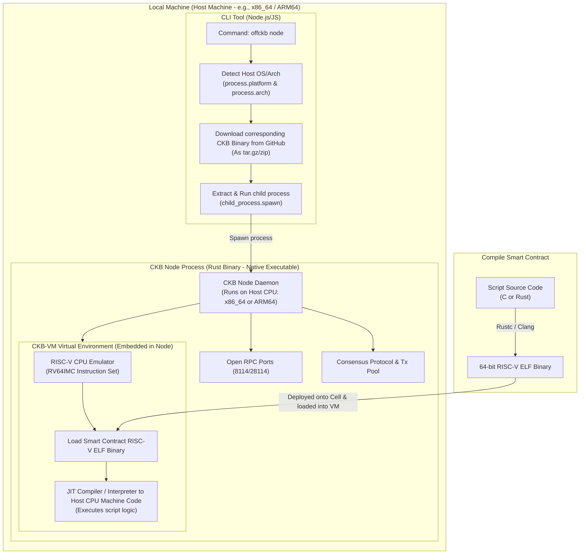
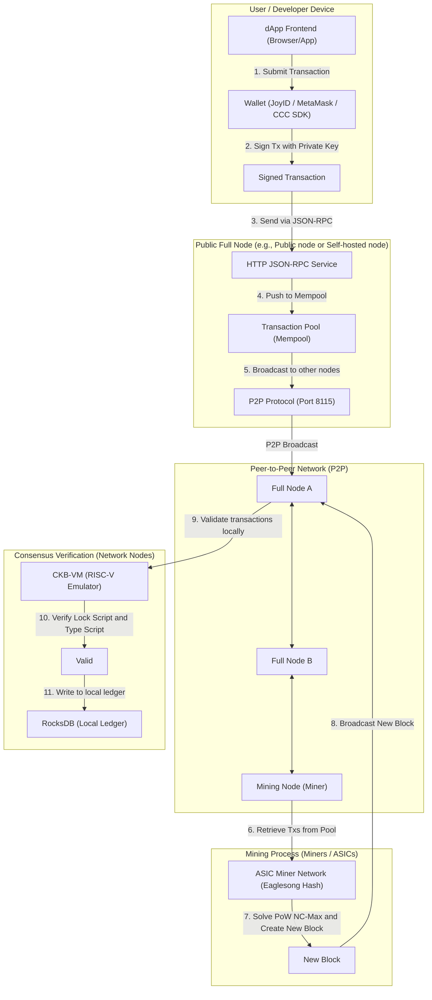

# Understanding the Architecture and Runtime Environment of OffCKB on Devnet

When running a Nervos CKB application on **Devnet** using the **offckb** tool, the entire test blockchain network runs **locally on your computer (local machine)**, rather than on any remote server.

Below is a detailed guide explaining how this works under the hood from a software architecture and compilation perspective.

---

## 📋 Table of Contents

1. [How `offckb` Operates on Devnet](#1-how-offckb-operates-on-devnet)
2. [System & Compilation Architecture](#2-system--compilation-architecture)
3. [CKB-VM and RISC-V (Contract Execution Environment)](#3-ckb-vm-and-risc-v-contract-execution-environment)
4. [Comparing Devnet (Local) and Testnet/Mainnet](#4-comparing-devnet-local-and-testnetmainnet)
5. [Testnet/Mainnet Decentralized Network Architecture](#5-testnetmainnet-decentralized-network-architecture)

---

## 1. How `offckb` Operates on Devnet

### Starting a Local Node
When you execute the following command:
```bash
offckb node
```
The CLI automatically launches a local CKB Node instance running in the background. This node acts as an independent mini-blockchain on your local machine.

### Local Ports
* **CKB RPC Port (`8114`)**: The default port for the CKB node to listen to and handle blockchain RPC requests.
* **OffCKB Proxy Port (`28114`)**: A proxy port provided by `offckb` to facilitate smoother connections from a dApp frontend (accessed via `http://localhost:28114`).

### Managing Pre-funded Accounts
* `offckb` comes with **20 test accounts** that are pre-funded with a large amount of mock CKB (Capacity) for development.
* You can view the list of these accounts and their private keys by running:
  ```bash
  offckb accounts
  ```

---

## 2. System & Compilation Architecture



### How `offckb` Launches the Node Locally
`offckb` **does not use** heavy OS virtualization technologies like Docker, VirtualBox, or virtual containers. Instead:
* **Node.js Wrapper:** `offckb` is written in TypeScript/JavaScript running on Node.js. It acts as an orchestrator/manager.
* **Native Binaries:** When you run `offckb node` for the first time, it automatically detects your OS and CPU architecture, then fetches the corresponding pre-compiled **native executable binary** of the CKB Node from the official [nervosnetwork/ckb](https://github.com/nervosnetwork/ckb) GitHub Releases.
* **Storage & Extraction:** It extracts these executable binaries into a system configuration directory (e.g., `~/.config/offckb-nodejs/` on Linux or `~/Library/Application Support/offckb-nodejs/` on macOS).
* **Child Process Execution:** When starting the Devnet, `offckb` uses Node.js's native `child_process.spawn` to directly execute the `ckb` executable as a background child process, passing in pre-generated Devnet configurations.

### Compilation & Development Language
* **Rust Node:** The CKB Node itself is written entirely in **Rust** (for memory safety and high performance).
* **Official Builds:** The CKB development team uses CI/CD pipelines to cross-compile the Rust codebase into native executables for each target platform.
* **Compiling from Source:** 
  If you want to build the node yourself rather than using the pre-compiled binary provided by `offckb`, you only need the Rust toolchain (`rustc`, `cargo`):
  ```bash
  git clone https://github.com/nervosnetwork/ckb.git
  cd ckb
  cargo build --release
  ```
  Once compiled, the native executable will be located at `target/release/ckb`. You can instruct `offckb` to run your custom binary using the path flag:
  ```bash
  offckb node --binary-path /path/to/your/compiled/ckb
  ```

### Host Architecture Dependency
* Since the CKB Node runs directly as a native process on the OS, the host CPU must run the instruction set supported by that executable.
* `offckb` automatically detects your system's OS and CPU architecture to download the correct build:
  * **x86_64 (Intel/AMD)**
  * **aarch64/ARM64 (Apple Silicon M1/M2/M3, Raspberry Pi, etc.)**
* If you are on an exotic architecture (like MIPS, PowerPC, or physical RISC-V boards), the pre-compiled packages in `offckb` will not run out of the box. You must cross-compile the CKB Rust source code for your target platform and run it using the `--binary-path` flag.

---

## 3. CKB-VM and RISC-V (Contract Execution Environment)

The smart contract execution engine of Nervos CKB (CKB-VM) is a virtual machine simulating a **64-bit RISC-V CPU (RV64IMC instruction set)**.

* **On-Chain Scripts:** Smart contracts (called *Scripts* in CKB) do not run directly as raw x86_64 or ARM64 machine code. They are written in languages like **C** or **Rust** and compiled into standard **64-bit RISC-V ELF executables**.
* **Executing Transactions:** When the local CKB Node (running as a native host binary) validates a transaction, it initializes a **CKB-VM (RISC-V)** instance inside its memory. The VM loads the RISC-V ELF binary of the smart contract and executes its instructions (compiled JIT - Just-In-Time or interpreted directly into the host CPU's native instructions).
* This design makes CKB completely programming-language agnostic: any language that compiles down to RISC-V assembly can run natively on the CKB blockchain.

---

## 4. Comparing Devnet (Local) and Testnet/Mainnet

| Feature | Devnet (via `offckb`) | Testnet / Mainnet (Public Networks) |
| :--- | :--- | :--- |
| **Running Location** | **Local (Your personal computer)** | **Decentralized Servers (Nodes globally)** |
| **RPC Address** | `http://localhost:28114` | Community public endpoints (e.g., Testnet RPC) |
| **CKB Test Tokens** | 20 pre-funded accounts included | Must claim from an online Faucet |
| **Block Time** | Instant (a few milliseconds) | Takes 10 to 30 seconds for mining blocks |
| **Data Persistence** | Can be reset anytime via `offckb clean` | Permanently stored on the public blockchain ledger |

---

## 5. Testnet/Mainnet Decentralized Network Architecture

On the **Testnet** and **Mainnet**, the system is no longer hosted on a single local computer. Instead, it operates as a Peer-to-Peer (P2P) network consisting of thousands of physical nodes (Full Nodes, Miners, Light Clients) connected globally.

### Workflow Diagram:



### Key Components of Testnet/Mainnet:
1. **How do nodes run?** 
   Each node is a computer (cloud server or personal PC) running the native `ckb` executable. They communicate with each other over TCP port `8115` to synchronize blocks and propagate transactions.
2. **Consensus Mechanism (NC-Max & Eaglesong):**
   * CKB uses the **NC-Max** consensus mechanism (an optimized variant of Bitcoin's Nakamoto Consensus).
   * Specialized mining hardware (ASIC) continuously solves the **Eaglesong** hashing algorithm to discover new blocks and claim CKB rewards.
3. **Verification Process:**
   * When a block is mined, peer-to-peer nodes receive it and validate it.
   * Every node hosts its own **CKB-VM (RISC-V)** sandbox to verify transaction signatures and smart contract logic locally. Once verified, the block is appended to the node's local database (`RocksDB`).
