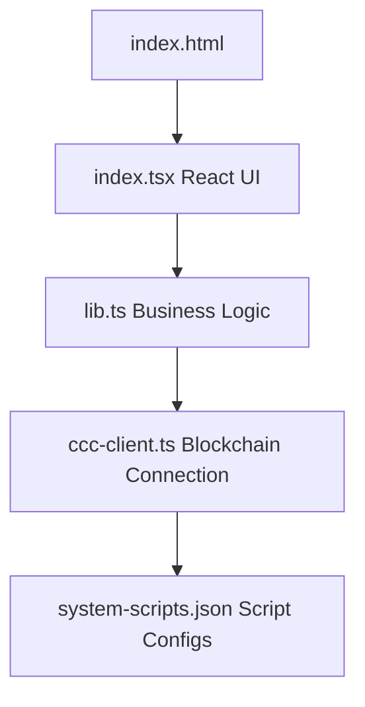
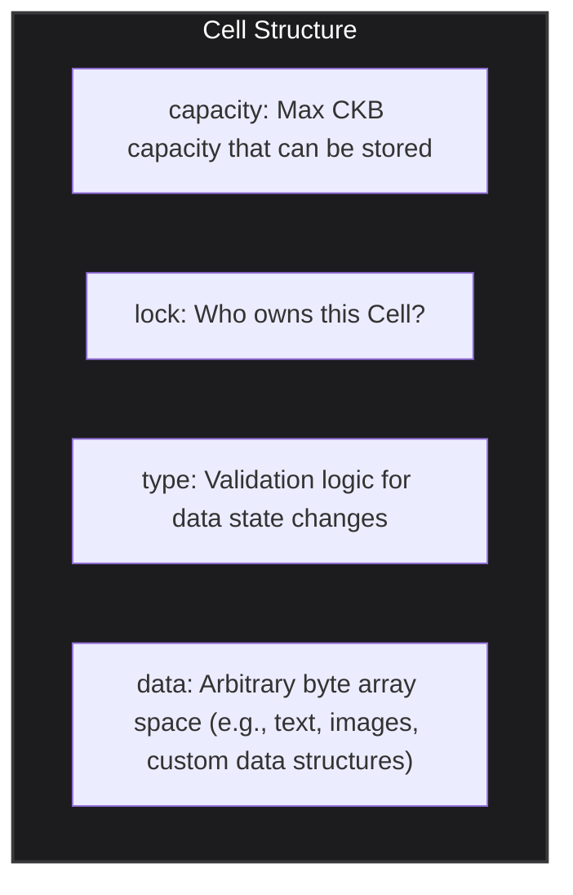
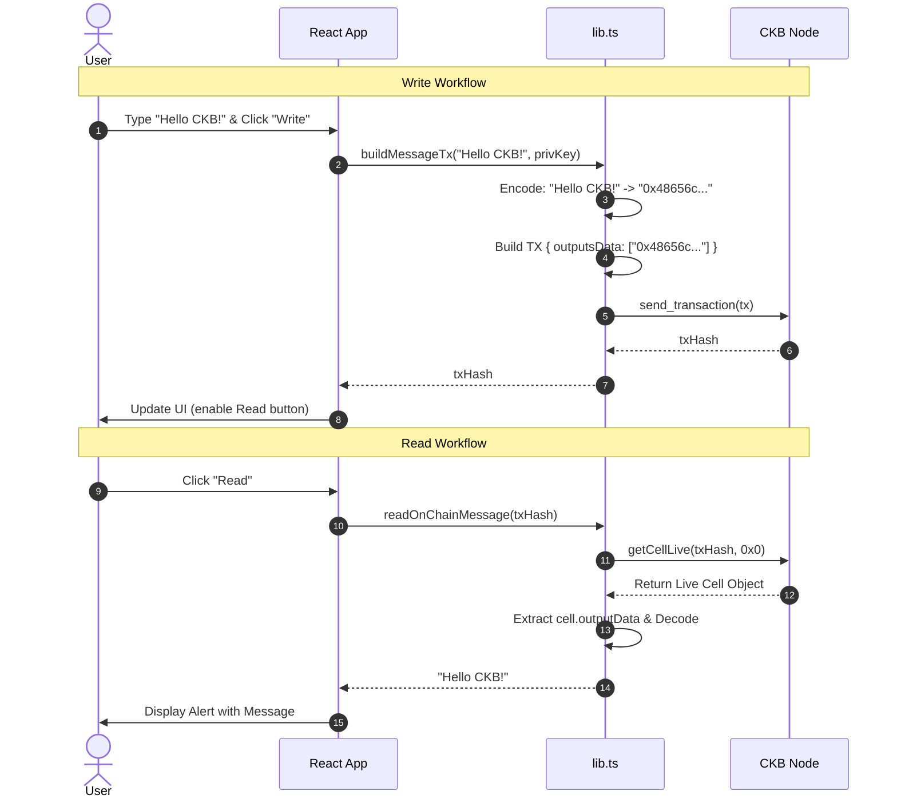

# 📖 Detailed Explanation: Store Data On Cell dApp

> **Reference Source**: [Store Data on Cell Tutorial - Nervos Docs](https://docs.nervos.org/docs/dapp/store-data-on-cell)
>
> This is a simple sample dApp to **store arbitrary data (a text message)** into the `data` field of a Cell on the Nervos CKB blockchain, and retrieve/read that text message back.

---

## 📋 Table of Contents

1. [Overview](#1-overview)
2. [Project Architecture](#2-project-architecture)
3. [Core CKB Concepts to Know](#3-core-ckb-concepts-to-know)
4. [Analyzing `ccc-client.ts` — Blockchain Connection](#4-analyzing-ccc-clientts--blockchain-connection)
5. [Analyzing `lib.ts` — Core Business Logic](#5-analyzing-libts--core-business-logic)
6. [Analyzing `index.tsx` — React UI](#6-analyzing-indextsx--react-ui)
7. [End-to-End Workflow](#7-end-to-end-workflow)
8. [How to Run the Example](#8-how-to-run-the-example)
9. [Deep Dive into Transaction & Data Structures (According to RFC-0019 & RFC-0022)](#9-deep-dive-into-transaction--data-structures-according-to-rfc-0019--rfc-0022)

---

## 1. Overview

### Purpose
This dApp implements basic features to help you get familiar with CKB's state storage capability:

| Feature | Description |
|-----------|-------------|
| **Wallet Initialization & Balance Checking** | Enter private key → display CKB address, lock script, and total capacity (similar to the Transfer dApp) |
| **Write Data** | Enter text message → encode to Hex → create transaction containing data in the Output Cell → submit to the blockchain |
| **Read Data** | Use TxHash → find the corresponding Live Cell → extract the `data` field → decode Hex back to the original text message |

### Tech Stack

| Technology | Role |
|-----------|---------|
| **React 18** | UI construction |
| **TypeScript** | Type-safe development |
| **Parcel** | Bundler to build the application |
| **@ckb-ccc/core** | SDK to interact directly with CKB Nodes / Blockchain |

---

## 2. Project Architecture

```
store-data-on-cell/
├── index.html          # HTML entry point
├── index.tsx           # Main React component (UI) with input forms
├── lib.ts              # Business logic: encoding/decoding, building TX, querying Cells
├── ccc-client.ts       # CCC Client setup connecting to CKB Node
├── system-scripts.json # System script configurations for devnet/testnet/mainnet
├── package.json        # Dependencies and scripts to run the app
└── tsconfig.json       # TypeScript configuration
```

### Dependency flow:



---

## 3. Core CKB Concepts to Know

### 3.1 Storage capability of the `data` field in a Cell

According to the design of CKB's **Cell Model**, each Cell has a field named `data` to store arbitrary application state.



### 3.2 Data Encoding (Hex Encoding)

On CKB, data in the `data` field is represented as raw byte arrays. In order for the SDK to send data via JSON-RPC to a CKB Node, we must represent that byte array as a **Hex string** (prefixed with `0x`). Therefore, any text from the UI must be **encoded** to Hex before writing, and **decoded** from Hex back to text when reading.

---

## 4. Analyzing `ccc-client.ts` — Blockchain Connection

Similar to the Transfer example, this file sets up the **CCC Client**.

- Declares target `Network` options (devnet, testnet, mainnet).
- Maps system script configurations from `system-scripts.json`.
- Initializes `cccClient` to communicate with the CKB node (using the local RPC proxy `http://localhost:28114` for Devnet, or public RPCs for Testnet/Mainnet).

---

## 5. Analyzing `lib.ts` — Core Business Logic

### 5.1 Handling Data Encoding & Decoding

```typescript
// Convert UTF-8 string (regular text) to Hex string ("0x...")
export function utf8ToHex(utf8String: string): string {
  const encoder = new TextEncoder();
  const uint8Array = encoder.encode(utf8String);
  return (
    "0x" +
    Array.prototype.map
      .call(uint8Array, (byte: number) => {
        return ("0" + (byte & 0xff).toString(16)).slice(-2);
      })
      .join("")
  );
}

// Convert Hex string retrieved from the blockchain back to UTF-8 text
export function hexToUtf8(hexString: string): string {
  const decoder = new TextDecoder("utf-8");
  const uint8Array = new Uint8Array(
    hexString.match(/[\da-f]{2}/gi)!.map((h) => parseInt(h, 16))
  );
  return decoder.decode(uint8Array);
}
```
**Explanation**: 
- `TextEncoder` and `TextDecoder` are built-in web browser APIs. Data uploaded to the network (referred to as `onChainMemoHex`) must be prefixed with `0x` and contain hexadecimal values (e.g., `0x48656c6c6f` for `Hello`).

### 5.2 Building a Transaction to Write Data (Write)

```typescript
export async function buildMessageTx(
  onChainMemo: string,
  privateKey: string
): Promise<string> {
  // Step 1: Encode the text
  const onChainMemoHex = utf8ToHex(onChainMemo);
  const signer = new ccc.SignerCkbPrivateKey(cccClient, privateKey);
  const signerAddress = await signer.getAddressObjSecp256k1();
  
  // Step 2: Initialize Transaction with an Output Cell containing the data
  const tx = ccc.Transaction.from({
    outputs: [{ lock: signerAddress.script }],
    outputsData: [onChainMemoHex],
  });

  // Step 3: CCC automatically gathers input Cells to have enough Capacity for storage
  await tx.completeInputsByCapacity(signer);
  // Add transaction fee
  await tx.completeFeeBy(signer, 1000);
  
  // Step 4: Sign and send
  const txHash = await signer.sendTransaction(tx);
  alert(`The transaction hash is ${txHash}`);

  return txHash;
}
```
**Key Point**: In the `Transaction.from` function, we define the `outputs` array.
- `outputs[0]` belongs to the sender (`signerAddress.script`).
- At the same time, `outputsData[0]` (which has a 1-to-1 index mapping to the outputs array) is supplied with the Hex string `onChainMemoHex`. When `completeInputsByCapacity` is executed, it automatically calculates the total size of this Cell (including its data) to provision the correct amount of Capacity (CKB).

### 5.3 Querying a Live Cell to Read Data (Read)

```typescript
export async function readOnChainMessage(txHash: string, index = "0x0") {
  // Step 1: Locate Cell using OutPoint (TxHash + Index)
  const cell = await cccClient.getCellLive({ txHash, index }, true);
  if (cell == null) {
    return alert("cell not found, please retry later");
  }
  
  // Step 2: Extract and decode data
  const data = cell.outputData;
  const msg = hexToUtf8(data);
  
  alert("read msg: " + msg);
  return msg;
}
```
**Explanation**: 
- `OutPoint` serves as the exact coordinate of a Cell on the network, consisting of the transaction hash that created it (`txHash`) and the index of the output Cell within that transaction (`index`).
- Since we put the output Cell at index 0 of the outputs array when writing, the `index` parameter passed in is always `0x0`.

---

## 6. Analyzing `index.tsx` — React UI

```typescript
const [message, setMessage] = useState("hello common knowledge base!");
const [txHash, setTxHash] = useState<string>();
```
The application manages two vital states: the content of the message to save (`message`) and the transaction hash (`txHash`) generated when written successfully.

### Handling the "Write" Button
```typescript
<button
  disabled={!enabled}
  onClick={() => {
    buildMessageTx(message, privKey).then(txHash => setTxHash(txHash));
  }}
>
  Write
</button>
```
This triggers the `buildMessageTx` function, saves the returned `txHash` to state, which in turn enables the **Read** button (since the `txHash` is now known for querying).

### Handling the "Read" Button
```typescript
<button
  disabled={!enabledRead}
  onClick={() => {
    readOnChainMessage(txHash);
  }}
>
  Read
</button>
```
Utilizes the `txHash` stored in the state to query the node and decode the message.

---

## 7. End-to-End Workflow



---

## 8. How to Run the Example

### Requirements
- **Node.js** (v18+) and **npm** / **yarn** installed.

---

### Running on Testnet (Public Test Network)

This guide shows you how to run the application on Nervos CKB's public Testnet.

1. **Launch the application**:
   By default, the system uses `testnet` if the `NETWORK` environment variable is not defined. You can also start it explicitly with:
   ```bash
   npm install
   NETWORK=testnet npm start
   ```
2. **Open browser**: Visit **`http://localhost:1234`**.
3. **Log in to wallet & Request Test CKB (Faucet)**:
   - On the dApp UI, a default test **Private Key** will be automatically filled, generating a corresponding **CKB Address**.
   - **Copy your CKB Address**.
   - Go to the public test faucet: **[Nervos CKB Testnet Faucet](https://faucet.nervos.org/)**.
   - Paste your address into the input field, verify the captcha, and click **Claim**. Wait about **10 - 30 seconds** for the transaction to be mined.
4. **Write and Read Data**:
   - Once your address has a balance (capacity), input any message in the `write message` box.
   - Click **Write**. The button will be disabled while the transaction is being sent.
   - Since it's Testnet, wait about **10 - 30 seconds** for a new block to be mined. When successful, the `tx hash` will be displayed.
   - Click **Read** to query the blockchain and view your written message.

---

### Running on Devnet (Local Node)

If you want to run and test on a local node with instant block confirmation:

1. **Start Devnet**: Open a new terminal and execute:
   ```bash
   offckb node
   ```
2. **Launch the application**:
   In your project directory, start the app pointing to your devnet:
   ```bash
   NETWORK=devnet npm start
   ```
3. **Open browser**: Visit **`http://localhost:1234`**. A default Private Key (Account #1 from OffCKB) will be pre-filled with an abundant CKB balance.
4. **Experience the app**:
   - Input your message in the `write message` box.
   - Click **Write**. The transaction will execute **instantly** (within milliseconds) on Devnet, and the `txHash` will appear below immediately.
   - Click **Read** to retrieve the data.

---

## 9. Deep Dive into Transaction & Data Structures (According to RFC-0019 & RFC-0022)

When writing data to a Cell, you are working directly with core structures defined in two foundational CKB RFC documents:
- **[RFC-0019 (Data Structures)](https://github.com/nervosnetwork/rfcs/blob/master/rfcs/0019-data-structures/0019-data-structures.md)**: Defines primary data structures such as `Cell`, `Script`, and `Transaction`.
- **[RFC-0022 (Transaction Structure)](https://github.com/nervosnetwork/rfcs/blob/master/rfcs/0022-transaction-structure/0022-transaction-structure.md)**: Explains how these structures interact to store value, store data, and execute smart contracts.

Here is how these two RFCs map directly to our data processing workflow:

### 9.1. Cell Data & Value Storage (UTXO)
According to **RFC-0022**, CKB uses an extended UTXO model (Cell Model). A transaction destroys Cells in the `inputs` section and creates new Cells in the `outputs` section.
- **Value Storage**: Transactions must respect the rule: `Total Capacity(inputs) >= Total Capacity(outputs)`. Unlike Bitcoin, which only stores value (nValue), CKB stores state.
- **Cell Data**: In our codebase, when declaring `outputsData: [onChainMemoHex]`, we follow the RFC-0022 specification: the `outputs_data` array runs parallel and corresponds 1-to-1 with the `outputs` array. The data of the `i`-th Cell resides at index `i` in `outputs_data`.
- **Capacity Limit**: According to **RFC-0019**, `capacity` refers to not only balance but also storage space in bytes. The mandatory rule is `occupied(cell) <= capacity`. This means that as you append more text into the `data` field, the Cell size expands, and you must hold enough CKB (capacity) to cover the entire storage space. The SDK (`completeInputsByCapacity`) automatically calculates this for us.

### 9.2. Script & Code Locating
In CKB, execution code (such as signature verification algorithms) is not stored directly inside every Cell to conserve space. Instead, it is referenced via a `Script` structure (specified in **RFC-0019**).
- A `Script` consists of: `code_hash`, `hash_type`, and `args`.
- **Code Locating (RFC-0022)**: When the virtual machine (CKB-VM) needs to execute a Lock Script to authorize a transaction, it looks up this `code_hash` inside the `cell_deps` array. `cell_deps` contains Cells storing the RISC-V binaries of the code. In our dApp, this process is automatically handled by the CCC Client (using `system-scripts.json`) pointing to the correct dependencies on the network (e.g., `secp256k1`).

### 9.3. The Role of Lock Script
According to **RFC-0022**, every Cell must contain a `lock` script. This script acts as a lock.
When we use `buildMessageTx` to create a new Cell containing data, we assign `outputs[0].lock = signerAddress.script`. This ensures that even though the Cell stores the text "Hello CKB!", ownership and the ability to consume/destroy the Cell to retrieve the underlying CKB Capacity remain exclusively under your control (via your Private Key).

**In Summary:** The "Store Data on Cell" practice serves as an excellent demonstration of the **RFC-0022 (Cell Data feature)**. It highlights CKB's advancement over traditional UTXO blockchains (like Bitcoin): you don't just transfer value; you allocate space on-chain to store any custom state data structure you want.
