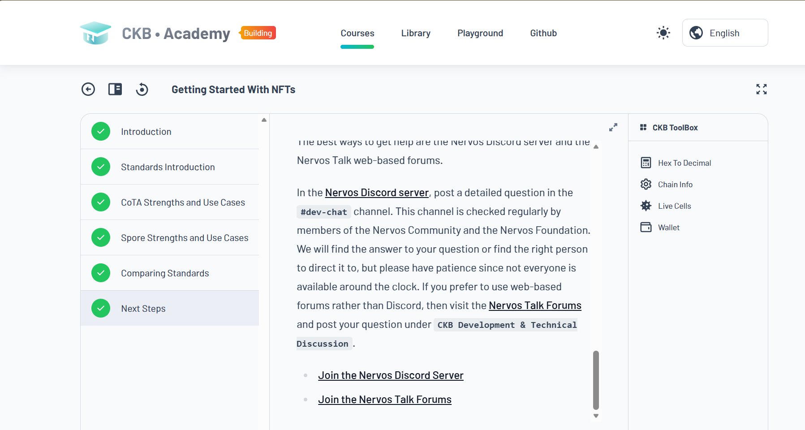
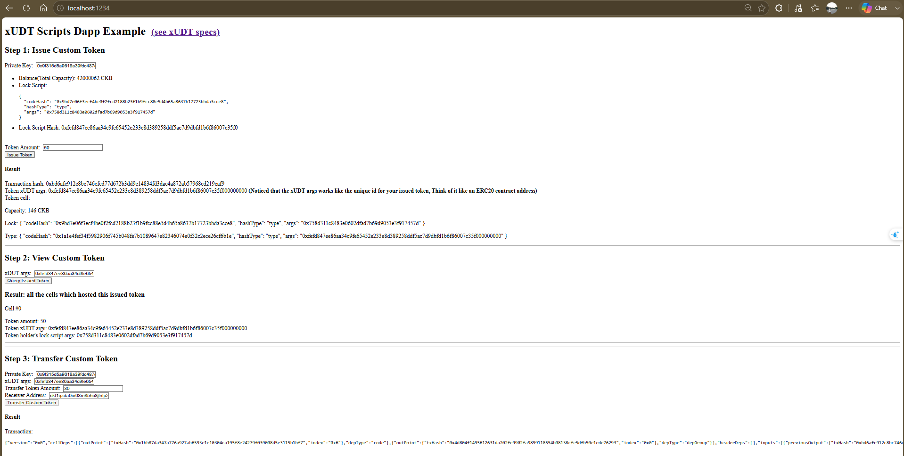

## Builder Track Weekly Report — Week 3

**Name:** Hiep Thach  
**Week Ending:** 07-05-2026

---

### Courses Completed

- **NFT Overview** ([CKB Academy Lesson 3](https://academy.ckb.dev/courses/nft-getting-started))
  - Learned basic NFT concepts on CKB.
  - Understood the Spore protocol overview.

- **CKB Scripts** 
  - Learned what Scripts are (sandboxed bytecode on CKB-VM).
  - Contrasted **Lock Scripts** (ownership) and **Type Scripts** (app logic).

- **Create a Fungible Token (xUDT) dApp** ([Nervos Docs](https://docs.nervos.org/docs/dapp/create-token))
  - Learned how to issue and transfer tokens using the xUDT standard.
  - Studied the dApp architecture and `@ckb-ccc/core` SDK.
  - Analyzed `index.tsx` (frontend) and `lib.ts` (logic).

- **Construct & Send First CKB Transaction** ([Cryptape Blog](https://blog.cryptape.com/construct-and-send-your-first-ckb-transaction))
  - Reviewed and refreshed knowledge on the transaction construction flow.
  - Gained a new perspective on CKB development using Java, as previous exercises were in TypeScript.

---

### Key Learnings

- **Lock vs. Type Scripts**: Lock scripts are required to prove ownership. Type scripts are optional for custom logic.
- **xUDT Standard**: xUDT is the standard for fungible tokens on CKB. Token amounts are stored in the `data` field.
- **NFT Protocols (CoTA & Spore)**: Learned the use cases for CKB's NFT standards. CoTA is optimized for low-cost, mass minting (e.g., tickets, game items), while Spore ensures 100% on-chain permanence for high-value assets.

---

### Exercises and Practical Work

- **Reviewed Java Transaction Steps**: Refreshed knowledge on building and sending a CKB transaction using Java.
- **Researched CKB Scripts**: Investigated CKB-VM execution and the differences between Lock and Type Scripts.
- **Studied Fungible Token Code**:
  - Read `lib.ts` for xUDT issue and transfer logic.
  - Read `index.tsx` for UI code.
- **Ran dApp on Devnet**:
  - Successfully issued and transferred fungible tokens on the local Devnet.
- **Ran dApp on Testnet**:
  - Successfully issued token ([View TX](https://testnet.explorer.nervos.org/transaction/0x245cd28bd5da72461d8f2a7c968fdb779f7a265950b007affc5e1414d23edfd2)).
  - Successfully transferred token ([View TX](https://testnet.explorer.nervos.org/transaction/0xa23c14c5294cebeacd3c979b0e03c954d040ab380e8ee6063e9b72bad27c810a)).

---

### Screenshots

**NFT Overview Completed (CKB Academy Lesson 3)**

**Running Create Fungible Token dApp on Devnet**

---

### Plan for Next Week

- Watch Module 5: Dapps with CKB Workshop videos.
- Read Module 8: Start Your CKB Development Journey.
- Set up a local CKB Node on testnet.
- Practice creating a DOB (Digital Object).
- Start testing code on the CCC Playground.
