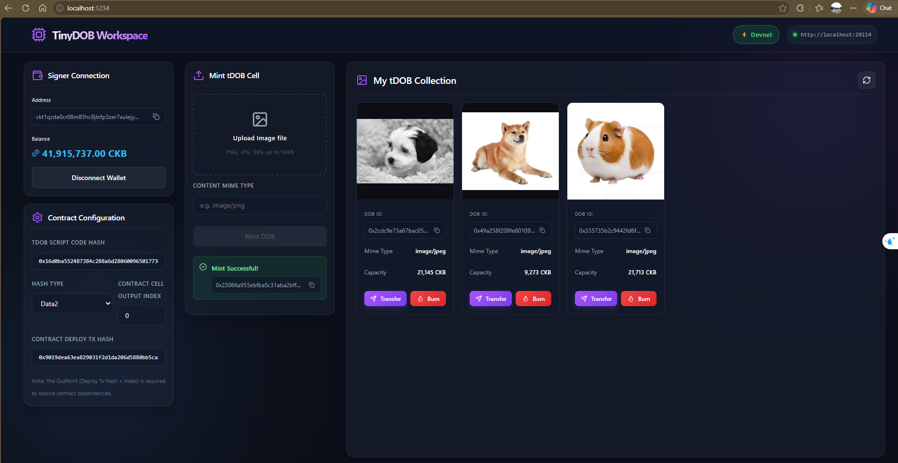
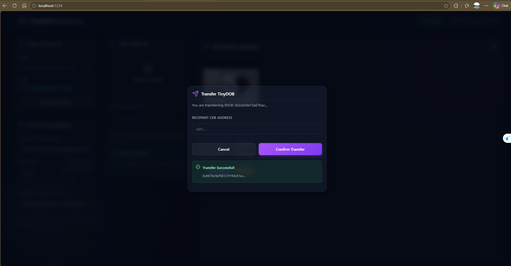
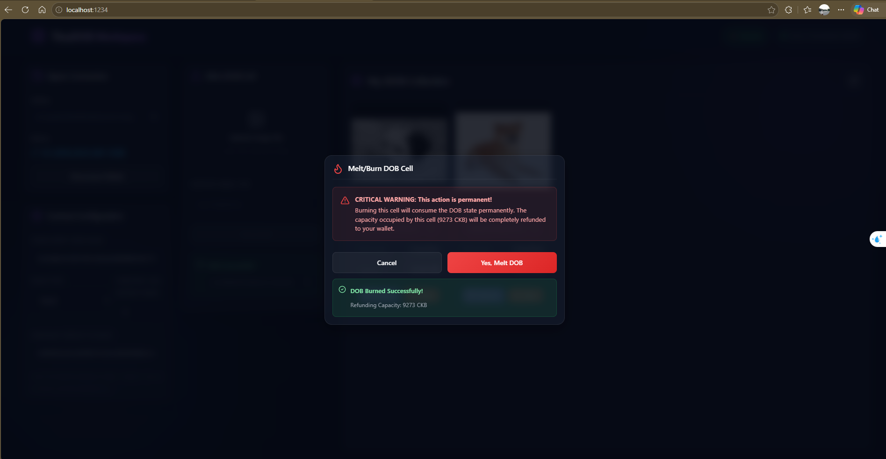

## Builder Track Weekly Report — Week 4

**Name:** Hiep Thach  
**Week Ending:** 07-12-2026

---

### Courses Completed

- **Dapps with CKB Workshop**
  - Watched Video 1 & 2: [Dapps with CKB Workshop Series](https://www.youtube.com/watch?v=iVjccs3z5q0&list=PLRke1-EE4VWFirxtxtXmW7enINVZP2Lk6&index=2)

- **CKB CLI Overview**
  - Read and learned about `ckb-cli` commands.
  - Concluded that `offckb` is a more convenient and efficient tool for local development, so decided not to dive deeper into raw CKB CLI commands at this time.

- **Create a DOB (Digital Object Bundle) dApp**
  - Explored the `create-dob` example to understand how Digital Objects are minted and managed on CKB.
  - Initialized and built the `tiny-dob` project locally.

---

### Key Learnings

- **DOB Creation**: Learned the step-by-step process of creating DOBs, including setting up the contract and deploying the application.
- **CKB Tools**: Understood the basic commands of CKB CLI, while solidifying the preference for using `offckb` to streamline the local node and environment setup.
- **CCC SDK**: Gained foundational knowledge of the CCC SDK for dApp development through the workshop videos, preparing for more hands-on practice.
- **Debugging**: Learned how to debug Rust script using `ckb-debugger` and GDB debug on VS Code.

---

### Exercises and Practical Work

- **Built `tiny-dob` Project**: 
  - Successfully created the [tiny-dob project](tiny-dob-project/README.md).
  - Studied how the DOB contract is structured and deployed.

---

### Verification Results (Devnet Only)

- Verified the successful creation of the `tiny-dob` project.
- Verified that the DOB contract can be deployed and executed correctly on the local Devnet.
- Connected with account 3 using the private key provided in the `offckb` account.
- Minted DOB successfully with 3 images.
  - **Successfully created DOB**
    
- Transferred DOB successfully to the account with address `ckt1qzda0cr08m85hc8jlnfp3zer7xulejywt49kt2rr0vthywaa50xwsq2prryvze6fhufxkgjx35psh7w70k3hz7c3mtl4d` (account 19 in `offckb` account).
  - **Successfully transferred DOB**
    
- Burned DOB successfully.
  - **Successfully burned DOB**
    
- Detailed execution logs can be found at `tiny-dob-project/logs/`.

---

### Plan for Next Week

- **Module**: Begin reading [L1 Developer Training Course](https://nervos.gitbook.io/developer-training-course).
- **Build a Simple Lock**: Complete the tutorial.
- **CCC Playground**: Complete the examples on CCC Playground.
- **CCC Documentation**: Read CCC App docs and API docs.

