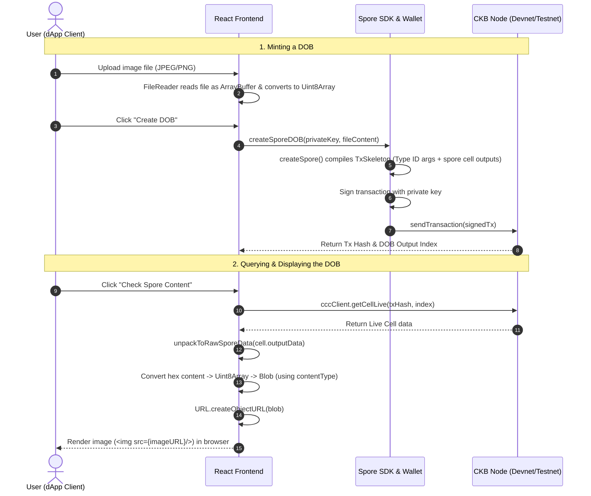

# 📖 Detailed Explanation: Create a Digital Object (DOB) using Spore Protocol

> **Reference Sources**:
> - [Create a DOB - Nervos Docs](https://docs.nervos.org/docs/dapp/create-dob)
> - [Spore Protocol Documentation](https://docs.spore.pro/)
> - [RFC-0022 CKB Transaction Structure](https://github.com/nervosnetwork/rfcs/blob/master/rfcs/0022-transaction-structure/0022-transaction-structure.md#type-id)
> - README.md (TinyDOB Workspace)

---

## 📋 Table of Contents

1. [Overview](#1-overview)
2. [Project Architecture](#2-project-architecture)
3. [Core CKB & Spore Concepts](#3-core-ckb--spore-concepts)
4. [Deep Dive into `lib.ts` — Core Business Logic](#4-deep-dive-into-libts--core-business-logic)
5. [Deep Dive into `helper.ts` & `spore-config.ts` — SDK Config & Lumos Integration](#5-deep-dive-into-helperts--spore-configts--sdk-config--lumos-integration)
6. [Deep Dive into `index.tsx` — React Frontend Logic](#6-deep-dive-into-indextsx--react-frontend-logic)
7. [End-to-End Operational Workflow](#7-end-to-end-operational-workflow)
8. [Comparison: Official Spore Protocol vs. Custom `tiny-dob-script` (Rust)](#8-comparison-official-spore-protocol-vs-custom-tiny-dob-script-rust)
9. [Why Do We Need DOBs & What Are Their Practical Use Cases?](#9-why-do-we-need-dobs--what-are-their-practical-use-cases)

---

## 1. Overview

### Purpose
This dApp demonstrates how to issue, retrieve, and render **on-chain Digital Objects (DOBs)** on the Nervos CKB blockchain using the **Spore Protocol**. 

Unlike conventional NFTs on other blockchains (like Ethereum ERC-721 or Solana SPL) which only store a metadata URL pointing to off-chain servers (e.g., IPFS or AWS), a **Spore DOB** stores both the file metadata (`content-type`) and the raw asset content (`content` such as images, SVG, markdown, or custom byte formats) **directly inside the Cell's `data` field on CKB**.

This guarantees absolute ownership, decentralization, and high durability: if the Nervos CKB blockchain is alive, your digital object is alive and accessible without relying on external web hosting.

### Tech Stack
- **Frontend Framework**: React 18 with TypeScript.
- **Bundler**: Parcel.
- **CKB Blockchain SDK**: `@ckb-ccc/core` for account generation, querying live cells, and wallet interactions.
- **Spore Protocol SDK**: `@spore-sdk/core` to construct the transactions and unpack Spore data structures.
- **Lumos Utilities**: `@ckb-lumos/lumos` (integrated inside Spore SDK utilities) for key operations and transaction skeleton preparation.

---

## 2. Project Architecture

The directory tree of the example project at `create-dob` is structured as follows:

```text
create-dob/
├── index.html            # Entry-point HTML for the Parcel bundler
├── index.tsx             # React UI component; handles file uploads and state
├── lib.ts                # Main business logic: creates DOB transactions and queries content
├── helper.ts             # Wallet constructor & hex-to-binary utilities using Lumos
├── spore-config.ts       # Network script configurations (devnet & testnet parameters)
├── ccc-client.ts         # Sets up the CCC Client to communicate with CKB Nodes
├── system-scripts.json   # OutPoint mappings for built-in/deployed lock and type scripts
├── package.json          # Node dependencies and build scripts
└── tsconfig.json         # TypeScript compiler configurations
```

---

## 3. Core CKB & Spore Concepts

### 3.1 On-Chain Digital Object (DOB) Cell Structure
Under the Spore Protocol, a DOB is encapsulated entirely inside a CKB Cell. The structure is defined as:

```yaml
data:
    content-type: Bytes   # MIME type string (e.g., "image/jpeg", "text/plain") in hex
    content: Bytes        # Raw file binary content in hex
    # OPTIONAL
    cluster_id: Bytes     # Link to a collection/group of Spore DOBs
type:
    hash_type: "data1"
    code_hash: SPORE_TYPE_DATA_HASH
    args: SPORE_ID        # A unique 32-byte hash identifying the DOB
lock:
    <user_defined>        # Owner Lock Script (e.g., SECP256K1_BLAKE160)
```

- **Immutability**: Once a Spore DOB cell is created on CKB, its `type` script and `data` fields are immutable. They cannot be modified, preventing anyone (including the creator) from changing the asset after issuance.
- **Zero-Fee Storage**: CKB utilizes the **State Rent** model. Every byte of data requires CKB capacity (1 CKB = 1 Byte). When you mint a Spore DOB, you lock a certain amount of CKB to store the data. If you decide you no longer want the DOB, you can **burn (melt)** it to destroy the Cell and fully reclaim the locked CKB capacity back to your wallet.

### 3.2 Spore ID (Type ID Pattern)
To prevent hash collisions and ensure that every Spore DOB is globally unique, the `args` of the Spore Type Script contains a `SPORE_ID`. This is generated using CKB's **Type ID** mechanism, which guarantees that:
1. The ID is uniquely bound to the outpoint of the very first transaction input and the output index.
2. It cannot be duplicated or falsified because CKB-VM validators enforce that Type ID matches the cryptographic hash of the input transaction state.

---

## 4. Deep Dive into `lib.ts` — Core Business Logic

The `lib.ts` file manages the core interactions with the blockchain.

### 4.1 Creating a Spore DOB (`createSporeDOB`)
This function creates the transaction skeleton to mint a new DOB. It leverages the `@spore-sdk/core` to automatically build the cell structure.

```typescript
export async function createSporeDOB(
  privkey: string,
  content: Uint8Array
): Promise<{ txHash: string; outputIndex: number }> {
  // 1. Initialize a Lumos-compatible wallet from private key
  const wallet = createDefaultLockWallet(privkey);

  // 2. Call the Spore SDK to construct the transaction skeleton
  const { txSkeleton, outputIndex } = await createSpore({
    data: {
      contentType: "image/jpeg",
      content,
    },
    toLock: wallet.lock,
    fromInfos: [wallet.address],
    config: SPORE_CONFIG,
  });

  // 3. Sign and submit the transaction to the CKB Node
  const txHash = await wallet.signAndSendTransaction(txSkeleton);
  console.log(`Spore created at transaction: ${txHash}`);
  console.log(
    `Spore ID: ${
      txSkeleton.get("outputs").get(outputIndex)!.cellOutput.type!.args
    }`
  );
  return { txHash, outputIndex };
}
```

*Key details*:
- `createSpore` takes the raw binary `content` and wraps it. Under the hood, it constructs outputs and automatically calculates the required CKB capacity to store the file size.
- `outputIndex` indicates which output cell in the transaction contains the newly created Spore DOB.

### 4.2 Fetching and Unpacking DOB Content (`showSporeContent`)
To display the DOB, the application queries the blockchain to fetch the live cell and unpacks the serialized raw bytes.

```typescript
export async function showSporeContent(txHash: string, index = 0) {
  const indexHex = "0x" + index.toString(16);
  // 1. Retrieve the live cell from the CKB client using the outpoint
  const cell = await cccClient.getCellLive({ txHash, index: indexHex }, true);
  if (cell == null) {
    return alert("cell not found, please retry later");
  }

  // 2. Unpack cell.outputData to extract the MIME type and raw content
  const sporeData = unpackToRawSporeData(cell.outputData);
  console.log("spore data: ", sporeData);
  return sporeData;
}
```

*Key details*:
- `cccClient.getCellLive` fetches the latest state of the cell.
- `unpackToRawSporeData` parses the custom binary layout in `cell.outputData` into an object containing `{ contentType, content, clusterId }`.

---

## 5. Deep Dive into `helper.ts` & `spore-config.ts` — SDK Config & Lumos Integration

### 5.1 Wallet Interface & Transaction Signing in `helper.ts`
The file `helper.ts` uses `@ckb-lumos/lumos` to handle transaction signatures. 

```typescript
export function createDefaultLockWallet(privateKey: HexString): Wallet {
  const config = getSporeConfig();
  const defaultLock = config.lumos.SCRIPTS.SECP256K1_BLAKE160!;
  
  // Create lock script: SECP256K1 Lock script with private key blake160 hash
  const lock: Script = {
    codeHash: defaultLock.CODE_HASH,
    hashType: defaultLock.HASH_TYPE,
    args: hd.key.privateKeyToBlake160(privateKey),
  };

  const address = helpers.encodeToAddress(lock, { config: config.lumos });

  function signMessage(message: HexString): Hash {
    return hd.key.signRecoverable(message, privateKey);
  }

  function signTransaction(txSkeleton: helpers.TransactionSkeletonType) {
    // Loop through signing entries, matches script lock, and sign using signMessage
    // Updates witnessArgs.lock inside Transaction.witnesses
    ...
    return txSkeleton.set("witnesses", witnesses);
  }

  async function signAndSendTransaction(txSkeleton: helpers.TransactionSkeletonType) {
    txSkeleton = commons.common.prepareSigningEntries(txSkeleton, { config: config.lumos });
    txSkeleton = signTransaction(txSkeleton);
    const tx = helpers.createTransactionFromSkeleton(txSkeleton);
    const rpc = new RPC(config.ckbNodeUrl);
    return await rpc.sendTransaction(tx, "passthrough");
  }

  return { lock, address, signMessage, signTransaction, signAndSendTransaction };
}
```

- This acts as an adapter. Since `spore-sdk` outputs a Lumos-compatible `TransactionSkeletonType`, this wallet uses Lumos's `commons.common.prepareSigningEntries` to prepare the transaction for signing, signs it locally with the private key via `hd.key.signRecoverable`, and transmits the raw transaction via RPC.

### 5.2 Network Constants in `spore-config.ts`
The file `spore-config.ts` sets up the configuration for `spore-sdk`. It maps scripts (such as `Spore`, `Cluster`, `ClusterProxy`) to their respective `codeHash`, `hashType`, and `cellDep` outpoints on both **Devnet** (configured locally via `offckb`) and **Testnet**.

---

## 6. Deep Dive into `index.tsx` — React Frontend Logic

The React interface in `index.tsx` links files uploaded by users to the blockchain logic.

### 6.1 Uploading files as binary ArrayBuffer
When a user selects a file (e.g., an image), React reads it as a raw `ArrayBuffer` and converts it into a `Uint8Array` to be sent on-chain.

```typescript
const handleFileChange = (event: React.ChangeEvent<HTMLInputElement>) => {
  const files = event.target.files;
  if (files && files.length > 0) {
    setSelectedFile(files[0]);

    const reader = new FileReader();
    reader.onload = () => {
      const content = reader.result;
      if (content && content instanceof ArrayBuffer) {
        // Convert the ArrayBuffer to a Uint8Array
        const uint8Array = new Uint8Array(content);
        setFileContent(uint8Array);
      }
    };
    reader.readAsArrayBuffer(files[0]);
  }
};
```

### 6.2 Rendering the DOB from CKB Live Cell Data
Once the transaction is completed, the frontend fetches the cell content and creates an object URL to render the binary data inside the browser.

```typescript
const renderSpore = async () => {
  // 1. Fetch the raw unpacked DOB data from CKB
  const res = await showSporeContent(txHash, outputIndex);
  if (!res) return;
  setRawSporeData(res);

  // 2. Remove the "0x" hex prefix and convert the hex string back to a Uint8Array
  const buffer = hexStringToUint8Array(res.content.toString().slice(2));

  // 3. Create a browser Blob and a temporary URL to display the image
  const blob = new Blob([buffer], { type: res.contentType });
  const url = URL.createObjectURL(blob);
  setImageURL(url);
};
```

---

## 7. End-to-End Operational Workflow

The following flowchart displays the end-to-end operational pipeline of the Spore dApp:



---

## 8. Comparison: Official Spore Protocol vs. Custom `tiny-dob-script` (Rust)

In week 4, the workspace contains a custom on-chain contract written in Rust located in [tiny-dob-script](tiny-dob-project/ckb-rust-script/contracts/tiny-dob-script) (with validation entry code in `main.rs`).

Here is a comparison of how the official Spore SDK/Protocol and the custom Rust contract handle Digital Objects:

| Metric / Feature | Spore Protocol (Official) | Custom `tiny-dob-script` (Rust) |
|---|---|---|
| **Programming Language** | Rust (on-chain core) / JS/TS (SDK) | Rust (on-chain logic) |
| **DOB ID generation** | Custom Type ID implementation | `blake2b(first_input_outpoint + output_index)` (matches Standard Type ID layout) |
| **Cell Data Layout** | Serialized Molecule schema containing: `{ contentType, content, clusterId }` | Plain layout: `[1-byte content_type_len] + [content_type] + [content]` |
| **Immutability Enforcement** | Handled natively by Spore core rules (modifications prevent transaction validation) | Validated by comparing `GroupInput` data vs `GroupOutput` data during transfers (`ERR_TRANSFER_DATA_CHANGED` = 13) |
| **Collection Support** | Supports groupings (Clusters) via `cluster_id` pointer | Single-item focus (no cluster capability implemented) |
| **Melt / Burn Rules** | Fully supported (reclaims locked CKB) | Fully supported (returns success when group input count is 1 and output is 0) |
| **MIME Validation** | Extensible support for complex MIME types (SVG, audio, HTML, Lua code, etc.) | Simple length validation; checks that `content_type_len > 0` |

---

## 9. Why Do We Need DOBs & What Are Their Practical Use Cases?

### 9.1 The Limitations of Conventional NFTs
Traditional NFTs on blockchains like Ethereum have a severe structural vulnerability: **they are not fully decentralized**. 
- The token contract contains an external link (like `https://api.myproject.com/metadata/1`) that references a Web2 server.
- If the project developer goes bankrupt, fails to pay for their domain name, or their AWS server crashes, the NFT loses its image and metadata, leaving the owner with a broken link.

### 9.2 The Advantages of Spore DOBs on CKB
1. **True Decentralization**: The digital object exists directly on CKB. No server or IPFS gateway is needed.
2. **State Rent Model (CKB Utility)**: Locking CKB capacity enforces a cost on storage. Users only keep valuable DOBs. If a DOB becomes irrelevant, burning it refunds 100% of the storage cost (locked CKB), providing an exit liquidity path.
3. **Composability & Generative Logic**: Since the raw data is on-chain, CKB scripts can read other cells' DOB contents. This allows developers to build games where characters wear clothing/items that are dynamically composed of other DOB cells on-chain.

### 9.3 Practical Use Cases
- **On-Chain Digital Art**: Storing compact image formats, pixel art, or SVGs on-chain.
- **On-Chain Gaming Assets**: Character stats, inventory metadata, and achievements stored immutably.
- **Verifiable Credentials & Identity**: Storing signed documents, certifications, or avatars.
- **Fully On-Chain Blogs/Wikis**: Creating text or markdown DOBs that can never be censored or removed.
