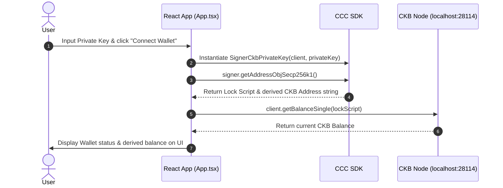
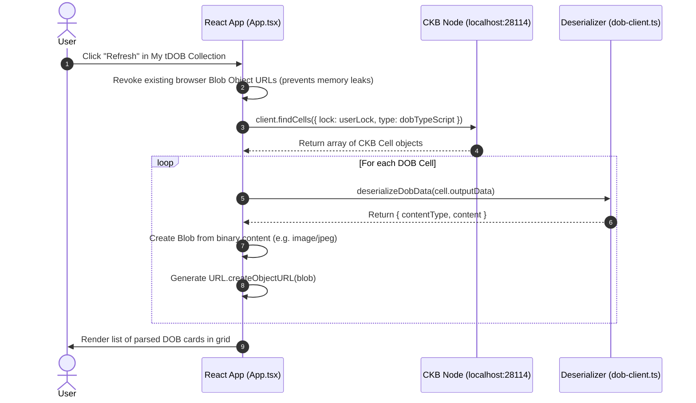
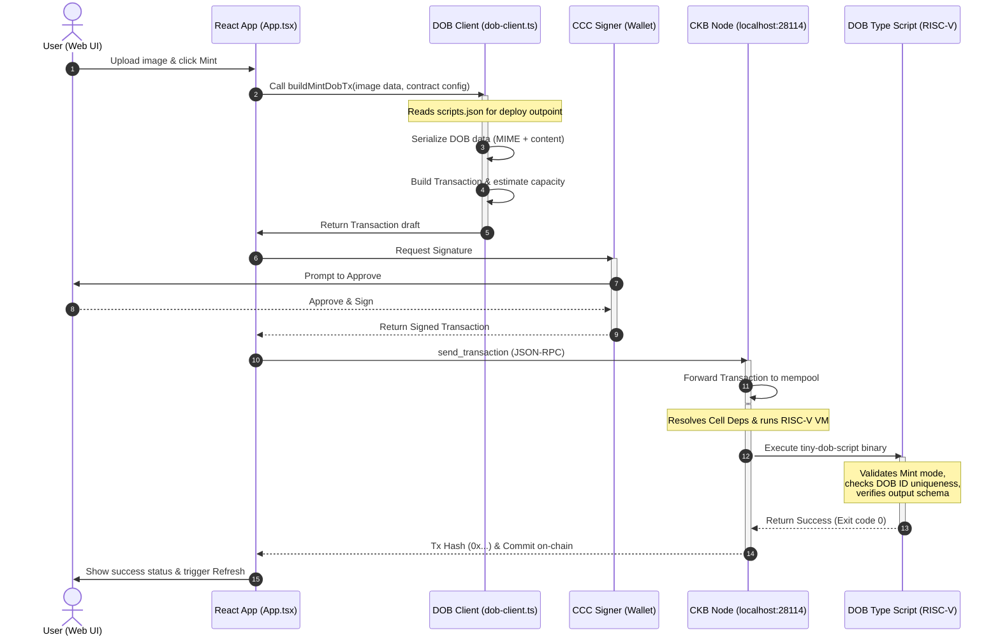
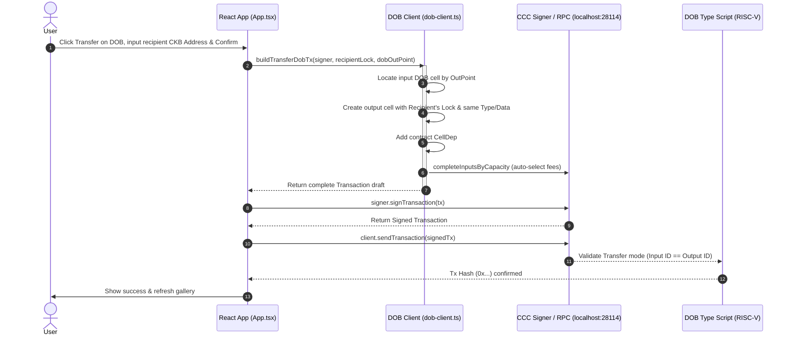
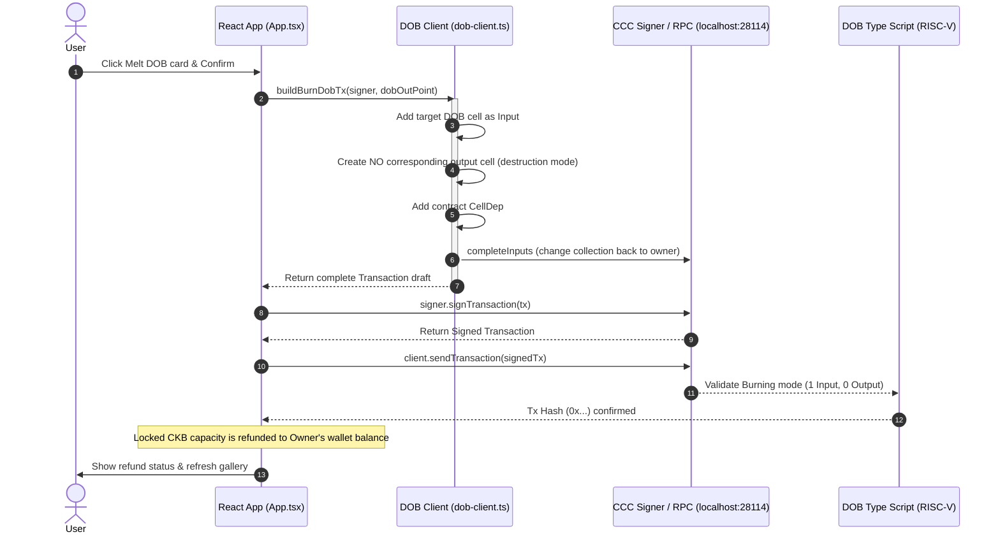

# TinyDOB (tDOB) Protocol Workspace

Welcome to the **TinyDOB (tDOB) Protocol** repository. This project is a simplified, lightweight implementation of the Digital Object Base (DOB) smart contract protocol on the Nervos CKB blockchain. It comprises an on-chain Rust validation contract, an off-chain React + TypeScript dashboard, and standalone CLI test scripts.

---

## Project Objectives & Learning Goals

This repository is designed as a practical, hands-on learning sandbox for CKB developer onboarding. The primary learning goals of this project are:

1. **On-Chain Script Writing, Compiling, and Debugging**:
   - **Contract Development**: Explore how to write custom CKB Type Scripts in Rust using the low-level `ckb-std` library.
   - **Compiling**: Learn to compile Rust source files into highly optimized stripped binaries targeting the RISC-V architecture.
   - **Testing & Debugging**: Master writing integration test suites using `ckb-testtool` to verify contract rules in a simulated environment, and step-by-step interactive debugging of CKB-VM contracts using `ckb-debugger` and GDB in VSCode.
   
2. **Deep Dive into the Common Chains Connector (CCC) SDK**:
   - Learn to use the `@ckb-ccc/core` SDK, CKB's next-generation toolkit for wallet connectivity and cell management.
   - Explore the roles of core CCC abstractions such as `Client` (for CKB node interaction), `Signer` (for cryptographic keys and transaction signatures), and building blocks like `Transaction`, `CellDep`, and `Script`.

3. **Frontend & Smart Contract Co-ordination (Off-chain to On-chain Boundary)**:
   - **State Synchronization**: Learn how the off-chain frontend queries live cells using the CKB indexer, deserializes raw binary cell data back to human-readable objects (e.g. converting cell bytes back to image files), and manages state seamlessly.
   - **Transaction Pipeline**: Understand the pipeline of gathering inputs, constructing cell outputs with Type Script arguments, resolving contract OutPoints as cell dependencies (`CellDeps`), executing wallet signing, and broadcasting to the CKB mempool via RPC.

---

## 1. Protocol Specification & Core Concepts

### Cell Data Layout
A tDOB cell holds the digital object's content and its MIME content-type directly in its data field. We use a simple byte-serialized format:
* `data[0]`: `content_type_len` (1 byte, `u8`)
* `data[1 .. 1 + content_type_len]`: `content_type` (UTF-8 string, e.g. `image/png` or `image/jpeg`)
* `data[1 + content_type_len ..]`: `content` (Raw binary bytes of the file)

### DOB ID (Type Script Args)
To guarantee uniqueness, each DOB is assigned a unique 32-byte ID as its Type Script args:
$$\text{TinyDOB\_ID} = \text{blake2b}(\text{first\_input\_outpoint} + \text{output\_index})$$
* `first_input_outpoint`: The serialized OutPoint of the very first input cell in the transaction. Since live cells can only be spent once, this prevents duplicate IDs.
* `output_index`: The index of the newly minted tDOB cell in the transaction's outputs. This allows minting multiple tDOBs in a single transaction while keeping each ID unique.

### Understanding Spore Protocol & TinyDOB Relationship

#### What is the Spore Protocol?
Spore Protocol is a next-generation standard for creating **Digital Objects (DOBs)** on the CKB blockchain. Unlike traditional NFTs, Spore is built specifically to leverage CKB's Cell Model:
1. **100% On-chain Storage (Zero Off-chain Dependency)**: The media content (e.g., images, audio) and its MIME type are directly serialized and saved in the cell's `data` field. It does not rely on IPFS, Arweave, or centralized servers. If CKB remains online, the DOB exists forever.
2. **CKB Capacity Backing**: To store data on-chain, a Spore cell locks a corresponding amount of CKB capacity (1 byte = 1 CKB). This grants Spore an intrinsic physical floor value. When burned, all locked CKB is refunded back to the owner's wallet.
3. **Globally Unique ID**: Every Spore Cell has a globally unique ID generated from the hash of the first input outpoint to prevent duplication or spoofing.
4. **Immutability**: Spore data is strictly read-only and cannot be altered once created.

#### Has our `tiny-dob-script` followed the Spore Protocol?
Conceptually **yes**, but technically **no**.

##### Conceptual Alignment (Core Philosophies Followed):
* **On-chain Data**: We store the raw content and content-type directly in the cell data.
* **Uniqueness**: We calculate the DOB ID using the same formula: `blake2b(first_input_outpoint + output_index)`.
* **CKB-Backing**: The contract allows melting/burning to release the capacity back to the owner.
* **Immutability**: We enforce that cell data cannot change during transfer.

##### Technical Differences (Simplified Implementation):
* **Data Serialization**:
  * *Official Spore*: Uses **Molecule** binary serialization format to serialize `SporeData` (`table SporeData { contentType: Bytes, content: Bytes, clusterId: Option<Bytes> }`).
  * *TinyDOB*: Uses a custom, simplified binary format: `[1-byte content_type_len] + [content_type] + [content]`.
* **Collection Support (Clusters)**:
  * *Official Spore*: Supports grouping DOBs under "Clusters" (analogous to NFT collections) with complex verification logic.
  * *TinyDOB*: Skips Clusters entirely; each DOB is independent.
* **Ecosystem Compatibility**:
  * Because of the simplified data layout, ecosystem tools (e.g., JoyID wallet, Spore Explorer, NFT marketplaces) will not be able to decode or render TinyDOB cells, though they remain fully valid CKB cells.

---

## 2. Project Structure

The project is structured into two main workspaces:

```text
tiny-dob-project/
├── ckb-rust-script/   # On-chain Smart Contract Workspace (Rust)
│   ├── contracts/
│   │   └── tiny-dob-script/   # Core tDOB Type Script contract
│   ├── tests/                 # Integration test suite (ckb-testtool)
│   ├── Makefile               # Make utility for build/test pipelines
│   └── DEBUGGING.md           # Extensive guide for GDB contract debugging
│
├── web/               # Off-chain Web Dashboard Workspace (React + TS)
│   ├── src/
│   │   ├── dob-client.ts      # Transaction builders & serialization using CCC SDK
│   │   ├── App.tsx            # Frosted glassmorphism dark-mode UI
│   │   └── App.css            # Premium layout stylesheet
│   ├── test/              # Standalone Node.js test/utility scripts
│   │   ├── test-mint.js       # Script to test minting from CLI
│   │   └── README.md          # Guide for using the test scripts
│   └── README.md              # Frontend-specific execution instructions
│
├── TROUBLESHOOTING.md # Guide covering silent fallback, HMR, and loops
└── deploy.py          # Python deploy helper script
```

---

## 3. Smart Contract Workspace (`ckb-rust-script/`)

The on-chain code handles unique DOB ID validation, data schema verification, and state transitions (Mint, Transfer, Burn).

### Implementation Details:
1. **Cargo and Workspace Setup**:
   The contract uses pure Rust `blake2b-ref` crate (version `0.3.1`) to avoid compiling native C-based hashing code on the RISC-V CKB-VM.
2. **On-chain Validation Logic (`src/main.rs`)**:
   - **Load Script & ID**: Fetches script details via `load_script()` and extracts the 32-byte DOB ID arguments. Bypasses validation if args are empty for testing.
   - **Retrieve Group Sizes**: Counts cells in inputs and outputs sharing the same type script via `load_cell_type()` under `GroupInput` and `GroupOutput` sources.
   - **Lifecycle Modes**:
     - **Mint Mode** (0 Inputs, 1 Output): Verifies DOB ID matches personalized BLAKE2b hash (`ckb-default-hash`) of the first input cell's OutPoint and output index, and checks data conforms to layout structure.
     - **Transfer Mode** (1 Input, 1 Output): Ensures inputs and outputs share identical data, preserving data immutability.
     - **Burn Mode** (1 Input, 0 Outputs): Allows consumption of the cell, releasing the CKB capacity back to the owner.
     - **Invalid Mode**: Returns `ERR_INVALID_GROUP_COUNT` for any other input/output combinations.

### Commands
Navigate to the `ckb-rust-script` directory first:
```bash
cd ckb-rust-script
```

*   **Build the contract**:
    ```bash
    make build
    ```
    *Compiles the contract to RISC-V targets and places the stripped binary in `build/release/tiny-dob-script` and debug symbols in `build/release/tiny-dob-script.debug`.*

*   **Run integration tests**:
    ```bash
    make test
    ```
    *Executes the 5 automated verification tests (Mint, Transfer, Burn, Error validation) using `ckb-testtool`.*

*   **Interactive Debugging**:
    Refer to [DEBUGGING.md](ckb-rust-script/DEBUGGING.md) to inspect execution step-by-step using `ckb-debugger` and GDB in VSCode.

---

## 4. Web Dashboard Workspace (`web/`)

The client side leverages the Common Chains Connector (CCC) SDK to interact with wallets and build transactions. It runs a development server powered by **Parcel** at `http://localhost:1234`.

### Implementation Details:
1. **Off-chain Transaction Logic (`src/dob-client.ts`)**:
   - **Data Serialization**: Encodes the `content_type` with a 1-byte length prefix and appends raw image binary.
   - **Transaction Builders**: Includes `buildMintDobTx`, `buildTransferDobTx`, and `buildBurnDobTx` which manipulate outputs and cell dependencies dynamically.
2. **UI & State Management (`src/App.tsx`)**:
   - Fully interactive React application allowing private key wallet login, dynamic config loading from `scripts.json`, cell minting via file upload, and custom grid gallery indexing.

### Commands
Navigate to the `web` directory first:
```bash
cd web
```

*   **Install dependencies**:
    ```bash
    npm install
    ```

*   **Start development server**:
    ```bash
    npm run start
    ```
    *Runs a local server at `http://localhost:1234` with hot-reload (HMR) enabled.*

*   **Build production package**:
    ```bash
    npm run build
    ```

*   **Check TypeScript compilation**:
    ```bash
    npm run lint
    ```

---

## 5. End-to-End (E2E) Testing Guide

To connect the on-chain Rust contract (`tiny-dob-script`) with the React web frontend, follow these steps:

### Step 1: Start the Local CKB Node
Run the local blockchain devnet node using `offckb`:
```bash
offckb node
```
*Note: Do NOT append `start` to the command. Just run `offckb node`.*

### Step 2: Deploy the Contract
We must place the compiled contract binary onto the blockchain so the nodes can execute it.
1. Make sure you have compiled the contract:
   ```bash
   cd ckb-rust-script && make build
   ```
2. Deploy using the declarative `offckb.yaml` configuration and script:
   - Configure the network settings or contract path in `offckb.yaml` at the root of the project.
   - Run the deployment script from the root folder:
     ```bash
     python3 deploy.py
     ```
3. Once completed successfully, the script will execute `offckb deploy` and save output records. The web dashboard will automatically synchronize with these configuration values via `web/src/deployment/scripts.json`.

### Step 3: Run the Web Dashboard
1. Navigate to the `web/` directory and start the Parcel development server:
   ```bash
   cd ../web
   npm run start
   ```
2. Open your browser to `http://localhost:1234`.

### Step 4: Configure and Test
1. **Wallet Connection**:
   - In the **Signer Connection** card, the private key is pre-filled with the default Devnet Account 3 (`0xf4a1fc19468b51ba9d1f0f5441fa3f4d91e625b2af105e1e37cc54bf9b19c0a1`). Click **Connect Wallet**.
2. **Contract Settings**:
   - In the **Contract Configuration** card, the **Code Hash**, **Contract Deploy Tx Hash**, and **Contract Cell Output Index** are **automatically pre-filled** and kept in sync with the latest deployment. You can still manually edit them if needed.
3. **Mint a tDOB**:
   - Upload any image (e.g. `web/test/images(1).jpg`) in the **Mint tDOB Cell** form and click **Mint DOB**.
   - Under the hood, the client builds a CKB transaction referencing the contract cell, serializes the image, generates a unique DOB ID on-chain, and broadcasts it.
4. **Gallery and Interactions**:
   - Once connected, the page retrieves your minted items. You can click **Refresh** inside the **My tDOB Collection** card to fetch the latest state manually.
   - You can test transferring it to another address or melting (burning) it to reclaim the locked CKB capacity.

### Step 5: Standalone CLI Testing
Alternatively, you can test minting directly from the command line without the web interface:
1. Navigate to the `web/` directory.
2. Run the minting test script:
   ```bash
   node test/test-mint.js
   ```
   *This reads the configuration from scripts.json, loads images(1).jpg, and broadcasts the mint transaction via your local Devnet node.*

---

## 6. Operation Flow

The following sections break down the detailed step-by-step interactions between the React frontend, Common Chains Connector (CCC) SDK, CKB Node (running locally via `offckb`), and the on-chain Rust contract (`tiny-dob-script`).

### 6.1 Signer Connection (Wallet Login)

When the user enters a CKB private key and connects their wallet:



---

### 6.2 Querying & Refreshing DOB Gallery

When the user clicks the "Refresh" button (or connects their wallet initially), the client queries the CKB indexer for cells belonging to both the user's wallet address and the configured Type Script:



---

### 6.3 Minting a DOB

When the user uploads an image and clicks "Mint DOB":



---

### 6.4 Transferring a DOB

When the user transfers a DOB to a recipient's address:



---

### 6.5 Melting (Burning) a DOB

When the user melts a DOB to destroy the data and reclaim the occupied CKB capacity:



---

## 7. Troubleshooting

If you encounter issues such as:
- Browser showing the wrong balance (e.g., `157,279.00 CKB` from Testnet)
- `TransactionFailedToResolve: Resolve failed Unknown(OutPoint)` errors
- React UI flashing and rendering indefinitely
- Cargo build failures during deployment

Please refer to the comprehensive [TROUBLESHOOTING.md](TROUBLESHOOTING.md) guide at the root of the workspace.
