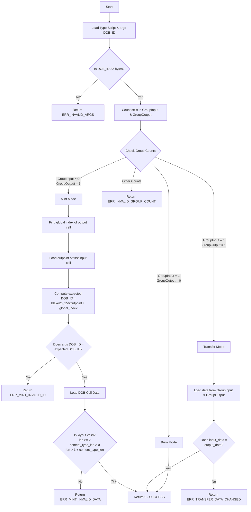

# tiny-dob-script: TinyDOB On-chain Type Script

This directory contains the on-chain validation script (Type Script) for the TinyDOB (tDOB) protocol. It is written in Rust, compiled down to RISC-V binary (`riscv64imac-unknown-none-elf`), and runs directly inside the CKB-VM bare-metal environment.

---

## 1. Protocol Architecture & Lifecycle

The script acts as a **Type Script** enforcing constraints on cell creation, transfers, and destruction. Since it groups cells sharing the exact same code hash and arguments (`dob_id`), it controls the lifecycle of each unique DOB.

### Cell Data Layout
Each TinyDOB cell must store its content-type (MIME) and actual binary payload in its `data` field according to the following layout:
```
┌──────────────────────┬──────────────────────┬───────────────────────────────┐
│ content_type_len     │ content_type         │ content                       │
│ (1 byte, u8)         │ (N bytes, UTF-8)     │ (M bytes, raw binary payload) │
└──────────────────────┴──────────────────────┴───────────────────────────────┘
```

### Execution Flowchart

The following flowchart visualizes the transaction validation flow:



---

## 2. Low-Level Function Call & Library Analysis

The contract uses two core Rust crates: `ckb-std` (official Nervos CKB smart contract SDK) and `blake2b-ref` (pure-Rust BLAKE2b hash library).

### Crate: `ckb-std`

This crate provides wrapper interfaces around CKB-VM environment system calls.

* **`load_script()`** (`ckb_std::high_level::load_script`)
  * **System Call**: `ckb_load_script` (syscall 2052)
  * **Role**: Loads the currently executing script's structure (hash type, code hash, and args). We use it to read the `dob_id` from the script's `args`.
  
* **`load_cell_type(index, source)`** (`ckb_std::high_level::load_cell_type`)
  * **System Call**: `ckb_load_cell_by_field` (syscall 2081, field: `type`)
  * **Role**: Retrieves the Type Script of a cell at a specific index under a source context.
  * **Usage**:
    * Iterates over `Source::GroupInput` and `Source::GroupOutput` to count the group size.
    * Iterates over global `Source::Output` to find the output index where the DOB is minted.

* **`load_input(index, source)`** (`ckb_std::high_level::load_input`)
  * **System Call**: `ckb_load_input` (syscall 2053)
  * **Role**: Loads the raw transaction input structure (which contains `previous_output`).
  * **Usage**: Used with index `0` and `Source::Input` to read the first consumed input.

* **`load_cell_data(index, source)`** (`ckb_std::high_level::load_cell_data`)
  * **System Call**: `ckb_load_cell_data` (syscall 2092)
  * **Role**: Reads the binary payload stored in a cell's data section.
  * **Usage**: Used to check the data layout during Minting and to verify cell data immutability during Transfers.

* **`ckb_std::ckb_types::prelude::Entity`**
  * **Role**: A core Molecule trait.
  * **Usage**: Provides the `.as_slice()` method. This trait must be imported to serialize CKB-VM struct representations like `Script` and `OutPoint` to binary byte slices before feeding them into cryptographic hash functions.

---

### Crate: `blake2b-ref`

A pure Rust implementation of the BLAKE2b hashing standard, optimized for `no_std` platforms.

* **`Blake2bBuilder`** (`blake2b_ref::Blake2bBuilder`)
  * **Role**: Constructs a BLAKE2b hash state.
  * **Usage**:
    ```rust
    let mut blake2b = Blake2bBuilder::new(32)
        .personal(b"ckb-default-hash")
        .build();
    ```
    We configure it to output a 32-byte digest and apply CKB's default personal string `b"ckb-default-hash"` to ensure compatibility with standard CKB cryptographic utilities.

---

## 3. Error Codes Reference Table

If validation fails, the script exits immediately and returns a negative or positive error code (non-zero exits halt and reject the transaction on CKB).

| Exit Code | Constant Name | Description |
| :---: | :--- | :--- |
| **`0`** | `SUCCESS` | Script validation passed successfully. |
| **`10`** | `ERR_INVALID_ARGS` | Failed to load script, or script arguments (DOB ID) are not exactly 32 bytes. |
| **`11`** | `ERR_MINT_INVALID_ID` | The minted DOB ID does not match `blake2b(first_input_outpoint + output_index)`. |
| **`12`** | `ERR_MINT_INVALID_DATA` | DOB cell data is corrupted (e.g. less than 2 bytes, content-type length is zero, or missing payload). |
| **`13`** | `ERR_TRANSFER_DATA_CHANGED` | DOB cell data was modified during a transfer. DOBs must be immutable. |
| **`14`** | `ERR_INVALID_GROUP_COUNT` | The count of cells sharing this Type Script in inputs/outputs does not map to any recognized lifecycle operation. |
| **`15`** | `ERR_MINT_INDEX_NOT_FOUND` | Could not resolve the global output index of the minted DOB cell in the transaction. |

---

## 4. Build and Test Instructions

Make sure the terminal current working directory is this contract's root or the workspace directory.

### Build Contract
Compile the Rust code into a RISC-V ELF binary:
```bash
make build
```
This output binary will be copied to `build/release/tiny-dob-script`.

### Run Tests
Execute the simulation tests defined in `tests/src/tests.rs`:
```bash
make test
```
