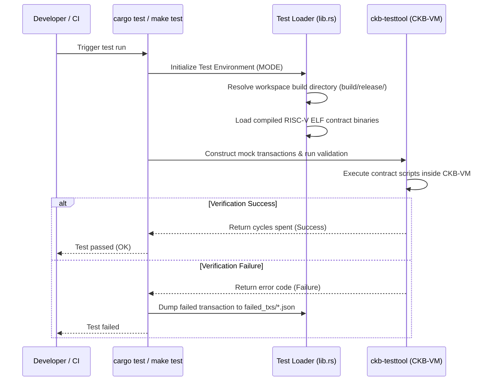

# CKB Contract Test Suite (tests)

This directory contains the integration and simulation test suite for the on-chain scripts (`hello-world` and `tiny-dob-script`). It is written in Rust, utilizing the **`ckb-testtool`** framework to mock CKB cell state, construct transaction structures, and execute scripts in a simulated CKB-VM environment.

---

## 1. Core Testing Ideas & Scenarios

The test suite validates the logic and error paths of the smart contracts:

### A. Hello World Contract
* **`test_hello_world`**: Verifies that the basic entry point contract executes successfully. It deploys the `hello-world` contract as a cell, constructs a mock transaction, calls the VM, and verifies that the script executes cleanly (returning success code `0`).

### B. TinyDOB Type Script Contract
The tests cover the full lifecycle of a digital object (DOB):

1. **Minting DOBs (Mint Mode)**
   * **`test_mint_dob_success`**: Simulates the creation of a new DOB. Verifies that the script passes validation when the Type Script arguments contain a globally unique ID generated from the first input outpoint and output index: `blake2b(first_input_outpoint + output_index)`. It also checks that the cell data layout adheres to `[content_type_len (1 byte)] + [content_type] + [content]`.
   * **`test_mint_dob_invalid_id`**: Asserts that minting fails (exits with error `11` - `ERR_MINT_INVALID_ID`) when the transaction attempts to set an invalid DOB ID (e.g. all zeros) instead of the computed hash.

2. **Transferring DOBs (Transfer Mode)**
   * **`test_transfer_dob_success`**: Verifies that a DOB cell can be successfully transferred from one owner address (lock script) to another, provided that the underlying DOB Type Script and cell data contents remain completely unchanged.
   * **`test_transfer_dob_data_changed`**: Verifies that any attempt to modify the contents of a DOB cell during a transfer transaction is rejected (exits with error `13` - `ERR_TRANSFER_DATA_CHANGED`), enforcing data immutability.

3. **Burning DOBs (Burn Mode)**
   * **`test_burn_dob_success`**: Verifies that a DOB cell can be destroyed/melted. The transaction consumes a DOB cell as input but does not produce any DOB output cell, effectively releasing the CKB capacity back to the owner.

---

## 2. Testing Methodology

The tests do not run against a live CKB node. Instead, they use a mock blockchain environment provided by `ckb-testtool`:

* **Mocking State (`Context`)**: The `Context` struct acts as a mini-node. It maintains a mock blockchain indexer, allowing you to deploy cells (`deploy_cell_by_name`), write cells directly to the ledger (`create_cell`), and build mock transaction structures.
* **Transaction Construction**: Transactions are built programmatically using `TransactionBuilder` by packing cells, lock scripts, type scripts, and binary payload data into CKB's transaction format.
* **CKB-VM Execution**: Calling `context.verify_tx(&tx, max_cycles)` initiates the CKB RISC-V virtual machine interpreter, which runs the compiled contract binaries and returns either the total cycles consumed or verification errors.
* **Failed Transaction Dumper**: If a verification fails, the helper method `verify_and_dump_failed_tx` in `src/lib.rs` writes a complete JSON representation of the failed transaction to `failed_txs/<tx_hash>.json` for easy debugging.

---

## 3. Test Execution Flow



### Steps to Run Tests:

1. **Build RISC-V Contract Binaries**:
   From the root directory, compile the contracts into RISC-V binaries:
   ```bash
   make build
   ```

2. **Execute Test Cases**:
   Run the test runner to execute the test suite:
   ```bash
   make test
   ```
   *Note: Under the hood, this runs `cargo test`. The `Loader` detects the build mode (defaulting to `release` or controlled by the `MODE` environment variable) and pulls the binaries from `build/release/` to execute them in the tests.*
