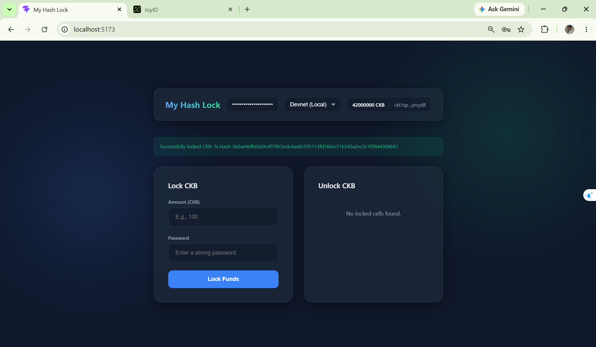
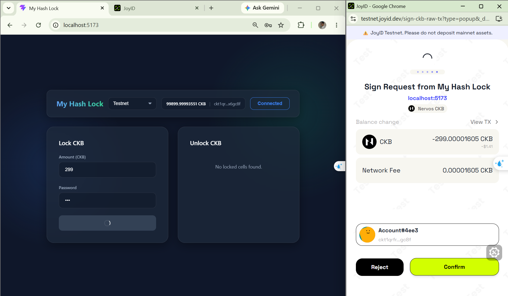
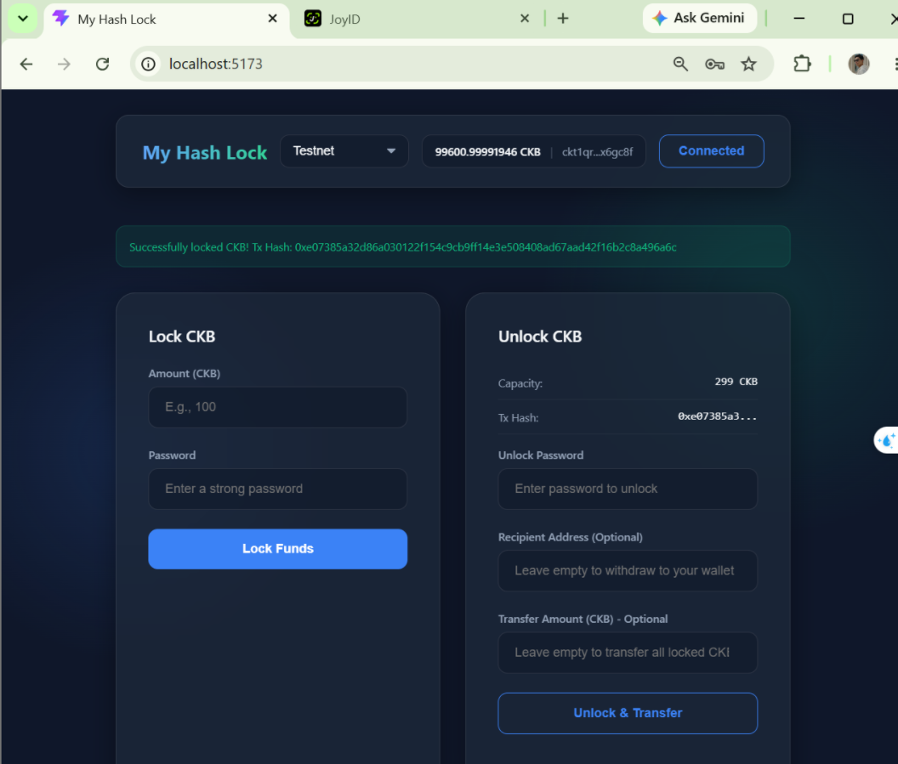
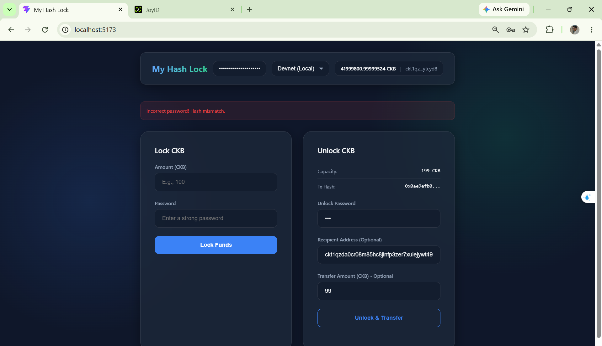
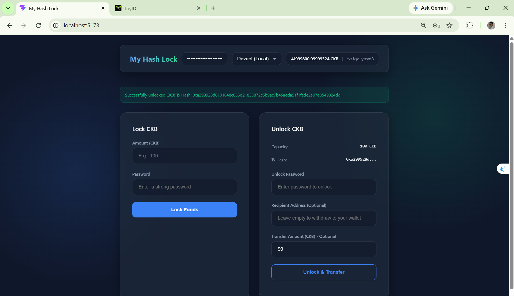
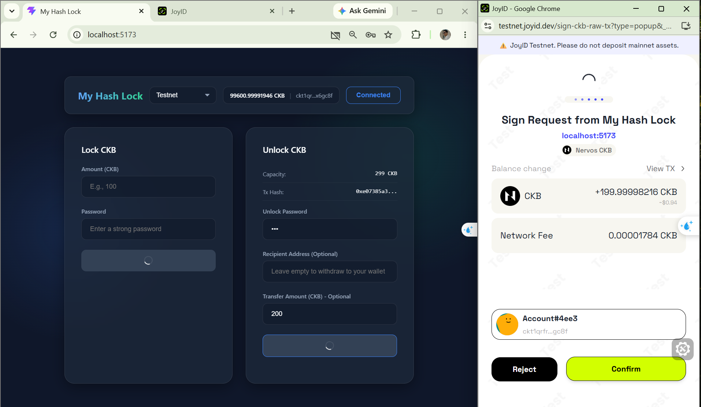
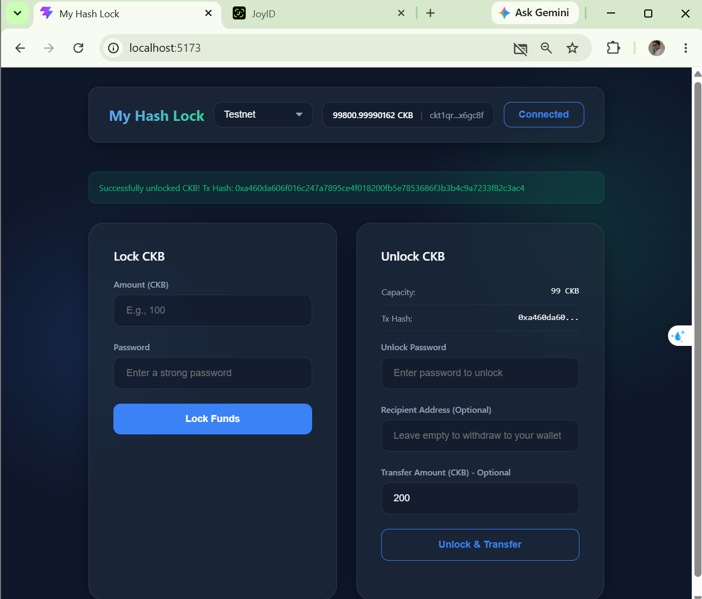

## Builder Track Weekly Report — Week 5

**Name:** Hiep Thach  
**Week Ending:** 19-07-2026

---

### Courses Completed

- **L1 Developer Training Course (Part 1)**
  - Began reading and understanding the foundational concepts in the Nervos Developer Training Course.
- **CCC Documentation**
  - Explored CCC App docs and API docs, diving deep into how `@ckb-ccc/core` connects wallets and constructs transactions on CKB.
- **CCC Playground**
  - Started working through the examples available in the CCC Playground to understand real-world frontend interactions with CKB.

---

### Key Learnings

- **Custom Lock Scripts**: Learned how to create a custom Hash Lock script using Rust (compiled for RISC-V with `ckb-std`), utilizing `WitnessArgs` for extracting preimages.
- **JavaScript/TypeScript Contracts**: Understood how contract scripts work using JS/TS and `ckb-js-vm` by thoroughly analyzing the original simple lock script example.
- **CKB Cell Model & UTXO**: Gained hands-on understanding of how cells are consumed and created in CKB, especially during partial transfers where the change must be re-locked using the same script.
- **CCC SDK & Wallet Integration**: Learned how to integrate **JoyID (FaceID/WebAuthn)** seamlessly using the CCC SDK without worrying about underlying cryptographic differences.
- **Testnet Deployment**: Learned how to deploy custom scripts to the CKB public Testnet using `offckb` and custom SECP256K1 private keys, and how to request Testnet CKB via the Nervos Faucet.

---

### Exercises and Practical Work

- **Built [`simple_lock_project`](simple_lock_project/README.md)**: 
  - Developed a full-stack dApp comprising an on-chain Rust contract (`hash-lock`) and an off-chain React frontend.
  - Successfully built and tested the Smart Contract using `ckb-testtool`.
  - Added support for Network Switching (Devnet vs Testnet).
  - Enhanced the Unlock feature to support **Partial Transfers** (sending a partial amount and automatically re-locking the change with the same Hash Lock password).

---

### Verification Results

- Verified contract deployment on both **Local Devnet** and **Public Testnet**.
  - Devnet deployment log: [deploy_hash_lock_contract.log](simple_lock_project/logs/devnet/deploy_hash_lock_contract.log)
  - Testnet deployment log: [deploy_hash_lock_contract.log](simple_lock_project/logs/testnet/deploy_hash_lock_contract.log)
  - Devnet offckb node log: [offckb_node.log](simple_lock_project/logs/devnet/offckb_node.log)
- Successfully interacted with the dApp using both default Devnet accounts and JoyID on Testnet.
- **Lock CKB:** Successfully locked CKB by hashing a plaintext password (Blake2b) and creating a Hash Lock output cell.
  - 
  - 
  - 
- **Unlock CKB:** Successfully verified the preimage against the on-chain Hash Lock to unlock funds.
  - 
- **Partial Transfer:** Successfully consumed a locked cell to transfer a portion of CKB while correctly creating a change cell that inherits the same Hash Lock script.
  - 
  - 
  - 

---

### Plan for Next Week

- **Module 4 (Part 2)**: Complete reading the L1 Developer Training Course.
- **CCC Playground (Completion)**: Complete all remaining examples and test custom code on CCC Playground.
- **CCC Code Examples**: Run and modify code examples directly from CCC documentation.
- **Community Manuals**: Read "Learning CKB" by Jnr.bit or "Learn CKB in 45 mins".
