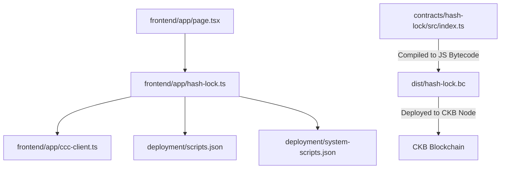
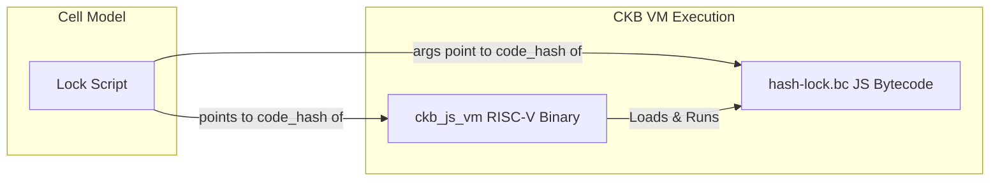
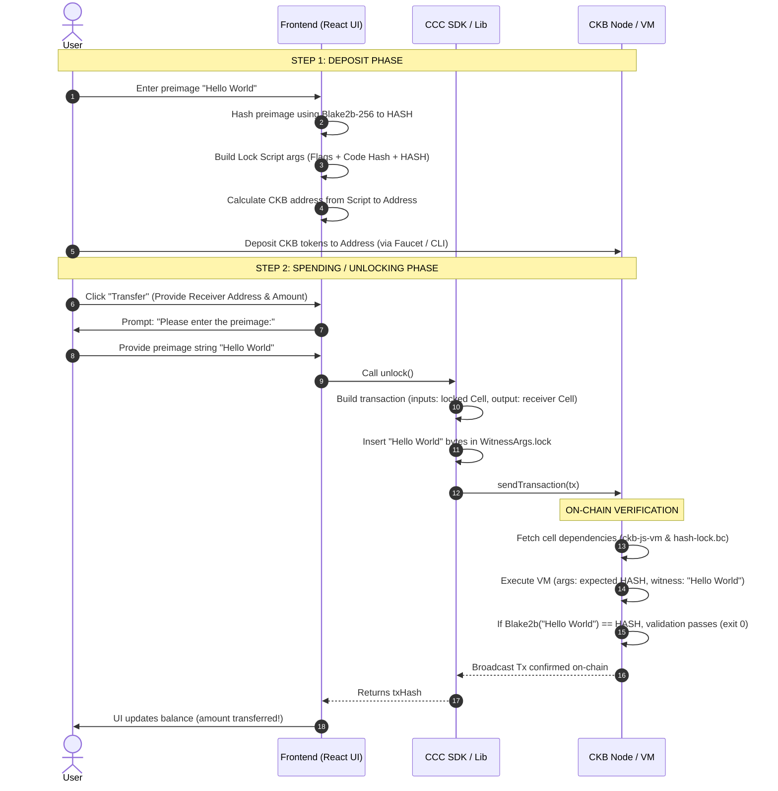
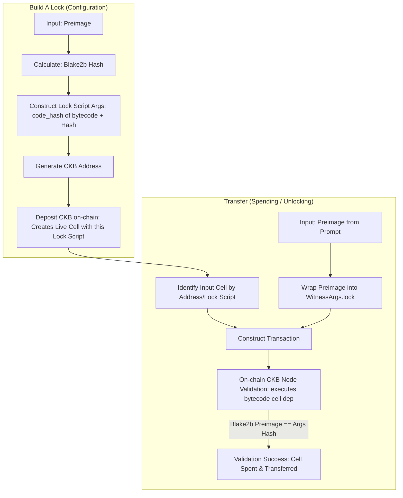
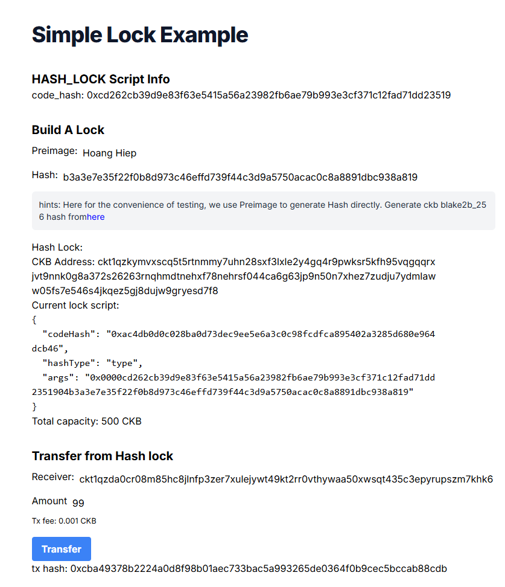

# 📖 Detailed Explanation: Simple Lock dApp

> **Reference Source**: [Build a Simple Lock Tutorial - Nervos Docs](https://docs.nervos.org/docs/dapp/simple-lock)
>
> This is a sample full-stack dApp demonstrating how to build a custom **Hash Lock** contract using the CKB JavaScript VM (`ckb-js-vm`). Users lock CKB tokens by specifying a hash in the Script arguments, and can only unlock (spend) the tokens by providing the matching preimage in the transaction's witness.

---

## 📋 Table of Contents

1. [Overview](#1-overview)
2. [Project Architecture](#2-project-architecture)
3. [CKB Concepts to Know beforehand](#3-ckb-concepts-to-know-beforehand)
4. [Analyzing `index.ts` — The Lock Script](#4-analyzing-indexts--the-lock-script)
5. [Analyzing `hash-lock.ts` — Blockchain Interactions](#5-analyzing-hash-lockts--blockchain-interactions)
6. [Analyzing `page.tsx` — React Frontend UI](#6-analyzing-pagetx--react-frontend-ui)
7. [End-to-End Workflow](#7-end-to-end-workflow)
8. [How to Run the Example](#8-how-to-run-the-example)
   - [8.1 Prerequisites](#81-prerequisites)
   - [8.2 Using Devnet (Local Blockchain)](#82-using-devnet-local-blockchain)
   - [8.3 Under the Hood: What happens during `pnpm run deploy`?](#83-under-the-hood-what-happens-during-pnpm-run-deploy)
9. [Deep Dive: CKB VM execution, Witness layout & Security Concerns](#9-deep-dive-ckb-vm-execution-witness-layout--security-concerns)
10. [Troubleshooting & Setup Fixes](#10-troubleshooting--setup-fixes)
11. [Custom vs Default Lock Verification & Frontend Mapping](#11-custom-vs-default-lock-verification--frontend-mapping)
    - [11.1 How does CKB identify Custom vs. Default Lock Scripts?](#111-how-does-ckb-identify-custom-vs-default-lock-scripts)
    - [11.2 How does the "Build A Lock" UI connect to the Unlocking Transaction?](#112-how-does-the-build-a-lock-ui-connect-to-the-unlocking-transaction)
    - [11.3 Concrete Example Walkthrough (Preimage: "Hoang Hiep")](#113-concrete-example-walkthrough-preimage-hoang-hiep)

---

## 1. Overview

### Purpose
The Simple Lock dApp demonstrates custom transaction verification on CKB. Instead of using standard cryptographic signatures (like Secp256k1) to authorize spending CKB, this dApp uses a custom **Hash Lock** logic:
- **Locking (Deposit)**: You lock CKB under a script that contains a hash ($H = \text{hash}(P)$).
- **Unlocking (Spending)**: Anyone can transfer CKB from this locked account if they provide the correct preimage $P$ (secret string).

| Functionality | Description |
|---|---|
| **Generate Hash Lock** | Enter a secret text (preimage) $\rightarrow$ calculates Blake2b-256 hash $\rightarrow$ generates a CKB Address corresponding to this lock script. |
| **Deposit to Lock** | Fund the generated lock script address with testnet/devnet CKB capacity. |
| **Unlock & Transfer** | Enter receiver address, amount, and the preimage $\rightarrow$ creates transaction $\rightarrow$ inserts preimage in `witnesses` $\rightarrow$ script verifies hash on-chain $\rightarrow$ completes transfer. |

### Tech Stack

| Technology | Role |
|---|---|
| **Next.js 14** | React Framework for the frontend UI. |
| **TypeScript** | Type-safe development across the project. |
| **@ckb-ccc/core** | SDK (Common Canonical Client) for building, signing, and sending CKB transactions. |
| **@ckb-js-std** | Libraries (`core` & `bindings`) used to write CKB smart contracts in JS/TS. |
| **ckb-js-vm** | The on-chain JavaScript/TypeScript execution environment running in CKB-VM. |
| **offckb** | CLI tool for running a local Devnet node and deploying scripts. |

---

## 2. Project Architecture

```
simple-lock/
├── contracts/
│   └── hash-lock/
│       ├── src/
│       │   └── index.ts          # On-chain Lock Script logic (TypeScript)
│       └── tsconfig.json
├── deployment/
│   ├── scripts.json              # Deployed custom script details (populated after deploy)
│   └── system-scripts.json       # System scripts (like ckb-js-vm info)
├── frontend/
│   ├── app/
│   │   ├── ccc-client.ts         # CCC client initialization
│   │   ├── hash-lock.ts          # Frontend transaction construction logic
│   │   ├── globals.css           # Styling
│   │   ├── layout.tsx
│   │   └── page.tsx              # React UI layout and state management
│   ├── deployment/               # Symlinked or copied deployment json files
│   └── package.json
├── tests/
│   ├── hash-lock.devnet.test.ts  # Integration test running on local devnet
│   └── hash-lock.mock.test.ts    # Unit test using ckb-testtool (mocked environment)
├── package.json
└── tsconfig.json
```

### Dependency Graph:



---

## 3. CKB Concepts to Know beforehand

### 3.1 Custom Lock Script vs Default Lock Script
Normally, CKB cells are secured by `secp256k1_blake160_sighash_all`, which checks if the transaction is signed by the private key belonging to the owner of the CKB address. 
In this dApp, we define a **custom Lock Script** called `hash_lock`. The CKB VM runs this custom script to determine whether input cells can be spent. If the script returns exit code `0`, the transaction is authorized.

### 3.2 The ckb-js-vm Execution Model
To avoid writing CKB contracts in low-level languages (like C or Rust), this example uses the `ckb-js-vm`. 
1. Our TS code in `contracts/hash-lock` is compiled into a JavaScript bytecode file (`hash-lock.bc`).
2. This bytecode file is deployed on CKB as raw cell data.
3. The Lock Script on-chain actually points to the `ckb_js_vm` cell dependency. The arguments (`args`) passed to this script instruct the `ckb_js_vm` to fetch our bytecode `hash-lock.bc` from the cell deps and run it.



---

## 4. Analyzing `index.ts` — The Lock Script

This script runs on-chain inside the CKB-VM when validation is triggered for inputs locked by our hash-lock.

```typescript
import * as bindings from "@ckb-js-std/bindings";
import { HighLevel, log, hashCkb, bytesEq } from "@ckb-js-std/core";

function main(): number {
  log.setLevel(log.LogLevel.Debug);
  
  // 1. Load the script configuration
  let script = bindings.loadScript();
  log.debug(`hash-lock script loaded: ${JSON.stringify(script)}`);

  // 2. Load the expected hash from script arguments (skipping 35-byte loader prefix)
  let expect_hash = new Uint8Array(HighLevel.loadScript().args).slice(35);

  // 3. Load the preimage from the first witness argument (witnesses[0].lock)
  let witness_args = HighLevel.loadWitnessArgs(0, bindings.SOURCE_GROUP_INPUT);
  let preimage = witness_args.lock!;

  // 4. Calculate hash of the preimage
  let hash = hashCkb(preimage);

  // 5. Compare the calculated hash with the expected hash
  if (!bytesEq(hash, expect_hash.buffer)) {
    log.error(`Check hash failed: ${new Uint8Array(hash)}, ${expect_hash}`);
    return 11; // Non-zero exit code indicates validation failure
  } else {
    return 0;  // Exit code 0 indicates success
  }
}

bindings.exit(main());
```

### Explanations:
- **`HighLevel.loadScript().args`**: Fetches the arguments array of the script. We slice it starting from index **35** because the first 35 bytes are metadata utilized by `ckb-js-vm` (explained in detail in Section 9.1).
- **`HighLevel.loadWitnessArgs(0, bindings.SOURCE_GROUP_INPUT)`**: Loads the serialized `WitnessArgs` for the cell index `0` of the input script group.
- **`witness_args.lock!`**: The `lock` field of `WitnessArgs` contains the preimage string sent from the frontend.
- **`hashCkb(preimage)`**: Hashes the preimage bytes using Blake2b-256 (the default hashing algorithm in CKB).
- **`bytesEq`**: Utility function to compare binary arrays.

---

## 5. Analyzing `hash-lock.ts` — Blockchain Interactions

This file contains utility functions used by the React frontend to build the unlocking transactions and interact with the node.

### 5.1 Account Generation & Script Mapping
```typescript
export function generateAccount(hash: string) {
  // Construct the lock arguments
  const lockArgs =
    "0x0000" +
    myScripts["hash-lock.bc"]!.codeHash.slice(2) +
    hexFrom(hashTypeToBytes(myScripts["hash-lock.bc"]!.hashType)).slice(2) +
    hash;

  // Build the lock script object
  const lockScript = {
    codeHash: mySystemScripts["ckb_js_vm"]!.script.codeHash,
    hashType: mySystemScripts["ckb_js_vm"]!.script.hashType,
    args: lockArgs,
  };

  // Convert the lock script to a user-friendly CKB Address string
  const address = ccc.Address.fromScript(lockScript, cccClient).toString();
  return {
    address,
    lockScript: ccc.Script.from(lockScript),
  };
}
```
- **`lockArgs` construction**: 
  - `0x0000`: 2-byte flags for `ckb-js-vm`.
  - `codeHash` of `hash-lock.bc`: 32 bytes (64 hex characters) mapping to the compiled bytecode file cell.
  - `hashType` of `hash-lock.bc`: 1 byte indicating how to query the dependency cell (typically `type`).
  - `hash`: The Blake2b-256 hash of our preimage (secret).
- **Resulting Script**: The CKB address is a human-readable representation of this script. Funds sent to this address can only be spent when the script rules are met.

---

### 5.2 Transaction Construction & Unlocking
The `unlock` function constructs the transaction that consumes the funds from the `hash_lock` script.

```typescript
export async function unlock(
  fromAddr: string,
  toAddr: string,
  amountInCKB: string,
): Promise<string> {
  const fromScript = (await ccc.Address.fromString(fromAddr, cccClient)).script;
  const toScript = (await ccc.Address.fromString(toAddr, cccClient)).script;
  
  // Set up a read-only signer (we do not need standard signatures to unlock this cell!)
  const readSigner = new ccc.SignerCkbScriptReadonly(cccClient, fromScript);

  // 1. Build basic outputs (where the unlocked CKB goes)
  const tx = ccc.Transaction.from({
    outputs: [{ lock: toScript }],
    outputsData: [],
  });

  tx.outputs.forEach((output) => {
    output.capacity = ccc.fixedPointFrom(amountInCKB);
  });

  // 2. Add required Cell Dependencies
  await tx.addCellDeps(myScripts["hash-lock.bc"]!.cellDeps[0].cellDep);
  await tx.addCellDeps(mySystemScripts["ckb_js_vm"]!.script.cellDeps[0].cellDep);

  // 3. Search and collect inputs that match the lock script to satisfy capacity requirements
  let occupiedSize = ccc.CellOutput.from({
    capacity: BigInt(1000),
    lock: fromScript,
  }).occupiedSize;

  await tx.completeInputsByCapacity(readSigner, ccc.fixedPointFrom(occupiedSize));
  
  // 4. Calculate change and fee
  const balanceDiff = (await tx.getInputsCapacity(cccClient)) - tx.getOutputsCapacity();
  if (balanceDiff > ccc.Zero) {
    tx.addOutput({
      lock: fromScript, // Send leftover back to the lock script
      capacity: balanceDiff - BigInt(1000), // Minus transaction fee (1000 Shannons)
    });
  }

  // 5. Gather Preimage input and populate Witness field
  const preimageAnswer = window.prompt("please enter the preimage: ");
  if (preimageAnswer == null) {
    throw new Error("user abort input!");
  }
  
  const newWitnessArgs = new ccc.WitnessArgs(
    stringToBytesHex(preimageAnswer) as `0x${string}`,
  );
  
  // Set WitnessArgs.lock in the transaction
  tx.setWitnessArgsAt(0, newWitnessArgs);

  // 6. Broadcast transaction to CKB node without traditional key-signing!
  const txHash = await cccClient.sendTransaction(tx);
  return txHash;
}
```

---

## 6. Analyzing `page.tsx` — React Frontend UI

This React component acts as the main user dashboard:

- **State Fields**:
  - `preimage`: Holds the secret string input (e.g. `"Hello World"`).
  - `hash`: Auto-calculated Blake2b-256 hash of `preimage` (`useEffect` triggers whenever `preimage` changes).
  - `fromAddr` & `fromLock`: Corresponding sender address/script based on the hash.
  - `balance`: Total CKB capacity currently locked in `fromAddr`.
  - `toAddr` & `amountInCKB`: Input fields for specifying where to send unlocked CKB.

- **Triggering Transfer**:
  - Clicking **"Transfer"** calls `unlock(fromAddr, toAddr, amountInCKB)`.
  - The UI temporarily disables the button, requests the preimage via window prompt, sends the transaction to CKB, waits for block inclusion (10s), and updates the balance state.

---

## 7. End-to-End Workflow



---

## 8. How to Run the Example

### 8.1 Prerequisites
Ensure you have **Node.js** (v18+), **pnpm**, and **offckb** CLI installed.

### 8.2 Using Devnet (Local Blockchain)
1. **Start Devnet Node**: Open a new terminal and run:
   ```bash
   offckb node
   ```
2. **Compile and Deploy Lock Script**:
   From the project root folder:
   ```bash
   pnpm install
   pnpm run deploy --network devnet
   ```
3. **Start Frontend Client**:
   ```bash
   # Copy build artifact
   cp deployment/scripts.json frontend/deployment/
   cd frontend
   pnpm install
   # Run local dev server (by default, configured to look for devnet env via config)
   NEXT_PUBLIC_NETWORK=devnet pnpm run dev
   ```
4. **Deposit CKB to the lock address**:
   - Open your browser to `http://localhost:3000`.
   - Copy the generated Hash Lock CKB Address (starts with `ckt...`).
   - Fund the address with CLI:
     ```bash
     offckb deposit --network devnet <PASTE_CKB_ADDRESS> 300
     ```
5. **Transfer/Unlock**:
   - In the browser, fill out a receiver address and amount.
   - Click **Transfer**, type `"Hello World"` when prompted, and watch it unlock instantly!

### 8.3 Under the Hood: What happens during `pnpm run deploy`?

The command `pnpm run deploy --network devnet` runs two main processes: building the contract bytecode and then deploying it to the CKB network.

#### 1. Building the Custom Contract (`node scripts/build-all.js`)
This script locates your TS source file at `contracts/hash-lock/src/index.ts` and does two things:
*   **Bundles TypeScript into JavaScript**: It uses `esbuild` to package the contract logic and dependencies into a single Javascript file: `dist/hash-lock.js`.
*   **Compiles to CKB-VM JS Bytecode**: It runs `ckb-debugger` using the `ckb-js-vm` engine:
    ```bash
    ckb-debugger --read-file dist/hash-lock.js --bin node_modules/ckb-testtool/src/unittest/defaultScript/ckb-js-vm -- -c dist/hash-lock.bc
    ```
    This translates the standard Javascript file into `dist/hash-lock.bc`, an optimized binary bytecode file format that the `ckb-js-vm` interpreter executes inside the CKB-VM on-chain.

#### 2. Deploying to the Blockchain (`node scripts/deploy.js --network devnet`)
This script invokes `offckb deploy --network devnet --target dist --output deployment`. Under the hood, this performs the following blockchain actions:
*   **Constructs a CKB Transaction**:
    *   **Inputs**: It consumes existing Live Cells (UTXOs) from the deployer's wallet (using a default pre-funded private key on devnet) to pay for the required storage capacity and transaction fees.
    *   **Outputs**: It creates a new **Code Cell** containing:
        *   `data`: The raw compiled bytecode binary bytes of `hash-lock.bc`.
        *   `capacity`: The amount of CKB tokens required to "lock" and cover the storage space occupied by the bytecode size (approx. 200+ CKB).
        *   `lock`: Controlled by the deployer's lock script (securing ownership of the contract code).
*   **Signs & Broadcasts**: The transaction is signed using the deployer's private key and sent to the CKB node.
*   **Transaction Confirmation**: It waits until the transaction is mined into a block on the devnet.
*   **Saves Artifacts**: Once confirmed, `offckb` writes the metadata to `deployment/scripts.json`, exposing:
    *   `codeHash`: The unique data hash of the deployed `hash-lock.bc` bytecode cell.
    *   `cellDeps`: The location (`txHash` and output `index`) of the Code Cell. The frontend uses this to reference the script as a transaction dependency.

---

## 9. Deep Dive: CKB VM execution, Witness layout & Security Concerns

### 9.1 Decoding the 35-Byte Slicing inside VM args
In CKB, contracts run inside the CKB virtual machine (CKB-VM). When executing a JavaScript script, the VM actually runs the compiled C-based JS interpreter engine (`ckb_js_vm`). 

When we invoke `HighLevel.loadScript().args`, it retrieves the arguments of the currently running script group. Because CKB runs our JS code via `ckb_js_vm`, the args must be formatted so the VM interpreter knows where to fetch our custom bytecode and how to run it.

The structure of the `args` array in raw bytes is:

```
+---------------+------------------------+-------------------+----------------------------+
| Flags         | bytecode code_hash     | bytecode hash_type| hash_lock contract args    |
| (2 bytes)     | (32 bytes)             | (1 byte)          | (Variable length - Hash)   |
+---------------+------------------------+-------------------+----------------------------+
|<---------------------- 35-Byte Prefix -------------------->|<----- Contract Arguments ->|
```

- **Flags (2 bytes)**: Configures JS engine parameters (like debug levels or engine settings). Set to `0x0000` here.
- **Bytecode code_hash (32 bytes)**: The Blake2b-256 identifier pointing to the cell containing the compiled `hash-lock.bc` JavaScript bytecode.
- **Bytecode hash_type (1 byte)**: Instructs CKB-VM on how to locate the dependency cell (e.g. `0x01` for `type` or `0x00` for `data`).
- **Hash Lock Arguments**: The actual argument passed into our custom script (the Blake2b-256 hash of the secret preimage).

Thus, doing `.slice(35)` is mandatory to strip away the virtual machine interpreter parameters and access only our custom contract args!

---

### 9.2 Witness Layout
In CKB transactions, `witnesses` are variable-length byte arrays associated with each input. They are typically used to store transaction signatures. 

To easily handle multiple structured fields inside the witness, CKB-VM developers use the **`WitnessArgs`** data structure. According to [CKB RFC-0022](https://github.com/nervosnetwork/rfcs/blob/master/rfcs/0022-transaction-structure/0022-transaction-structure.md), a serialized `WitnessArgs` contains:
1. `lock`: Verifier-specific authorization data (e.g. signatures or, in our case, the preimage text).
2. `input_type`: Metadata for type scripts in inputs.
3. `output_type`: Metadata for type scripts in outputs.

By wrapping our preimage in the `lock` field of `WitnessArgs`, the on-chain contract can cleanly extract it via the `HighLevel.loadWitnessArgs(0, SOURCE_GROUP_INPUT)` API, retrieve the `.lock` bytes, and perform hash checks.

---

### 9.3 Security Analysis: Why Hash Lock is unsafe for Production
While this contract illustrates script logic execution perfectly, it is fundamentally vulnerable to two attacks:

#### 1. Miner Front-running (MEV / Front-running)
When a transaction is broadcasted to the network, it enters the **Mempool** (the public pool of unconfirmed transactions). Miners and node runners examine these pending transactions. 

Because the preimage is stored in plaintext inside the witness field, a malicious miner or front-runner can:
- See the transaction in the mempool.
- Extract the preimage.
- Construct a new transaction with a higher fee that consumes the exact same inputs (your locked cell) but sends the outputs to *their own* address.
- Mine their transaction first, stealing your funds.

#### 2. Replayability and Public Exposures
Once the unlocking transaction is successfully mined and added to the blockchain, the witness (including the preimage) is recorded in public ledger history. 

If you locked multiple cells using the *same* lock script hash, as soon as you unlock one, the preimage becomes public knowledge. Anyone can scan the block history, copy the preimage, and build transactions to drain all remaining cells using the same lock.

> [!WARNING]
> To avoid these security vulnerabilities in production, lock scripts should use cryptographic signature schemes (like ECDSA or Schnorr signatures) which require a dynamic signature that changes per transaction and cannot be reused or front-run by other entities.

---

## 10. Troubleshooting & Setup Fixes

When setting up and deploying the dApp on a fresh environment, you might run into the following configuration issues:

### 10.1 The `[ERR_PNPM_IGNORED_BUILDS]` Error
* **Problem**: Newer versions of `pnpm` (v10+) enforce strict security policies and ignore dependency post-install build scripts by default, producing the error:
  ```
  [ERR_PNPM_IGNORED_BUILDS] Ignored build scripts: esbuild@..., secp256k1@..., sharp@..., unrs-resolver@...
  ```
* **Solution**: You must explicitly authorize the required dependencies to run their build scripts. This is done by modifying [pnpm-workspace.yaml](file:///home/hiepthach/04_CKB/docs.nervos.org/examples/dApp/simple-lock/pnpm-workspace.yaml) and changing the placeholder lines under `allowBuilds` from `set this to true or false` to `true`:
  ```yaml
  allowBuilds:
    esbuild: true
    secp256k1: true
    sharp: true
    unrs-resolver: true
  ```
  After saving the file, run `pnpm install` again to properly build the binary assets.

### 10.2 The `esbuild` ELF Executable Syntax Error
* **Problem**: In a `pnpm` workspace, the generated `.bin/esbuild` wrapper shell script tries to run the esbuild binary file via Node (`node .../esbuild/bin/esbuild`). Because `esbuild` downloads a compiled native ELF binary executable to that path, Node tries to parse the ELF executable as Javascript and crashes with:
  ```
  SyntaxError: Invalid or unexpected token
  ```
* **Solution**: Bypass the broken `pnpm` wrapper shim entirely. Change the esbuild invocation command inside the [scripts/build-contract.js](file:///home/hiepthach/04_CKB/docs.nervos.org/examples/dApp/simple-lock/scripts/build-contract.js#L54-L68) file to target the native binary directly:
  ```diff
  - "./node_modules/.bin/esbuild",
  + "./node_modules/esbuild/bin/esbuild",
  ```
  This guarantees that the OS executes the native ELF binary directly instead of passing it to Node.js.

### 10.3 Integration Tests Failing with Missing Private Key
* **Problem**: Running `pnpm test` crashes with `PRIVATE_KEY is not set in environment variables or .env file` during the Devnet integration test.
* **Solution**: Create a [.env](file:///home/hiepthach/04_CKB/docs.nervos.org/examples/dApp/simple-lock/.env) file in the root of the `simple-lock` folder and supply one of the default pre-funded private keys from your Devnet (e.g., generated by `offckb accounts`):
  ```env
  PRIVATE_KEY=0x6109170b275a09ad54877b82f7d9930f88cab5717d484fb4741ae9d1dd078cd6
  ```

---

## 11. Custom vs Default Lock Verification & Frontend Mapping

Understanding how CKB matches execution scripts and how the frontend links the user inputs to on-chain verification is crucial for CKB development.

### 11.1 How does CKB identify Custom vs. Default Lock Scripts?
On CKB, there is no hardcoded concept of "Default" vs "Custom" lock scripts. To the CKB Node, **everything is a Script**. 

Every Cell has a `lock` property consisting of:
```json
{
  "code_hash": "0x...",
  "hash_type": "type" | "data",
  "args": "0x..."
}
```

When a transaction consumes an input Cell, the CKB node MUST validate the Lock Script rules:
1. The node scans the `code_hash` specified in the input Cell's `lock`.
2. It searches the transaction's **`cell_deps`** (cell dependencies) array.
3. For each Cell in `cell_deps`, the node computes its data hash (or type script hash depending on `hash_type`).
4. Once a match is found (i.e. `input.lock.code_hash == cell_deps[i].data_hash`), CKB starts the CKB-VM instance and executes the binary bytecode found in that dependency Cell.

*   **Default Lock Script** (e.g. standard Secp256k1): The input Cell's `lock.code_hash` matches the hash of the system's Secp256k1 validation cell. The transaction's `cell_deps` includes the default system out-point.
*   **Custom Lock Script** (e.g. `hash_lock` running in `ckb_js_vm`): The input Cell's `lock.code_hash` matches the hash of the `ckb_js_vm` runner. The transaction's `cell_deps` includes:
    *   The `ckb_js_vm` cell dependency.
    *   Our custom compiled bytecode cell `hash-lock.bc`.

CKB simply loads the corresponding binary bytecode from `cell_deps` and executes it. The script code itself determines if the transaction is authorized.

---

### 11.2 How does the "Build A Lock" UI connect to the Unlocking Transaction?
The "Build A Lock" panel on the frontend is the **address configuration state**, while the "Transfer" panel triggers the **spending state**. They are linked by the CKB Cell model:



1.  **Address & Script Derivation**: When you input a preimage in "Build A Lock", the frontend computes its Blake2b hash. It generates a custom `lockScript` where the `args` field contains this hash. The CKB address is merely a human-readable representation of this script.
2.  **Cell Creation (Locking)**: When funds are deposited into that address, a Cell is created on the CKB ledger whose `lock` field is set to that exact `lockScript` (containing the hash).
3.  **Witness & Verification (Unlocking)**: When you click "Transfer", the transaction consumes this Cell as an input. To spend it, you must provide the preimage. The frontend prompts you for the preimage and places it in the `WitnessArgs.lock` field.
4.  **Execution Match**: During on-chain verification, CKB-VM runs the contract, which extracts the expected hash from its `args` (created during the "Build A Lock" step) and compares it with the hash of the preimage provided in the `Witness` (created during the "Transfer" step). If they match, the tokens are unlocked.

---

### 11.3 Concrete Example Walkthrough (Preimage: "Hoang Hiep")



To see this connection in action, let's analyze the following actual data configuration where the user sets up a lock using `"Hoang Hiep"` as the secret passcode:

#### The Configured Values in the UI:
*   **Preimage**: `Hoang Hiep`
*   **Calculated Hash (Blake2b-256)**: `b3a3e7e35f22f0b8d973c46effd739f44c3d9a5750acac0c8a8891dbc938a819`
*   **CKB Address**: `ckt1qzkymvxscq5t5rtnmmy7uhn28sxf3lxle2y4gq4r9pwksr5kfh95vqgqqrxjvt9nnk0g8a372s26263rnqhmdtnehxf78nehrsf044ca6g63jp9n50n7xhez7zudju7ydmlaww05fs7e546s4jkqez5gj8dujw9gryesd7f8`
*   **Generated Lock Script**:
    ```json
    {
      "codeHash": "0xac4db0d0c028ba0d73dec9ee5e6a3c0c0c98fcdfca895402a3285d680e964dcb46",
      "hashType": "type",
      "args": "0x0000cd262cb39d9e83f63e5415a56a23982fb6ae79b993e3cf371c12fad71dd2351904b3a3e7e35f22f0b8d973c46effd739f44c3d9a5750acac0c8a8891dbc938a819"
    }
    ```

#### Detailed Lock Script Args Breakdown:
The 74-byte hex string in `args` (`0x0000cd26...8a19`) is concatenated from 4 distinct fields:
1.  `0x0000` (2 bytes): Config flags for the JS VM runner.
2.  `cd262cb39d9e83f63e5415a56a23982fb6ae79b993e3cf371c12fad71dd23519` (32 bytes): The unique `codeHash` of our deployed compiled bytecode `hash-lock.bc` (matching `deployment/scripts.json`), telling `ckb_js_vm` what JS program to load.
3.  `04` (1 byte): The `hashType` of `hash-lock.bc`. `04` corresponds to `"data2"`.
4.  `b3a3e7e35f22f0b8d973c46effd739f44c3d9a5750acac0c8a8891dbc938a819` (32 bytes): The expected Blake2b hash of the preimage `"Hoang Hiep"`. This is the direct argument passed to our `hash-lock.bc` script.

#### Unlocking / Spending Flow:
1.  When transferring from this lock address, the user types `"Hoang Hiep"` in the browser prompt.
2.  The frontend embeds the string `"Hoang Hiep"` into the `WitnessArgs.lock` field of the transaction.
3.  The CKB Node launches the VM, matches the lock script's `codeHash` (`0xac4db...`), and runs `ckb_js_vm`.
4.  `ckb_js_vm` retrieves our `hash-lock.bc` from the transaction's `cell_deps` (matching the `cd262cb...` hash in the args) and runs it.
5.  Our custom code in `index.ts` slices off the first 35 bytes of the script args, leaving exactly `b3a3e7e35f22f0b8d973c46effd739f44c3d9a5750acac0c8a8891dbc938a819` (the expected hash).
6.  The script then hashes the witness value (`"Hoang Hiep"`), getting `b3a3e7e35f22f0b8d973c46effd739f44c3d9a5750acac0c8a8891dbc938a819`.
7.  Since the two hashes match, the script returns `0` (success), authorizing CKB to spend the cell and send the funds!

