# Simple Lock Project

A complete decentralized application (dApp) demonstrating a Hash Lock on the Nervos CKB network.
This project contains both the On-chain Smart Contract written in Rust, and the Off-chain Frontend written in React & TypeScript using `@ckb-ccc/core`.

## Architecture Overview & Operation Flow

This project connects an Off-chain Frontend with an On-chain Rust Smart Contract. The diagram below illustrates how they interact during the Lock and Unlock phases.

```mermaid
sequenceDiagram
    participant U as User (Wallet)
    participant F as Frontend (CCC SDK)
    participant N as CKB Node
    participant V as CKB VM (hash-lock)

    %% Lock Phase
    rect rgb(20, 40, 60)
        note right of U: Phase 1: Lock CKB
        U->>F: Enters CKB Amount & Password
        F->>F: Hashes Password (Blake2b)
        F->>F: Builds Tx (Output Cell with hash_lock & args = Hash)
        F->>U: Requests Signature
        U-->>F: Signs Tx (pays from wallet)
        F->>N: Broadcasts Lock Tx
        N-->>U: Cell Locked on-chain
    end

    %% Unlock Phase
    rect rgb(20, 60, 40)
        note right of U: Phase 2: Unlock CKB
        U->>F: Selects Locked Cell & Enters Password
        F->>F: Builds Tx (Input = Locked Cell, Witness = Password)
        F->>F: Adds CellDep for hash_lock script
        F->>U: Requests Signature (for fee if needed)
        U-->>F: Signs Tx
        F->>N: Broadcasts Unlock Tx
        N->>V: Triggers Script Validation
        V->>V: Reads Witness & Hashes Password
        V->>V: Compares Hash with Cell Args
        V-->>N: Returns 0 (Success)
        N-->>U: CKB Transferred to Recipient
    end
```



### Components
1. **ckb-rust-script/**: The On-chain Rust Smart Contract.
   - Implements a basic Hash Lock.
   - Requires the user to provide a plaintext password, packed into a Molecule schema (`HashLockWitness`), in the `WitnessArgs.lock` field that hashes (using Blake2b) to the 32-byte arguments embedded in the Lock Script.
   - Built on `ckb-std = "1.1"` without C-dependencies to simplify RISC-V cross-compilation.
2. **frontend/**: The Off-chain Frontend Application.
   - Built with Vite, React, and TypeScript.
   - Uses `@ckb-ccc/core` and `@ckb-ccc/connector-react` to interact with JoyID and other CKB wallets.
   - Allows users to lock CKB with a specific password and unlock it later.
   - Beautiful, modern Glassmorphism UI with Dark Mode.
   - Supports switching between **Devnet** (Local) and **Testnet**.

## Features
- **Native Rust Contract**: Highly optimized CKB-VM RISC-V contract for hash verification.
- **Custom Lock Script**: Demonstrates how to create and unlock a custom script using `WitnessArgs`.
- **Molecule Serialization**: Utilizes Molecule schemas for structured, zero-copy deserialization of the witness payload.
- **Wallet Agnostic**: Powered by CCC SDK, allowing connection with **JoyID** (FaceID/WebAuthn), MetaMask, UniSat, etc.
- **Network Switcher**: Easily toggle between CKB Testnet (Real Wallets) and Devnet (Local node).
- **Glassmorphism UI**: Beautiful, modern frontend design built with React & Vite.
- **Partial Transfers**: Advanced unlock functionality that sends a partial amount and automatically re-locks the change with the same Hash Lock!
- **Full dApp Flow**: Lock CKB with a password and securely unlock/transfer it later.

## Project Structure
```text
simple_lock_project/
├── ckb-rust-script/         # On-chain Smart Contract
│   ├── contracts/
│   │   └── hash-lock/       # The Rust contract source code
│   ├── tests/               # ckb-testtool unit tests
│   ├── scripts/             # Deployment scripts (deploy.sh)
│   └── Cargo.toml           # Workspace configuration
└── frontend/                # Off-chain React UI
    ├── src/
    │   ├── lib/
    │   │   └── hash-lock.ts # CCC SDK logic for building Tx
    │   ├── App.tsx          # Main React Application
    │   └── index.css        # Glassmorphism Styles
    ├── deployment/          # Syncs with on-chain artifacts
    └── package.json         # Frontend dependencies
```

## Tech Stack & Tools
- **Languages:** Rust (Smart Contract), TypeScript (Frontend), CSS (Styling)
- **Frameworks:** React, Vite
- **Libraries:** `@ckb-ccc/core` (dApp SDK for CKB), `ckb-std` (Rust std library for CKB VM), `molecule`
- **Tools:** `offckb` (Local CKB Node & CLI toolkit), `cargo`, `clang`

## Getting Started

### 1. Build and Test the Smart Contract

```bash
cd ckb-rust-script
# Build the contract for RISC-V
make build

# Run unit tests (Host architecture)
make test
```

### 2. Deploy the Smart Contract

**For Local Devnet:**
Make sure you are running a local node in a separate terminal:
```bash
offckb node
```
Then run the deployment script:
```bash
cd ckb-rust-script
bash scripts/deploy.sh devnet
```

**For Public Testnet:**
You will need a SECP256K1 private key funded with Testnet CKB.
```bash
cd ckb-rust-script
PRIVATE_KEY="0xYOUR_PRIVATE_KEY" bash scripts/deploy.sh testnet
```

### 3. Run the Frontend

```bash
cd frontend
# Install dependencies
npm install

# Start the dev server
npm run dev
```

## References
- [CKB Simple Lock Tutorial](https://docs.nervos.org/docs/dapp/simple-lock)
- [Rust Example: Simple Lock](https://docs.nervos.org/docs/script/rust/rust-example-simple-lock)
- [CCC SDK Core](https://docs.nervos.org/docs/dapp/ccc/)
