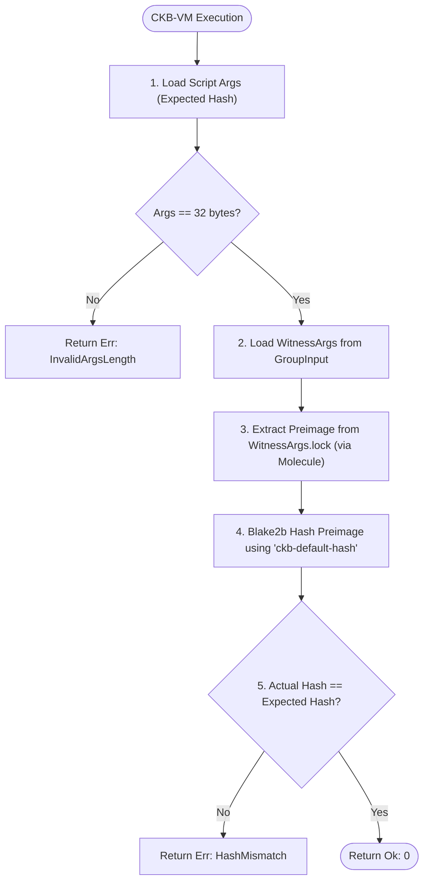

# Simple Lock CKB Rust Script

This directory contains the on-chain Rust contract for the Simple Lock dApp.
Unlike the reference project which uses the `ckb-js-vm` and TypeScript, this implementation is a **native CKB-VM RISC-V contract** written in `no_std` Rust.

## Prerequisites
- Rust and Cargo (`rustup`)
- The RISC-V target installed: `rustup target add riscv64imac-unknown-none-elf`
- `make` and `clang` (version 18+ recommended)

## Contract Logic & On-Chain Verification Flow

The `hash-lock` script provides a simple hash-based locking mechanism:
- When locking CKB, the `args` of the lock script contains a 32-byte Blake2b-256 hash.
- To unlock the CKB, the user must provide the corresponding preimage (secret text) packed inside a Molecule schema (`HashLockWitness`) in the `WitnessArgs.lock` field.
- During transaction verification on-chain, the CKB-VM runs this contract, which extracts the preimage from the witness using Molecule's zero-copy deserialization, hashes it, and compares it with the expected hash stored in `args`. If they match, the transaction is approved (exit code `0`).



## Build Instructions
To build the contract for the CKB-VM (RISC-V target):
```bash
make build
```
This command compiles the contract and places the optimized binary at `build/release/hash-lock`.

## Deployment
A deployment script is provided to deploy the compiled contract to your local Devnet or public Testnet.

**Deploy to Local Devnet:**
```bash
# From the ckb-rust-script directory
bash scripts/deploy.sh devnet
```

**Deploy to Testnet (with Custom Private Key):**
To deploy to the Testnet, you must provide a SECP256K1 private key funded with Testnet CKB:
```bash
PRIVATE_KEY="0xYOUR_PRIVATE_KEY" bash scripts/deploy.sh testnet
```

This script will deploy the compiled `hash-lock` binary to the specified network and automatically update `frontend/deployment/scripts.json` so the frontend knows the new `codeHash` and `cellDeps`.

## Run Tests
The test suite uses `ckb-testtool` to simulate the CKB-VM and verify the transaction logic without needing a live node.
To run the tests:
```bash
make test
```
The tests will verify:
1. Successful unlock with the correct preimage.
2. Failed unlock with an incorrect preimage.
3. Failed unlock when the witness is empty.
4. Failed unlock when the script arguments are not exactly 32 bytes.
