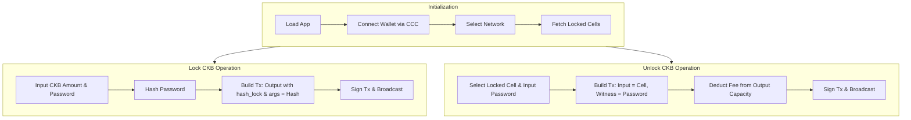

# Simple Lock - Frontend

This is the React frontend for the Simple Lock dApp on Nervos CKB. 
It uses `@ckb-ccc/core` for CKB interactions and `@ckb-ccc/connector-react` for wallet connections.

## Features & Operation Flow
- **Network Switcher**: Easily toggle between CKB Testnet and Devnet (Local node).
- **Wallet Connection**: Connect to **JoyID** (FaceID/WebAuthn) or injected wallets like MetaMask via CCC SDK.
- **Lock CKB**: Create a Hash Lock cell by hashing a plaintext password.
- **Unlock CKB**: Consume the locked cell by providing the correct plaintext password in the witness.
- **Partial Transfers**: When unlocking, specify a custom transfer amount. The remaining CKB is automatically re-locked with the same Hash Lock!



## File Structure
- `src/lib/hash-lock.ts`: Contains the core `@ckb-ccc/core` logic for building `lock` and `unlock` transactions. 
  *Note: It includes comments referencing official Nervos documentation for learning purposes.*
- `src/App.tsx`: The main UI component handling states and wallet interactions.
- `src/index.css`: A premium Vanilla CSS design system featuring glassmorphism and modern UI elements.

## Configuration
The application automatically reads the deployed Hash Lock script configuration (like `codeHash` and `cellDeps`) from `src/deployment/scripts.json`. This file is automatically generated and synchronized when you run the deploy script in the `ckb-rust-script` folder (`bash scripts/deploy.sh`).

## Run Locally
```bash
npm install
npm run dev
```
