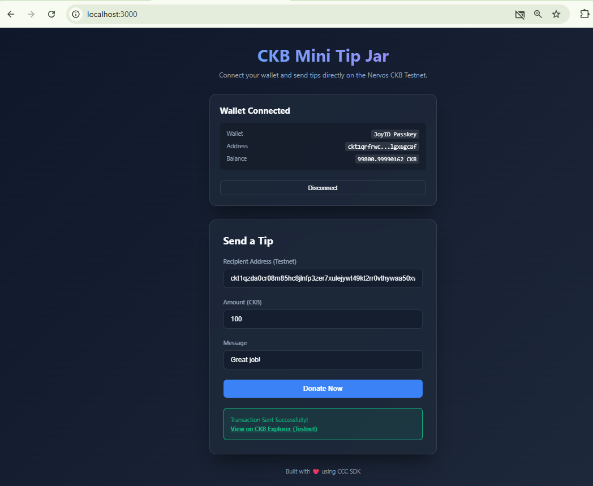
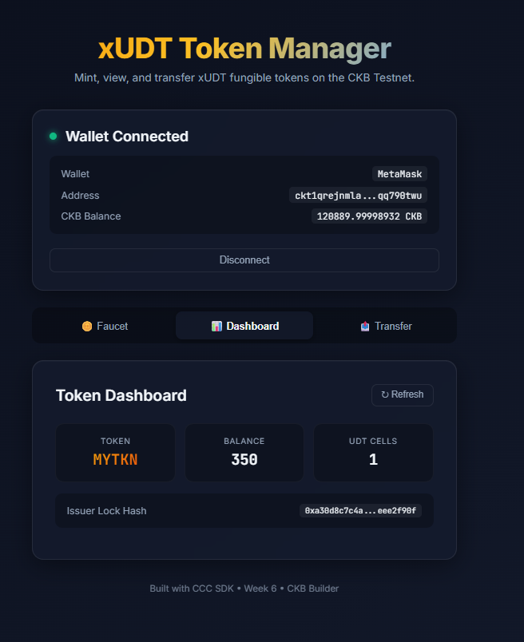

## Builder Track Weekly Report — Week 6

**Name:** Hiep Thach  
**Week Ending:** 26-07-2026

---

### Courses Completed

- **L1 Developer Training Course (Part 2)**
  - Completed reading the remaining concepts in the Nervos L1 Developer Training Course.
- **CCC Documentation**
  - Read through CCC App docs and API docs.
- **Community Manuals & Guides**
  - Read through community manuals like "Learning CKB" by Jnr.bit".
  - Studied Bitcoin Lightning Network and Nervos Fiber Network.

---

### Key Learnings

- **CCC Core Concepts & SDK Guides**: Deeply analyzed CCC SDK packages, components, and concepts.
- **Nervos Fiber Network**: Studied payment channels and their implementation on CKB via Fiber Network compared to Bitcoin Lightning Network.
- **xUDT & Token Management**: Practiced creating and managing Extensible UDT (xUDT) tokens using CCC and Next.js, including token minting and transferring functionalities.
- **Spore Protocol (DOB)**: Explored Spore Protocol for Digital Object (DOB) and built a badge platform for minting and displaying Spore badges on-chain.
- **Agentic Dev Skills**: Explored custom AI skill rules in `ckb-dev-skills` to enhance the development workflow for CKB.

---

### Exercises and Practical Work

- **Built [`mini-tip-jar`](mini-tip-jar/)**:
  - A simple Tip Jar dApp allowing users to connect their wallet and send CKB tips.
  - Practiced using `@ckb-ccc/connector-react` and `@ckb-ccc/core` to construct and send transactions on Testnet.
- **Built [`xudt-token-manager`](xudt-token-manager/)**:
  - A dApp to interact with xUDT (Extensible User Defined Token).
  - Practiced using CCC to implement xUDT Token Faucet, Token Dashboard, and Token Transfer.
- **Built [`spore-badge-platform`](spore-badge-platform/)**:
  - Explored and implemented a platform for creating and managing on-chain badges using the Spore Protocol (DOBs).
  - Practiced constructing transactions to mint Spore cells using CCC SDK.

---

### Verification Results

- **Mini Tip Jar**:
  - Successfully connected wallet and implemented CKB tips transferring.
  - 
- **xUDT Token Manager**:
  - Implemented the xUDT Token Faucet, Dashboard, and Transfer UI.
  - 
- **Spore Badge Platform**:
  - Initialized project structure and core components for Spore badge minting and gallery layout. Tested successfully with `npm run dev`.
  - 

---

### Plan for Next Week

- **Module 7**: Read CKB Script Programming Series to gain advanced insights.
- **Capstone Project Brainstorm & Prototype**: Finalize Capstone Idea and build the initial prototype (POC).
- **Architecture Design**: Design the capstone project's system architecture and determine the core tech stack.
