# CKB Mini Tip Jar dApp

This project is a decentralized application (dApp) built on the **Nervos CKB Testnet**. It serves as a "Tip Jar" where users can connect their Web3 wallets (JoyID, MetaMask, UniSat) to view their balances and donate CKB along with a custom on-chain message.

The project demonstrates the core capabilities of the **CCC SDK (CKBers' Codebase)** for seamless multi-wallet integration and declarative transaction building on CKB.

---

## Architecture Overview & Operation Flow

This application is purely a frontend off-chain integration. It leverages the CKB default Lock Scripts (Secp256k1/OmniLock) instead of a custom on-chain smart contract.

```mermaid
sequenceDiagram
    participant U as User (Wallet)
    participant F as Frontend (CCC SDK)
    participant N as CKB Node

    %% Phase 1: Tip Transaction / State Creation
    rect rgb(20, 40, 60)
        note right of U: Send Tip (Transfer CKB & Data)
        U->>F: Enters Recipient Address, Amount & Message
        F->>F: Decodes Address to Lock Script
        F->>F: Encodes Message to Hex for outputData
        F->>F: Builds Tx (Output Cell with Lock & Data)
        F->>F: Automatically Collects UTXOs (completeInputsByCapacity)
        F->>F: Calculates Fee & Change (completeFeeBy)
        F->>U: Requests Signature
        U-->>F: Signs Tx (pays capacity & fees)
        F->>N: Broadcasts Transaction
        N-->>U: Transaction Confirmed on CKB Network
    end
```



---

## Components Overview

- `frontend/`: The Next.js (React) application that provides the user interface and handles off-chain transaction logic using the `@ckb-ccc/connector-react` and `@ckb-ccc/core` libraries.

---

## Features

- **Multi-Wallet Integration**: Supports JoyID, MetaMask, UniSat, and OKX Wallet using a unified interface.
- **Testnet Ready**: Configured for the Nervos CKB Testnet (Aggron).
- **On-chain Messaging**: Encodes custom text messages as Hex and embeds them directly into the transaction's `outputData`.
- **Declarative Transactions**: Automatic UTXO gathering, fee calculation, and change generation via CCC SDK.
- **Premium UI**: Beautiful glassmorphism aesthetic built with vanilla CSS.

---

## Project Structure

```text
CKBuilder/week6/mini-tip-jar/
└── frontend/                   # Next.js Application
    ├── package.json
    ├── tsconfig.json
    ├── next.config.js
    └── src/
        ├── app/
        │   ├── layout.tsx      # Application layout & <ccc.Provider>
        │   ├── page.tsx        # Main landing page
        │   └── globals.css     # Premium UI styles
        └── components/
            ├── WalletConnect.tsx # Wallet state & connection UI
            └── TipJarForm.tsx    # Transaction logic & tip form
```

---

## Tech Stack & Tools

| Category     | Technology / Tool             |
| ------------ | ----------------------------- |
| Framework    | Next.js (App Router), React   |
| Language     | TypeScript                    |
| Styling      | Vanilla CSS (Glassmorphism)   |
| CKB SDK      | `@ckb-ccc/core`, `@ckb-ccc/connector-react` |
| Node.js      | >= 18.0.0                     |

---

## Getting Started

Since this project does not contain a custom on-chain Rust contract, you only need to run the frontend application.

### Step 1: Run the Frontend

Navigate to the frontend directory and install dependencies:

```bash
cd frontend
npm install
```

Start the local development server:

```bash
npm run dev
```

### Step 2: Use the dApp

1. Open your browser and navigate to `http://localhost:3000`.
2. Ensure you have a Web3 Wallet (like [JoyID Testnet](https://testnet.joyid.dev) or MetaMask) connected to the CKB Testnet.
3. Click "Connect Wallet" and authorize the connection.
4. Fill out the recipient testnet address, amount, and message in the form.
5. Click "Donate Now" and sign the transaction popup in your wallet.
6. Click the generated Explorer link to view your transaction on the CKB Explorer!

---

## References

- [Nervos CKB Documentation](https://docs.nervos.org/)
- [CCC SDK Documentation](https://docs.ckbccc.com/)
- [JoyID Wallet](https://joy.id/)
- [CKB Testnet Explorer](https://explorer.nervos.org/aggron/)
