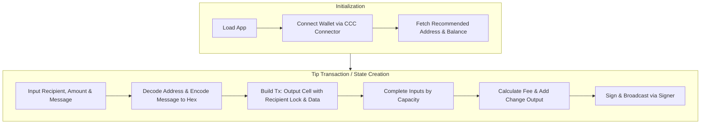

# CKB Mini Tip Jar - Frontend

This is the off-chain frontend interface for the CKB Mini Tip Jar dApp. It is built using **Next.js (React)** and integrates seamlessly with the Nervos CKB blockchain via the **CCC SDK** (`@ckb-ccc/core`, `@ckb-ccc/connector-react`).

## Features & Operation Flow

- Connects to Web3 wallets (JoyID, MetaMask, UniSat).
- Displays user's CKB balance in real-time.
- Composes and signs transactions to send CKB tips with an embedded hex-encoded message.
- Tracks transaction progress and provides block explorer links.



## File Structure

- `src/app/layout.tsx`: Initializes the `<ccc.Provider>` with the supported wallets.
- `src/app/page.tsx`: The main landing page layout.
- `src/app/globals.css`: Contains the premium glassmorphism styling and UI constraints.
- `src/components/WalletConnect.tsx`: React component for handling the wallet connection state, fetching the recommended address, and displaying the CKB balance.
- `src/components/TipJarForm.tsx`: React component containing the core CCC transaction logic. Handles address decoding, message hex encoding, and declarative transaction building (`completeInputsByCapacity` / `completeFeeBy`).

## Configuration & Network

This frontend currently targets the **CKB Testnet (Aggron)** by default. When connecting with wallets like MetaMask (OmniLock) or JoyID, ensure that the wallet's internal network is properly set to Testnet.

Since this project leverages standard CKB Lock Scripts and does not deploy custom smart contracts, there are no synchronized `scripts.json` artifacts.

## Run Locally

Make sure you have Node.js (version 18 or above) installed.

1. **Install dependencies:**
   ```bash
   npm install
   ```

2. **Start the development server:**
   ```bash
   npm run dev
   ```

3. **Open the application:**
   Navigate to [http://localhost:3000](http://localhost:3000) in your browser.
