# Spore On-Chain Badge Minting & Reclaim Platform

This decentralized application (dApp) is built on the **Nervos CKB Testnet**. It demonstrates how to interact with the **Spore Protocol** (On-Chain Digital Objects/NFTs) using the **CCC SDK**. Users can connect their Web3 wallets to mint Spore badges (DOBs), view them in a gallery, and melt (burn) them to reclaim the CKB capacity locked in the Cell.

This is **Project 3 (Nâng cao)** from the CKB Builder Week 6 curriculum, focusing on mastering the `@ckb-ccc/spore` module.

---

## Architecture Overview & Operation Flow

This application is a frontend-only dApp that leverages the predefined Spore Scripts provided by the CCC SDK to mint and melt on-chain digital objects.

```mermaid
sequenceDiagram
    participant U as User (Wallet)
    participant F as Frontend (CCC SDK)
    participant N as CKB Node
    participant V as CKB VM (Spore Script)

    %% Phase 1: Mint Spore (Create State)
    rect rgb(20, 40, 60)
        note right of U: Phase 1: Mint Spore Badge
        U->>F: Selects Content (Image/Text) & Clicks Mint
        F->>F: Prepares SporeData (ContentType + Buffer)
        F->>F: Builds Tx (createSpore)
        F->>U: Requests Signature
        U-->>F: Signs Tx (Pays capacity for Spore)
        F->>N: Broadcasts Transaction
        N-->>U: Spore Cell Created On-chain
    end

    %% Phase 2: Melt Spore (Consume State)
    rect rgb(20, 60, 40)
        note right of U: Phase 2: Melt Spore (Reclaim Capacity)
        U->>F: Clicks "Burn & Refund CKB" on a Badge
        F->>F: Builds Tx (meltSpore) using Spore ID
        F->>F: Auto-calculates fees and change (refund)
        F->>U: Requests Signature
        U-->>F: Signs Tx
        F->>N: Broadcasts Transaction
        N->>V: Triggers Spore Script Validation
        V-->>N: Returns 0 (Success)
        N-->>U: Spore Burned & CKB Capacity Refunded
    end
```



---

## Components Overview

- **`src/app/`**: Next.js App Router structure and premium Glassmorphism global CSS.
- **`src/components/Providers.tsx`**: Initializes the CCC SDK Provider for the Testnet.
- **`src/components/WalletConnect.tsx`**: Manages wallet connection via `useCcc` and `useSigner`.
- **`src/components/MintBadge.tsx`**: UI form to input text/upload images, constructs `SporeData`, and executes `spore.createSpore()`.
- **`src/components/BadgeGallery.tsx`**: Scans the user's live cells for Spores using `findCells` and Spore Script info, displays the decoded content, and provides the `spore.meltSpore()` functionality.

---

## Features List

- **Native Spore Integration**: Mint Spore DOBs directly on-chain without smart contract deployment.
- **Multi-wallet Support**: Connect via JoyID, MetaMask, UniSat, OKX Wallet using CCC SDK.
- **Capacity Reclaiming**: Melt functionality to destroy the Spore cell and refund 100% of the locked CKB capacity.
- **On-chain Metadata**: Store image or text data directly inside the Spore Cell's `outputData`.

---

## Project Structure

```text
spore-badge-platform/
├── README.md
├── src/
│   ├── app/
│   │   ├── globals.css      # Premium Glassmorphism styling
│   │   ├── layout.tsx       # Root layout with Providers
│   │   └── page.tsx         # Main entry point combining components
│   └── components/
│       ├── BadgeGallery.tsx # Gallery & Melt Spore logic
│       ├── MintBadge.tsx    # Create Spore logic
│       ├── Providers.tsx    # CCC Provider setup
│       └── WalletConnect.tsx# Wallet integration
```

---

## Tech Stack & Tools

- **Framework**: [Next.js 14](https://nextjs.org/) (React)
- **SDK**: [CCC (Common Chain Connectivity)](https://docs.ckbccc.com/) (`@ckb-ccc/core`, `@ckb-ccc/connector-react`, `@ckb-ccc/spore`)
- **Protocol**: [Spore Protocol](https://spore.pro)
- **Styling**: Vanilla CSS (Custom Glassmorphism theme)
- **Node**: >= 18.x

---

## Getting Started

### Step 1: Install Dependencies
```bash
npm install
```

### Step 2: Run Development Server
```bash
npm run dev
```

### Step 3: Connect and Interact
1. Open `http://localhost:3005` in your browser.
2. Connect your wallet (e.g., JoyID on Testnet).
3. Ensure you have Testnet CKB (claim from the [Faucet](https://faucet.nervos.org/) if needed).
4. Select a content type and Mint a new Spore badge.
5. Burn the badge from your gallery to reclaim the CKB.

---

## References

- [CCC SDK Documentation](https://docs.ckbccc.com/)
- [Spore Protocol Documentation](https://docs.spore.pro/)
- [Nervos CKB Documentation](https://docs.nervos.org/)
