# Mini xUDT Token Faucet & Balance Manager

A decentralized application (dApp) built on the **Nervos CKB Testnet** that demonstrates xUDT (Extensible User Defined Token) operations using the **CCC SDK**. Users can connect their Web3 wallets to mint fungible tokens, view token balances, and transfer tokens to other CKB addresses.

This is **Project 2 (Intermediate)** from the CKB Builder Week 6 curriculum, focusing on mastering the `@ckb-ccc/udt` module and xUDT token standard.

---

## Architecture Overview & Operation Flow

This application is a frontend-only dApp that uses the CKB default xUDT Type Script (`KnownScript.XUdt`) with the connected wallet's lock script hash as the issuer `args`. No custom on-chain smart contract is required.

```mermaid
sequenceDiagram
    participant U as User (Wallet)
    participant F as Frontend (CCC SDK)
    participant N as CKB Node

    %% Phase 1: Mint xUDT Tokens (Faucet)
    rect rgb(40, 30, 10)
        note right of U: Phase 1: Mint xUDT Tokens
        U->>F: Clicks "Claim 500 MYTKN"
        F->>F: Gets Signer Lock Script → Computes Lock Hash
        F->>F: Builds xUDT Type Script (KnownScript.XUdt + Lock Hash)
        F->>F: Encodes 500 as uint128 LE (16 bytes outputData)
        F->>F: Creates Output Cell (Lock + Type + Data)
        F->>F: completeInputsByCapacity → completeFeeBy
        F->>U: Requests Signature
        U-->>F: Signs Transaction
        F->>N: Broadcasts Mint Transaction
        N-->>U: xUDT Tokens Created On-Chain
    end

    %% Phase 2: Query Balance
    rect rgb(10, 30, 40)
        note right of U: Phase 2: Query Token Balance
        U->>F: Opens Dashboard Tab
        F->>N: findCells(lock + xUDT type filter)
        N-->>F: Returns matching UDT Cells
        F->>F: Sums uint128 LE amounts from all cells
        F-->>U: Displays Total Balance & Cell Count
    end

    %% Phase 3: Transfer xUDT Tokens
    rect rgb(10, 40, 20)
        note right of U: Phase 3: Transfer xUDT Tokens
        U->>F: Enters Recipient Address & Amount
        F->>F: Collects Sender UDT Cells as Inputs
        F->>F: Creates Recipient Output (Lock + Type + Amount)
        F->>F: Creates Change UDT Cell (if excess tokens)
        F->>F: completeInputsByCapacity → completeFeeBy
        F->>U: Requests Signature
        U-->>F: Signs Transaction
        F->>N: Broadcasts Transfer Transaction
        N-->>U: Tokens Transferred On-Chain
    end
```



---

## Components Overview

- `frontend/`: The Next.js (React) application that provides the UI and handles all off-chain transaction logic using `@ckb-ccc/connector-react` and `@ckb-ccc/core`.

---

## Features

- **xUDT Token Minting (Faucet)**: Mint 500 MYTKN tokens per claim using the xUDT standard.
- **Token Balance Dashboard**: Real-time query of xUDT token balance across all UDT cells via `findCells`.
- **Token Transfer**: Send xUDT tokens to any CKB Testnet address with automatic UDT cell collection and change handling.
- **Multi-Wallet Integration**: Supports JoyID, MetaMask, UniSat, and OKX Wallet via CCC connector.
- **uint128 Encoding/Decoding**: Manual little-endian encoding of 128-bit token amounts (learning-focused).
- **Minimum Capacity Awareness**: Enforces 142 CKB minimum for UDT cells.
- **Premium UI**: Dark glassmorphism theme with amber token branding, tab navigation, and micro-animations.

---

## Project Structure

```text
CKBuilder/week6/xudt-token-manager/
├── README.md                           # This file
└── frontend/                           # Next.js Application
    ├── package.json
    ├── tsconfig.json
    ├── next.config.js
    └── src/
        ├── lib/
        │   └── xudt.ts                 # xUDT utility functions (encode/decode, mint, transfer)
        ├── app/
        │   ├── layout.tsx              # Root layout with <ccc.Provider>
        │   ├── page.tsx                # Main page with tab navigation
        │   └── globals.css             # Premium dark theme styles
        └── components/
            ├── Providers.tsx           # CCC Provider wrapper (Testnet)
            ├── WalletConnect.tsx       # Wallet connection & status UI
            ├── TokenDashboard.tsx      # Token balance display & cell stats
            ├── TokenFaucet.tsx         # Mint/claim tokens (faucet)
            └── TokenTransfer.tsx       # Send tokens to another address
```

---

## Tech Stack & Tools

| Category    | Technology / Tool                              |
| ----------- | ---------------------------------------------- |
| Framework   | Next.js 14 (App Router), React 18              |
| Language    | TypeScript 5                                   |
| Styling     | Vanilla CSS (Glassmorphism + Amber Accent)      |
| CKB SDK     | `@ckb-ccc/core`, `@ckb-ccc/connector-react`   |
| Token Std   | xUDT (RFC 0052) via `ccc.KnownScript.XUdt`    |
| Node.js     | >= 18.0.0                                      |

---

## Getting Started

Since this project uses the standard xUDT Type Script deployed on CKB Testnet (no custom on-chain contract), you only need to run the frontend.

### Step 1: Install Dependencies

```bash
cd frontend
npm install
```

### Step 2: Run Development Server

```bash
npm run dev
```

### Step 3: Use the dApp

1. Open your browser and navigate to `http://localhost:3001`.
2. Connect a Web3 wallet (e.g., [JoyID Testnet](https://testnet.joyid.dev) or MetaMask).
3. **Faucet Tab**: Click "Claim 500 MYTKN" to mint tokens to your wallet.
4. **Dashboard Tab**: View your token balance and UDT cell count.
5. **Transfer Tab**: Send tokens to another CKB Testnet address.
6. Click the Explorer link to verify transactions on [CKB Testnet Explorer](https://explorer.nervos.org/aggron/).

---

## Key Technical Concepts

### xUDT Type Script Construction
The xUDT standard identifies tokens by a Type Script where:
- `code_hash` + `hash_type`: Resolved via `ccc.KnownScript.XUdt`
- `args`: Blake2b-256 hash of the issuer's lock script (determines minting authority)

### Token Amount Encoding (uint128 Little-Endian)
Token amounts are stored in cell `outputData` as 16-byte unsigned 128-bit integers in little-endian format:
```
500 tokens → 0xf401000000000000 0000000000000000 (16 bytes LE)
```

### UDT Cell Capacity Requirement
Each cell holding xUDT data requires a minimum of **142 CKB** capacity to cover:
- 8 bytes (capacity field) + lock script + type script + 16 bytes (token data)

---

## References

- [Nervos CKB Documentation](https://docs.nervos.org/)
- [CCC SDK Documentation](https://docs.ckbccc.com/)
- [CCC UDT Package](https://docs.ckbccc.com/en/docs/packages/protocol-sdks/udt)
- [xUDT RFC 0052](https://github.com/nervosnetwork/rfcs/blob/master/rfcs/0052-extensible-udt/0052-extensible-udt.md)
- [Token Standards Overview](https://docs.nervos.org/docs/assets-token-standards/assets-overview)
- [CKB Testnet Explorer](https://explorer.nervos.org/aggron/)
- [JoyID Wallet](https://joy.id/)
