# xUDT Token Manager — Frontend

Next.js (React) frontend for the Mini xUDT Token Faucet & Balance Manager dApp. Built with `@ckb-ccc/core` and `@ckb-ccc/connector-react` for CKB Testnet wallet integration and xUDT token operations.

---

## Features & Operation Flow

```mermaid
flowchart TD
    subgraph Initialization
        Start[Load App] --> Connect[Connect Wallet via CCC Connector]
        Connect --> FetchAddr[Fetch Address & CKB Balance]
    end

    subgraph Faucet [Token Faucet - Mint]
        ClaimBtn[Click Claim 500 MYTKN] --> GetLock[Get Signer Lock Script]
        GetLock --> BuildType[Build xUDT Type Script from Lock Hash]
        BuildType --> EncodeAmt[Encode 500 as uint128 LE 16 bytes]
        EncodeAmt --> BuildMintTx[Build Tx: Output Cell with Lock + Type + Data]
        BuildMintTx --> SignMint[completeInputsByCapacity → completeFeeBy → Sign & Send]
    end

    subgraph Dashboard [Token Dashboard - Query]
        RefreshBtn[Open Dashboard / Refresh] --> FindCells[findCells with lock + xUDT type filter]
        FindCells --> Decode[Decode uint128 from each cell outputData]
        Decode --> SumBalance[Sum total balance & count cells]
    end

    subgraph Transfer [Token Transfer - Send]
        InputForm[Enter Recipient & Amount] --> CollectCells[Collect Sender UDT Cells]
        CollectCells --> BuildRecipient[Build Recipient Output Cell]
        BuildRecipient --> BuildChange[Build Change UDT Cell if excess]
        BuildChange --> SignTransfer[completeInputsByCapacity → completeFeeBy → Sign & Send]
    end

    Initialization --> Faucet
    Initialization --> Dashboard
    Initialization --> Transfer
```



---

## File Structure

```text
frontend/
├── package.json                    # Dependencies & scripts
├── tsconfig.json                   # TypeScript config (bundler resolution)
├── next.config.js                  # Next.js config
├── next-env.d.ts                   # Next.js type declarations
└── src/
    ├── lib/
    │   └── xudt.ts                 # Core xUDT utilities
    │                                 - encodeUdtAmount / decodeUdtAmount
    │                                 - buildXudtTypeScript
    │                                 - getUdtBalance
    │                                 - mintXudt / transferXudt
    ├── app/
    │   ├── layout.tsx              # Root layout with Providers & fonts
    │   ├── page.tsx                # Main page with tab navigation
    │   └── globals.css             # Dark theme with glassmorphism
    └── components/
        ├── Providers.tsx           # CCC Provider → CKB Public Testnet
        ├── WalletConnect.tsx       # Wallet status & connect/disconnect
        ├── TokenDashboard.tsx      # Balance display & cell stats
        ├── TokenFaucet.tsx         # Mint tokens via faucet claim
        └── TokenTransfer.tsx       # Transfer tokens to recipient
```

---

## Configuration

The application connects directly to **CKB Public Testnet** via `new ccc.ClientPublicTestnet()` in `Providers.tsx`. No additional RPC endpoint configuration is needed.

The xUDT Type Script is resolved dynamically using `ccc.KnownScript.XUdt`, which automatically provides the correct `code_hash` and `hash_type` for the connected network.

---

## Run Locally

```bash
npm install
npm run dev
```

Open [http://localhost:3001](http://localhost:3001) in your browser.

---

## References

- [CCC SDK Documentation](https://docs.ckbccc.com/)
- [CCC UDT Package](https://docs.ckbccc.com/en/docs/packages/protocol-sdks/udt)
- [CCC Wallet Connector Guide](https://docs.ckbccc.com/en/docs/guides/connect-wallets)
