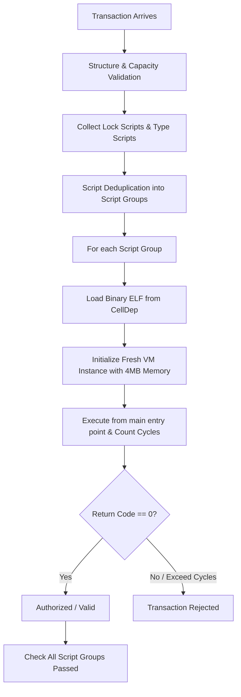

# CKB-VM Deep Dive & RFC 0003 Summary Guide

This document consolidates comprehensive knowledge about **CKB-VM** from two primary sources:
1. **[Lesson 12: CKB-VM Deep Dive](https://website-sooty-chi-72.vercel.app/lessons/12-ckb-vm-deep-dive)**
2. **[CKB RFC 0003: CKB-VM Specification](https://github.com/nervosnetwork/rfcs/blob/master/rfcs/0003-ckb-vm/0003-ckb-vm.md)**

---

## 1. CKB-VM Overview & Core Philosophy

**CKB-VM** is the Virtual Machine that executes all **Lock Scripts** (responsible for verifying cell ownership) and **Type Scripts** (responsible for enforcing data rules & state) on the **Nervos CKB** network.

### Core Characteristics:
- **Pure Software RISC-V Interpreter**: CKB-VM is written entirely in Rust (~3,000 lines of code). It simulates the RISC-V instruction set without depending on any specific physical hardware.
- **Absolute Sandbox Isolation**: CKB-VM runs in a strict isolated environment:
  - No filesystem access.
  - No network access.
  - No randomness or entropy sources.
  - No access to the host machine's external memory.
  - Scripts cannot communicate directly with each other except through the transaction structure.
- **Consensus Determinism**: Every node on the network, when receiving the same Transaction with the same input data, must produce **exactly identical results**. Any non-deterministic factors (system time, random numbers, network calls) are eliminated to ensure absolute blockchain consensus.

---

## 2. Why Did CKB Choose RISC-V Architecture?

Choosing the RISC-V Instruction Set Architecture is one of CKB's most important design decisions. CKB chose RISC-V for 6 strategic reasons:

1. **Open Standard**: RISC-V is managed by the non-profit organization RISC-V International. Unlike x86-64 (Intel/AMD owned) or ARM (requires commercial licensing), anyone can implement and verify CKB-VM without licensing fees or legal barriers.
2. **Simplicity & Auditability**: The base integer instruction set (RV64I) contains only about 47 instructions, much simpler than the thousands of instructions in x86-64. This keeps the entire CKB-VM codebase very lean (~3,000 lines of Rust), minimizing potential security vulnerabilities.
3. **Strict Determinism**: RISC-V specifies precise behavior for every instruction (including integer overflow, division by zero). There is no Undefined Behavior at the ISA level.
4. **Mature Toolchain Ecosystem**: Both GCC and LLVM officially support RISC-V as a first-class compilation target. Developers can write scripts in **Rust** (`rustc`), **C/C++**, **Zig**, or **Go** (TinyGo) without learning a new virtual language or using experimental compilers.
5. **Modular Extension System**: RISC-V allows selecting appropriate extensions (like `rv64imc`). CKB can upgrade with new extensions in the future without breaking backward compatibility.
6. **Future-Ready for Hardware**: As RISC-V chips become more widespread (SiFive, Alibaba T-Head...), future CKB nodes could execute directly on RISC-V hardware CPUs, reducing VM overhead cost to nearly zero.

---

## 3. RISC-V Variant Details: `rv64imc`

CKB-VM chooses the **`rv64imc`** variant:

- **`rv64`**: 64-bit registers and address space. All registers from `x0` to `x31` are 64-bit wide, supporting 4GB+ memory per script.
- **`i` (Base Integer ISA)**: Base integer instructions (~47 instructions) including arithmetic (`ADD`, `SUB`), logic (`AND`, `OR`, `XOR`), bit shifting (`SLL`, `SRL`), load/store (`LB`, `LW`, `LD`, `SB`, `SW`, `SD`), branches & jumps (`BEQ`, `JAL`), and `ECALL` for syscalls.
- **`m` (Multiply/Divide Extension)**: Adds hardware multiply and divide instructions (`MUL`, `MULH`, `DIV`, `REM`...). Without this extension, multiplication must be simulated in software (requiring many more instructions).
- **`c` (Compressed Instructions Extension)**: Compresses common 32-bit (4 bytes) instructions into 16-bit (2 bytes) instructions like `C.ADD`, `C.LW`.
  - **Significance for CKB**: Script binaries are stored directly on-chain in Cells. 25-30% smaller file size means less CKB Capacity is needed to store scripts, reducing deployment costs.

---

## 4. Memory Model W^X (Write XOR Execute - RFC 0003)

In CKB-VM, the environment has no standard Memory Management Unit (MMU) like regular computers. Therefore, RFC 0003 introduces the **W^X** mechanism to ensure memory safety:

### W^X Rules:
CKB-VM's runtime memory has a maximum capacity of **4 MB**, divided into pages of **4 KB** size (aligned at addresses `0x0`, `0x1000`, `0x2000`...).
- Each memory page can only be in one of two states:
  - **Writable**: Allows loading data, variables, stack.
  - **Executable**: Allows containing code for the CPU to read and execute.
- **Absolutely NO memory page can be both Writable and Executable at the same time.**

### Benefits of W^X:
1. **Prevents Code Injection & Buffer Overflow Attacks**: Prevents attackers from exploiting buffer overflow bugs to write malicious code into Stack/Data sections and then jump to execute it.
2. **Simplifies CKB-VM Architecture**: Eliminates complexity when handling Self-Modifying Code, making it easy to apply optimization techniques like Trace Cache, JIT (Just-In-Time), or AOT (Ahead-Of-Time) compilers in CKB-VM.
3. CKB-VM provides syscalls to transition between Writable and Executable states when necessary.

---

## 5. Smart Contract Execution Process in CKB-VM (Execution Model & Lifecycle)

When a transaction is submitted to a CKB Node:



### Key Concepts:
- **Script Grouping**: Cells with the same script parameters (`code_hash` + `hash_type` + `args`) are grouped together. A script executes **exactly once for the entire cell group**, rather than repeatedly for each cell.
- **Exit Code**:
  - **`0`**: Script executed successfully (valid).
  - **Non-zero**: Script failed (transaction rejected).
- **Transaction Cycle Limit**: All scripts in the same Transaction **share** a common cycle limit (approximately 70 billion cycles/tx).

---

## 6. RISC-V Register Set & Syscall Calling Convention (Registers & Syscalls)

CKB-VM provides 32 general-purpose 64-bit registers:

| Register | ABI Name | Role / Purpose |
| :--- | :--- | :--- |
| `x0` | `zero` | Always holds value `0` (all writes to `x0` are ignored) |
| `x1` | `ra` | Return address (stores the return address of the function) |
| `x2` | `sp` | Stack pointer |
| `x3` | `gp` | Global pointer |
| `x4` | `tp` | Thread pointer (unused because CKB-VM is single-threaded) |
| `x5 - x7` | `t0 - t2` | Temporary registers |
| `x8` | `s0 / fp` | Saved register 0 / Frame pointer |
| `x9` | `s1` | Saved register 1 |
| `x10 - x11`| `a0 - a1` | Function arguments 0-1 / Return values |
| `x12 - x17`| `a2 - a7` | Function arguments 2-7 |
| `x18 - x27`| `s2 - s11`| Saved registers 2-11 |
| `x28 - x31`| `t3 - t6` | Temporary registers 3-6 |

### Syscall Calling Convention:
- Arguments are loaded into registers: `a0`, `a1`, `a2`, `a3`, `a4`, `a5`, `a6`.
- **Syscall Number** is placed in register **`a7`**.
- **`ECALL`** instruction is invoked.
- Syscall return result will be in register **`a0`**.

---

## 7. Complete CKB Syscall Reference Table

Syscalls are the sole bridge that allows Scripts to interact with external data. In Rust, the `ckb-std` library wraps these syscalls into safe functions.

### 1. VM Control
- **`exit` (93)**: Immediately stops script execution with an exit code. `exit(0)` = success.
- **`debug` (2177)**: Prints a debug string to log (commonly used in `debug!` macro). Production nodes will ignore it.

### 2. Transaction & Script Identification
- **`load_tx_hash` (2061)**: Loads the 32-byte Blake2b hash of the current transaction (used as the signing message).
- **`load_transaction` (2051)**: Loads the entire Transaction data structure in Molecule format.
- **`load_script_hash` (2062)**: Loads the 32-byte hash of the currently running script.
- **`load_script` (2052)**: Loads the Script structure currently running (`code_hash`, `hash_type`, `args`).

### 3. Reading Cell, Input & Witness Data
- **`load_cell` (2071)**: Loads the Molecule `CellOutput` structure (capacity, lock, type).
- **`load_cell_data` (2092)**: Loads the raw bytes in the Cell's `data` field. The most common syscall in Type Scripts.
- **`load_cell_by_field` (2081)**: Loads exactly one data field of the Cell (capacity, lock hash, type hash...) which saves RAM and cycles compared to `load_cell`.
- **`load_input` (2073)**: Loads the `CellInput` structure (`OutPoint` + `since`).
- **`load_input_by_field` (2083)**: Loads a specific field of the input (`OutPoint`, `since`).
- **`load_witness` (2074)**: Loads Witness data at the corresponding index (contains signatures, Merkle proofs...).

### 4. Reading Block Headers
- **`load_header` (2072)**: Loads the Block Header from `header_deps`. Used for Nervos DAO interest calculation based on timestamp/epoch.
- **`load_header_by_field` (2082)**: Loads a specific field in the Block Header (epoch, timestamp, number).

### 5. Advanced VM Management - Multi-VM / Spawn (CKB2023+ Hardfork)
- **`spawn` (2601)**: Spawns a Child VM to execute a different script binary, enabling modular script architecture.
- **`pipe` (2604)**: Creates a file descriptor pair for data transfer between parent and child VM.
- **`read` (2605)** / **`write` (2606)** / **`close` (2608)**: Read/write/close file descriptor communication via pipe.
- **`wait` (2603)**: Waits for child VM to finish and receives its exit code.
- **`process_id` (2602)**: Gets the Process ID of the current VM.
- **`inherited_fd` (2607)**: Gets the list of file descriptors inherited from the parent VM.

### 6. Introspection
- **`current_cycles` (2042)**: Returns the number of Cycles consumed so far.
- **`vm_version` (2041)**: Returns the CKB-VM version (0: initial, 1: spawn support).

### `Source` Parameter:
Most syscalls that read Cell/Input accept a `source` parameter to specify which Cell set to query:
- `Source::Input` (1): All Input Cells.
- `Source::Output` (2): All Output Cells.
- `Source::CellDep` (3): Dependent Cells (containing script binary or shared data).
- `Source::HeaderDep` (4): Dependent Block Headers.
- `Source::GroupInput` (`0x0100000000000001`): Only Input Cells belonging to the **same Script Group** as the running script.
- `Source::GroupOutput` (`0x0100000000000002`): Only Output Cells belonging to the **same Script Group** as the running script.

---

## 8. Cycle Cost Model & Performance Evaluation (Cycles & Performance)

Each RISC-V instruction executed in CKB-VM consumes a fixed number of **Cycles**. Cycle is a deterministic measure of computation (not dependent on whether the running node hardware is fast or slow).

### Instruction Cost Table:

| Instruction Category | Example Instructions | Cost (Cycles) |
| :--- | :--- | :--- |
| **ALU Operations** | `ADD`, `SUB`, `AND`, `OR`, `XOR`, `SLL` | **1 cycle** |
| **Comparisons** | `SLT`, `SLTU`, `SLTI` | **1 cycle** |
| **Loading Large Constants** | `LUI`, `AUIPC` | **1 cycle** |
| **Memory Load** | `LB`, `LH`, `LW`, `LD` | **3 cycles** |
| **Memory Store** | `SB`, `SH`, `SW`, `SD` | **3 cycles** |
| **Branches / Jumps** | `BEQ`, `BNE`, `BLT`, `JAL`, `JALR` | **3 cycles** |
| **Multiply / Divide** | `MUL`, `DIV`, `REM` | **5 cycles** |
| **Syscall** | `ECALL` | **500+ cycles** (plus data costs) |

### Real-world Algorithm Costs:

| Operation | Estimated Cycles |
| :--- | :--- |
| **secp256k1 ECDSA verify** (Bitcoin/Ethereum Standard) | ~1,200,000 |
| **secp256r1 ECDSA verify** (WebAuthn / Passkeys) | ~3,000,000 |
| **ed25519 verify** (Solana/Cardano) | ~2,500,000 |
| **RSA-2048 verify** | ~5,000,000 |
| **Blake2b-256** (32 bytes data) | **~1,600** |
| **Blake2b-256** (1 KB data) | **~6,500** |
| **SHA-256** (32 bytes data) | **~3,000** |
| **SHA-256** (1 KB data) | **~15,000** |

> **Why is Blake2b ~2x faster than SHA-256 on CKB-VM?**
> Blake2b is designed to be software-optimized with a 128-byte block size. SHA-256 uses a 64-byte block size and relies heavily on SHA-NI hardware instructions (which are not available in software CKB-VM).

### Cycle Measurement Tools:
1. **`ckb-debugger`**: CLI tool that runs script binary offline to check exact cycle count.
   ```bash
   ckb-debugger --bin target/riscv64imac-unknown-none-elf/release/my-script
   ```
2. **`current_cycles` Syscall**: Place cycle measurement checkpoints directly in Rust code to benchmark individual code segments.
3. **RPC `dry_run_transaction`**: Submit Transaction to a test Node to get total Cycle count without broadcasting the tx.

---

## 9. Script Optimization Techniques (Optimization Best Practices)

1. **Minimize Syscalls**: Each syscall call costs at least ~500 fixed cycles. Cache syscall results in variables instead of repeatedly calling.
2. **Partial Data Loading**: Use `offset` and `length` in Cell Data read syscalls if you only need the first few bytes (e.g., read 16 bytes of token balance instead of loading the entire Cell Data).
3. **Optimize Binary Size Compiler Configuration (`Cargo.toml`)**:
   ```toml
   [profile.release]
   opt-level = "s"      # Optimize for size instead of speed
   lto = true           # Link-time optimization removes dead code
   codegen-units = 1    # Enables whole binary optimization
   panic = "abort"      # Removes unwinding support
   strip = true         # Removes debug symbols from binary
   ```
   *This configuration can reduce ELF binary file size by 50-70%.*
4. **Return Early**: Perform cheap checks first (like checking `data.len()`), only perform expensive hash or signature verification when basic conditions are met.
5. **Limit Heap Memory Allocation**: In `no_std` environment, prefer fixed arrays on Stack (`[u8; 32]`) over `Vec<u8>` on Heap.

---

## 10. Cryptographic Freedom & Multi-Language Support (Cryptographic Freedom & Languages)

### Cryptographic Freedom:
Other blockchains like Bitcoin or Ethereum hardcode specific cryptographic algorithms (SHA-256, secp256k1, Keccak-256). Adding new algorithms requires a hard fork.

CKB-VM **does not hardcode any cryptographic algorithms into the virtualization**.
Every signature/hashing algorithm is just regular Rust/C code compiled to RISC-V.
- This allows CKB to immediately support:
  - **Secp256r1 (Passkeys / WebAuthn)**: Log into dApps using fingerprint/FaceID.
  - **Schnorr Signatures**: Bitcoin-standard multisig.
  - **BLS Signatures**: Signature aggregation (combine multiple signatures into 1).
  - **Post-Quantum Cryptography** like Dilithium, Kyber, FALCON.
- **Omnilock** is a prime example: A single Lock Script supporting diverse authentication methods by branching algorithms based on `args` parameter.

### Multi-Language Support (Any Language to RISC-V):
Any language with a compiler targeting RISC-V ELF can be used to write CKB Scripts:

| Language | Compiler / Target | Notes |
| :--- | :--- | :--- |
| **Rust** | `rustc` (`riscv64imac-unknown-none-elf`) | Most popular, has strong `ckb-std` SDK |
| **C / C++** | `riscv64-unknown-elf-gcc` / Clang | Very popular, leverages native C libraries |
| **Zig** | `zig build-exe -target riscv64-freestanding-none` | Good RISC-V support |
| **Go** | TinyGo with RISC-V backend | Actively developed by community |
| **JavaScript** | Embedded QuickJS interpreter compiled to RISC-V | Write JS directly on CKB VM |
