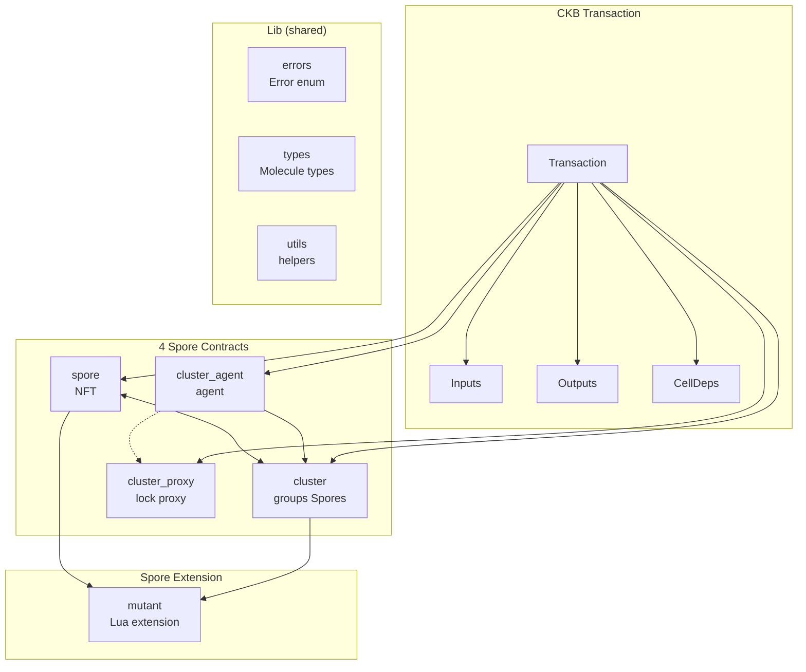
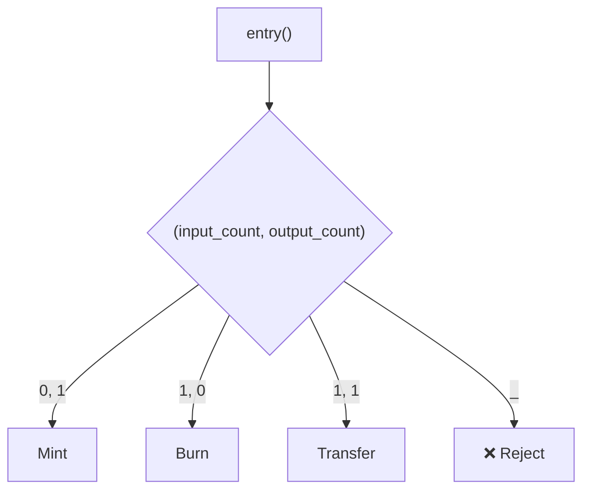
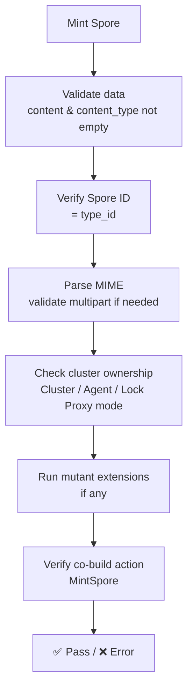
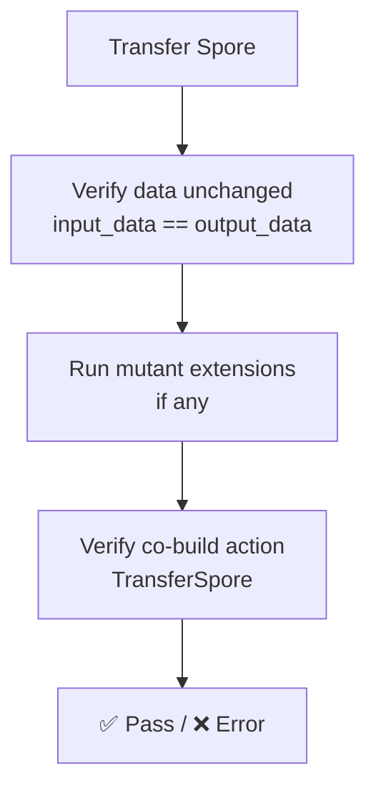
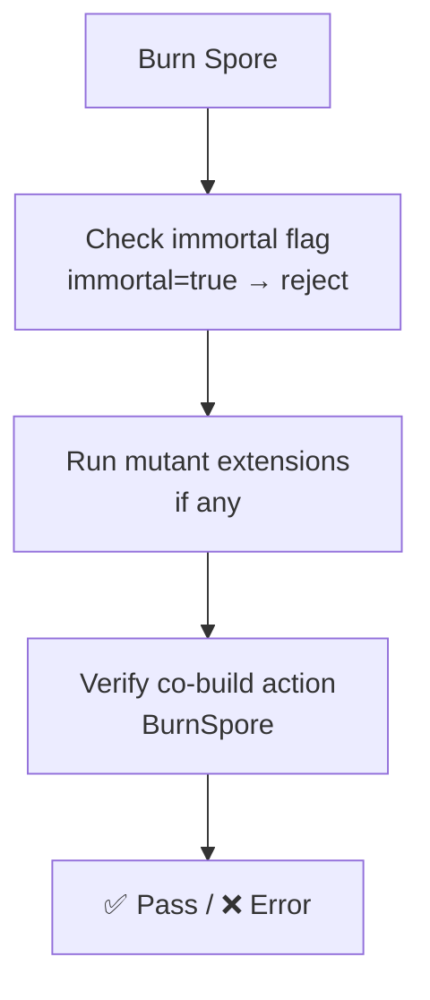
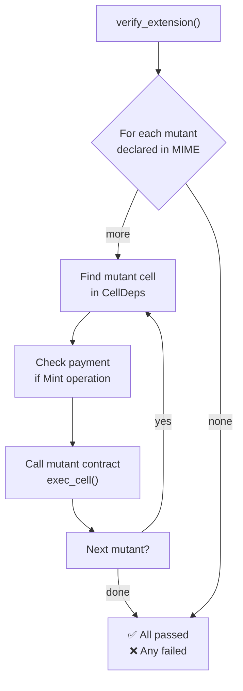
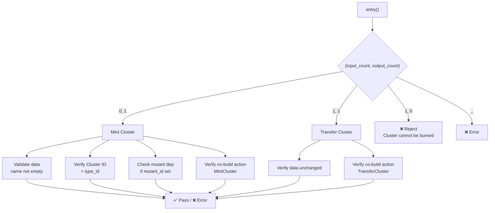
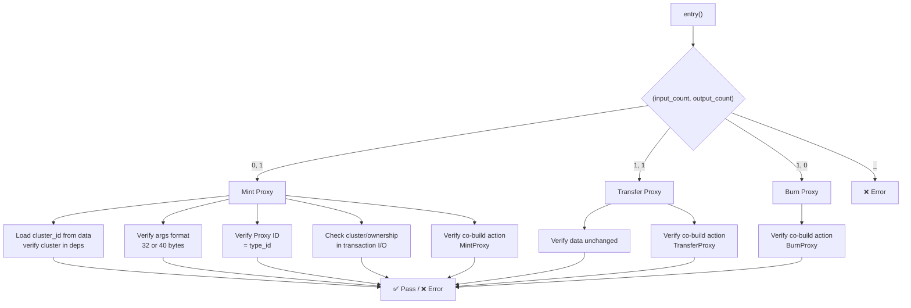
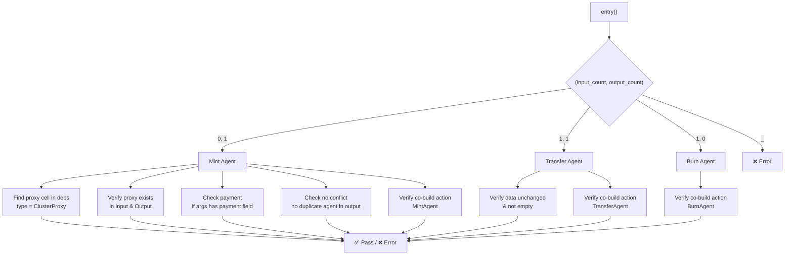
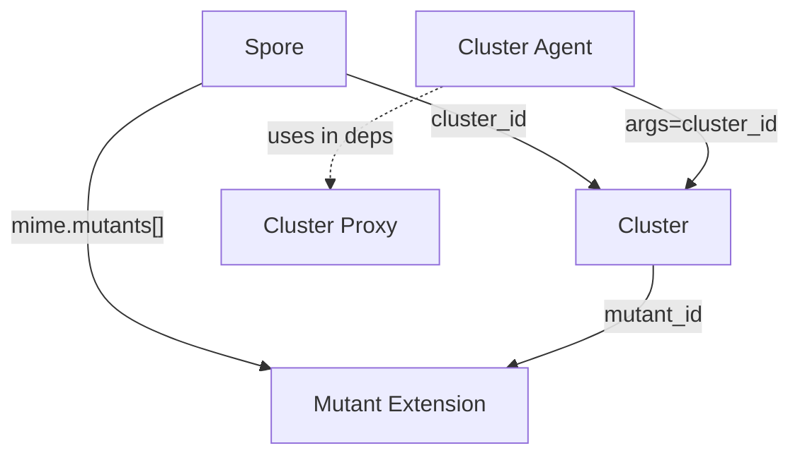

# Spore Contract Analysis

> **Source:** [sporeprotocol/spore-contract](https://github.com/sporeprotocol/spore-contract)

## 1. Overview

Spore is an NFT protocol on CKB, consisting of 4 main contracts:

| Contract | Function |
|---|---|
| `spore` | Create / transfer / burn NFT (Spore cell) |
| `cluster` | Groups Spore cells together |
| `cluster_proxy` | Lock Proxy — allows cluster ownership without cluster in the same transaction |
| `cluster_agent` | Agent cell — replaces cluster in a transaction |

---

## 2. Architecture Overview



**Common processing flow across all contracts:**

1. **Count** — count cells of the same type in Input / Output
2. **Dispatch** — classify operation based on (input_count, output_count)
3. **Validate** — check data, args, ownership, MIME
4. **Co-build** — verify action from co-build script
5. **Done** — return Ok() or Error

---

## 3. Folder Structure

```
spore-contract/
├── contracts/
│   ├── spore/
│   │   ├── build.rs
│   │   └── src/
│   │       ├── main.rs          # entry point, no_std setup
│   │       ├── entry.rs         # Mint / Transfer / Burn logic
│   │       └── hash.rs          # whitelist code hashes
│   ├── cluster/
│   │   ├── build.rs
│   │   └── src/
│   │       ├── main.rs
│   │       ├── entry.rs
│   │       └── hash.rs
│   ├── cluster_proxy/
│   │   ├── build.rs
│   │   └── src/
│   │       ├── main.rs
│   │       ├── entry.rs
│   │       └── hash.rs
│   ├── cluster_agent/
│   │   ├── build.rs
│   │   └── src/
│   │       ├── main.rs
│   │       ├── entry.rs
│   │       └── hash.rs
│   └── spore_extension_lua/
│       ├── build.rs
│       └── src/
│           ├── main.rs
│           ├── entry.rs         # Lua VM extension
│           └── error.rs
├── lib/
│   ├── build/                   # molecule generated code
│   ├── errors/                  # Error enum definitions
│   ├── types/
│   │   ├── generated/           # Mol types: SporeData, ClusterData, Action...
│   │   └── schemas/
│   │       └── spore.mol        # Mol schema
│   └── utils/                   # Shared helpers (MIME, type_id, find_cell...)
├── tests/                        # Capsule integration tests
├── deployment/                   # Deployment scripts
├── docs/                         # RFC, versions history
├── Cargo.toml                     # Workspace root
├── capsule.toml                  # Capsule build config
└── rust-toolchain
```

---

## 4. Spore Contract (`contracts/spore/src/entry.rs`)

### 4.1 Data Structure

```rust
SporeData {
    content: Vec<u8>,        // blob content
    content_type: String,    // MIME type, e.g. "image/png"
    cluster_id: Opt<Byte32>, // cluster this spore belongs to
}
```

- Serialized using **Molecule**.
- **Spore ID** = **type_id** (derived from script args).

### 4.2 Entry Point — Dispatch by cell count



### 4.3 Mint (0 input, 1 output)



### 4.4 Transfer (1 input, 1 output)



### 4.5 Burn (1 input, 0 output)



### 4.6 Mutant Extension



---

## 5. Cluster Contract (`contracts/cluster/src/entry.rs`)

### 5.1 Data Structure

```rust
ClusterDataV2 {
    name: String,
    description: String,
    mutant_id: Opt<Byte32>,
}
```

### 5.2 Operations



---

## 6. Cluster Proxy Contract (`contracts/cluster_proxy/src/entry.rs`)

Type script: `data = cluster_id (32 bytes)`, `args = Proxy ID (type_id)`.



---

## 7. Cluster Agent Contract (`contracts/cluster_agent/src/entry.rs`)



---

## 8. Relationships Between the 4 Contracts



**3 Ownership modes when Spore belongs to a cluster:**

| Mode | Condition | When to use |
|---|---|---|
| Cluster | Cluster cell in both Input & Output | Spore + Cluster in same transaction |
| Agent | Agent cell in both Input & Output | Agent replaces cluster |
| Lock Proxy | Cluster lock hash matches | No cluster/agent needed |

---

## 9. Co-build Action Verification

Each operation verifies the action from the co-build script — ensuring transaction data matches the signed intent:

```rust
MintSpore      { spore_id, data_hash, to: SporeAddress }
TransferSpore  { spore_id, from: SporeAddress, to: SporeAddress }
BurnSpore      { spore_id, from: SporeAddress }
MintCluster    { cluster_id, data_hash, to: SporeAddress }
TransferCluster { cluster_id, from: SporeAddress, to: SporeAddress }
MintProxy      { proxy_id, cluster_id, to: SporeAddress }
TransferProxy  { proxy_id, cluster_id, from, to }
BurnProxy      { proxy_id, cluster_id, from }
MintAgent      { agent_id, cluster_id, proxy_id, to }
TransferAgent  { agent_id, from, to }
BurnAgent      { agent_id, from }
```

- `SporeAddress` = blake2b(lock_script + flags)
- `data_hash` = blake2b(cell_data)

---

## 10. Type ID Mechanism

```
Spore ID = blake2b(input_cell_ptr + output_cell_ptr + type_script)
```

The contract verifies that script args match the computed type_id — ensuring the ID is unique and cannot be forged.

---

## 11. Key Security Checks

1. **Immutable fields** — Transfer must not modify data (input == output)
2. **No conflict** — 1 cell of the same type per group
3. **No multi-spend** — 1 input of the same type
4. **Immortal NFT** — `immortal=true` → cannot be burned
5. **Mutant payment** — minting with mutant requires sufficient CKB payment
6. **Co-build action** — every op verifies action from co-build script
7. **Spore address** — validates `from/to` address is correct
